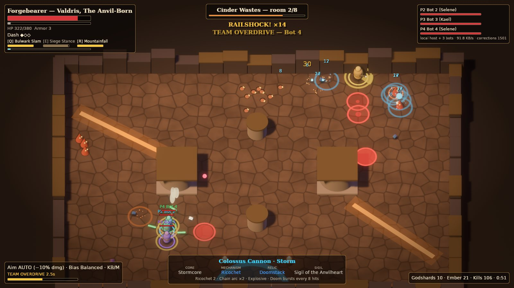
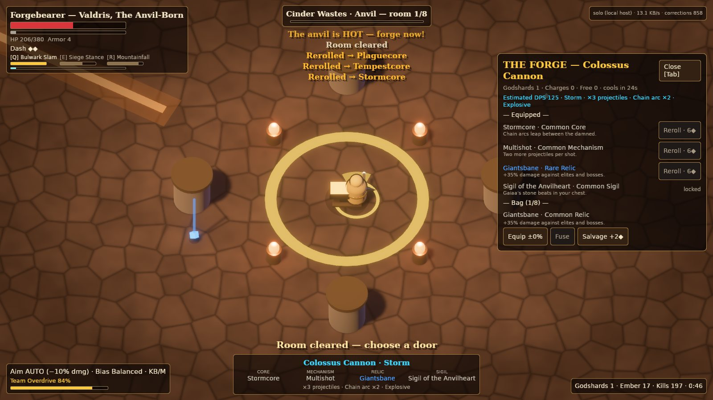
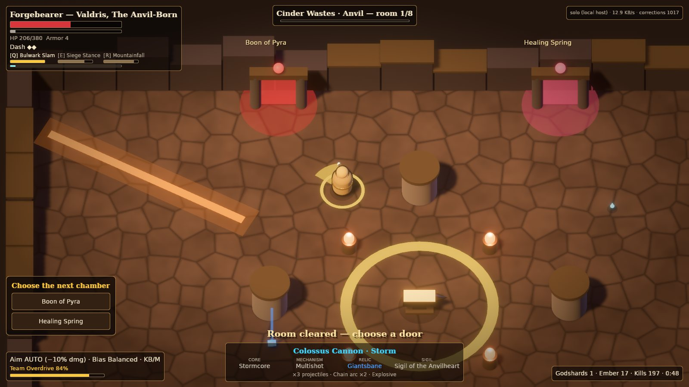

# GODFORGE: The Last Arsenal

*Hades II presentation & build depth × NIMRODS horde-crafting chaos × 4-player co-op carnage.*

A 4-player co-op isometric horde roguelite. You forge absurd weapons mid-run, **1 Chassis + Core,
Mechanism, Relic and Sigil**, at guarded anvils, stack god boons on top, and detonate elemental
synergies with your friends while 400 enemies flood the screen.



| | |
|---|---|
|  |  |

**Status: vertical slice (P1).** Three characters, six chassis, the full Forge loop, Cinder Wastes
through its boss, 4-player host-authoritative co-op, and all three aim modes. The EA content set is
authored and validated behind a phase gate. Art is greybox with the final colour and readability
language. See [docs/VERTICAL_SLICE.md](docs/VERTICAL_SLICE.md).

## Quick start

Requires Rust 1.96 (pinned in `rust-toolchain.toml`). On Linux, install `libudev-dev libwayland-dev
libxkbcommon-dev` (gamepads + Wayland/X11 windowing).

```sh
cargo run --release                          # solo run: the host sim runs on a thread, you join over loopback
cargo run --release -- --bots 3              # you + 3 bot teammates
cargo run --release -- --host 27015          # listen server for friends…
cargo run --release -- --join 192.168.1.20:27015   # …who join like this
cargo run --release -- --help                # every option (character, chassis, aim mode, chaos tier, seed…)
```

WASD move · mouse aim · LMB fire · Space dash · Q/E abilities · R ultimate · V Team Overdrive ·
F interact · Tab forge · F1/F2/F3 AUTO/ASSISTED/MANUAL · H help. Gamepad and touch are supported.

## Test rigs

```sh
cargo test --workspace                                        # rules, content, netcode, determinism
cargo run -p gf_tools -- import --check                       # spreadsheets ↔ generated data in sync
cargo run --release -- --bot-run --bots 4 --phase ea          # nightly: bots play a full run over the netcode
cargo run --release -- --stress 400 --bots 4                  # chaos stress: host tick budget at 400 enemies
cargo run --release -- --autoplay --bots 3 --screenshot shot.png --shots 4   # client smoke + captures
```

## Repository map

| Path | What |
|---|---|
| `crates/gf_core` | Engine-agnostic rules: Forge, modifiers, weapons, aim policies, damage/status, synergies, scaling, revive, movement, RNG |
| `crates/gf_content` | Content schema, loader, validator, content hash |
| `crates/gf_net` | Host-authoritative protocol, delta snapshots, loopback/UDP transports |
| `crates/gf_engine` | The only crate that touches Bevy `=0.20.0-rc.1` directly |
| `crates/gf_sim` | Headless 60 Hz authoritative simulation + bots |
| `crates/gf_client` | Presentation, input (KB/M, pad, touch), prediction, HUD, Forge UI |
| `crates/gf_game` | The `godforge` binary |
| `tools/gf_tools` | `gf-content`: spreadsheet import, validation, 100-hour audit |
| `content/sheets` | Designer spreadsheets (CSV) |
| `assets/content` | Game data (RON): generated tables + hand-authored tuning, kits, rooms, bosses, biomes |

## Documentation

* [Architecture](docs/ARCHITECTURE.md): crate graph, tick, netcode, prediction, budgets, testing.
* [Vertical slice](docs/VERTICAL_SLICE.md): scope, status, acceptance criteria, exit gates.
* [Content pipeline](docs/CONTENT_PIPELINE.md): sheets → RON → validation, adding content without code.
* [100-hour audit](docs/HUNDRED_HOUR_AUDIT.md): generated from content by `gf-content audit --write`.

## IP hygiene

GODFORGE captures the *qualities* of its references, never their assets, names, characters, text or
UI layouts (§20.8). Every name, character, god, biome and line of flavour text here is original.
Bundled fonts are DejaVu (free licence, `assets/fonts/LICENSE-DejaVu.txt`).
