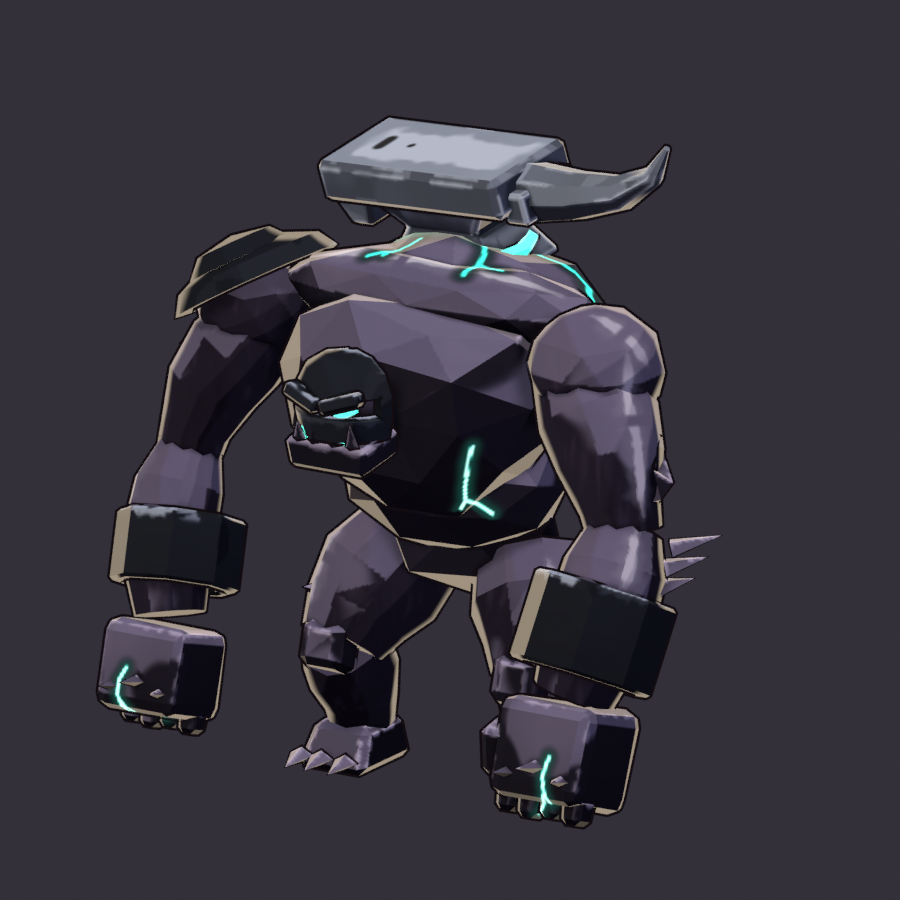

# Anvil Brute (`anvil_brute`)

**Status: AI build done, user approval pending.** meta.json says `ai_final_pending_user_approval`, and
`status.json` has stage `2_user_approval` set to `pending_human`.

The Cinder Wastes plated Elite Brute, built end to end from code with no concept art and no hand edits:
model (with an intact and a cracked copy of every plate), hand-painted NPR textures, a dedicated rig, eight
clips, the GLB, validation and the review sheets.

```text
"C:\Program Files\Blender Foundation\Blender 5.2\blender.exe" -b --factory-startup --python-exit-code 1 ^
    -P tools/blender/gf_assets/enemies/anvil_brute.py
python tools/blender/gf_assets/gfa_validate.py assets/models/enemies/anvil_brute.glb
```

The before/after sheet of the art review fixes comes from `enemies/anvil_brute_fix_sheet.py -- --before DIR`, where
DIR holds the pre-fix GLB and `anvil_brute_34.png` (see its docstring).

A full run takes about 100 s on the CPU. The fast loops:

* `--preview [--state intact|cracked|stripped|all]` renders the geometry in flat zone colours (about 10 s).
* `--look [--close]` paints into `work/look/` and renders the three plate states in the 3/4 view, the 55° view
  and the game camera at true pixel size (about 60 s). `--close` adds close-ups of the plates.
* `--poses [--game] [--clip <name>]` adds the rig and clips in flat colours (about 20 s).



| Sheet | What it shows |
|---|---|
| [reports/anvil_brute_plates.png](reports/anvil_brute_plates.png) | **the gimmick**: intact, cracked and stripped in the 3/4 view and through the game camera at 1x and 3x, the no-client fallback, and the `plates_break` key frames |
| [reports/anvil_brute_scale.png](reports/anvil_brute_scale.png) | front lineup with the 2.2 m hero mannequin (rest and the loaded windup), five key poses through the game camera at true 1080p pixel size (1x and 3x), and the game-size silhouette |
| [reports/anvil_brute_clips.png](reports/anvil_brute_clips.png) | the key poses of all eight clips |
| [reports/anvil_brute_review.png](reports/anvil_brute_review.png) | the standard toolkit review: rest-pose turnaround, four frames of every clip, the in-game camera at 1x, 3x and as a silhouette, the textures and the palette |
| [reports/anvil_brute_review_fix.png](reports/anvil_brute_review_fix.png) | the art review fixes, before and after: both GLBs through the game camera at true pixel size on the Cinder flagstones and on the spec floor, the L* band maps and the value metric, and the 3/4 view |

## Brief and content row

`content/sheets/enemies.csv`: Elite, Cinder Wastes, P0, hp 520, speed 2.4, radius 0.9, contact 18, mass 4.0,
plating `(resist: {Kinetic: 0.5}, plate_hp: 260.0)`,
`Charger(range: 9.0, windup: 0.9, speed: 13.0, duration: 0.55, cooldown: 3.5, damage: 34.0, width: 1.4)`,
colour `#7A7F8C`, greybox Brute, scale 1.3. Its line is "Plated in anvil-iron. Kinetic rounds glance off until
the plates crack."

The task brief asked for player +20-30 % bulk, anvil-iron plates as the one gimmick (they crack and fall away,
separable pieces with an intact and a cracked look, and a documented engine switch), and a heavy overhead slam
wind-up.

## Design decisions

* **Faction: The Unmade.** ENEMIES.md does not assign this row a faction. The brute is written as a member of
  the Slag King's court, the Unmade that fuse the dead gods' broken forge-iron into themselves (the Slag King
  itself is built from broken anvils). It is a hunched, knuckle-walking hulk of faceted obsidian and dark fused
  flesh. It has hammered anvil-iron onto its body as armour, and teal ichor seeps where the iron is fused in.
  This keeps it apart from the Cinder elite of the other faction, the gold Forge Warden, and from Valdris, the
  gold-trimmed "Anvil-Born" hero.
* **The one gimmick: anvil-iron plates**, the only light metal on a black body.
  - The biggest plate is a whole **anvil** fused across the shoulders like a yoke. Its long axis runs across
    the body, so the game camera sees the anvil icon: the polished face, a bull-swept horn that juts out past
    the left shoulder, the square heel over the right shoulder, and the pinched waist sunk into the hump in a
    glowing ichor weld.
  - The other plates are two stepped iron domes on the right shoulder, an iron visor with one teal eye slit
    under a V of brow, and a cuff on each forearm (the heavier one on the slam arm).
  - The horn on one side and the pauldron on the other give the Unmade asymmetry, and the left arm is bigger.
* **Three readable states.** Intact is the plated look: the light anvil, the dark iron domes, visor and cuffs.
  Cracked adds jagged gaps whose walls glow teal, with burnt lips on the iron. Stripped leaves the black body, and a glowing ichor wound where the anvil sat, which reads
  as "vulnerable now". The engine switches between them (see "Plate states" below).
* **The verb: the overhead slam that launches the charge.**
  - `windup` rears up onto its legs with both fists clasped overhead, 3.8 m up, above the anvil. The height jump is the
    tell.
  - `attack` hammers both fists into the ground in front and drives forward into the charge.
  - `charge@loop` is a head-down gallop behind the anvil.
* **Value hierarchy at game size.**
  - The anvil's face is the one bright metal: `#737B87` with a hammer-struck band `#9AA2AD`, and the hardy
    and pritchel holes painted dark.
  - The rest of the anvil is iron `#545A66`, from the row colour `#7A7F8C`, with dark forge-scale patches. It
    uses the broad-plane painter `gfa_brush`, whose broad value planes and brush strokes on the edges keep
    the iron from streaking.
  - The other plates (the pauldron domes, the visor and the cuffs) are iron shadow `#181A20` in broad value
    planes, with ONE brushy light stroke `#7E8694` on the edge that faces up: the cuff's upper rim, the visor's
    brow V and crown, and the lit arc of the big dome's rim.
  - The obsidian is `#1A1720` and the flesh a dark plum `#1B1721` with a faint wet sheen. Their up-facing planes
    (the shoulders, the back, the arms, the thighs) are painted in the faction's obsidian light `#4B4658` and a
    step above it, with a glassy sheen on some facets. The sides and undersides stay dark, so every form has two
    values and few mid values, which are the floor's own. Light crest strokes (`#9896A0` on the obsidian,
    `#8E8998` on the flesh) run along the trapezius ridge under the anvil, the left shoulder cap, the upper arms,
    the forearms above the cuffs and the thighs, and the obsidian's sharp creases carry broken light strokes.
* **Emissive budget.** Teal `#2FBFA8` is used only in these places:
  - the eye slit and the maw;
  - the weld round the anvil's waist and six short fissures radiating from it;
  - three fissures on the chest and one on each fist;
  - the crack walls, in the cracked state only;
  - the wound, which the anvil covers until it falls.

  Mint `#B8FFE8` appears only as the core of those lines. There are no player colours and no red-white: the
  engine draws the charge telegraph.

## Art review fixes (6.5/10)

The Cinder bestiary art review scored the brute 6.5/10 with two must-fix items. Both are paint fixes: the mesh,
rig, clips, sockets, plate states and file names are unchanged.
[reports/anvil_brute_review_fix.png](reports/anvil_brute_review_fix.png) shows before and after.

* **Floor separation.** The plum-obsidian body melted into the mid-dark Cinder floor, carried only by the ink and
  the rim light. The up-facing planes of the shoulders, back, arms and thighs are now painted in obsidian light
  `#4B4658` and a step above it, with a narrow brushy border to the dark sides. Light crest strokes, 2-3 game
  pixels wide, run along the crests of those forms, as in the clinker fix.
* **The dark plates.** The cuffs, shoulder domes and visor were flat mid-grey blocks (`#8A909C` in the flat
  preview) that read as untextured primitives and competed with the anvil. They are a separate paint zone,
  `iron_dark`, in iron shadow with one brushy top-edge stroke. The anvil face is the only bright metal.

The value metric repeats the art review's. It covers the creature's pixels through the game camera at true pixel
size and takes the mean of three poses (idle facing the camera, idle 3/4, the loaded windup):

| | Before | After |
|---|---|---|
| Median L* | 29.1 | 32.5 |
| Within ±7 L* of the spec floor `#3A2C24` | 34 % | 12 % |
| Within ±7 L* of the mid flagstone `#603320` | 34 % | 16 % |

On the idle pose facing the camera, the review measured L* 29 and 36 % / 37 %. The sheet's own before render
gives the same numbers, and the after render gives L* 35.8 and 11 % / 17 %. The loaded windup stays the darkest
pose (median L* 25): reared up, it shows the camera the dark chest front and the undersides.

The review's two should-fix items are open: the anvil's plan-view read (a pinched waist and a stepped heel seen
from above), and the fists that sink 0.30 m into the ground on the slam impact and 0.45 m in death.

## Plate states (the engine contract)

Every plate is in the mesh twice. The metadata is in `meta.json` under `plate_states`.

| Plate | Parent bone | Intact joint | Cracked joint (group) | Fragment joints |
|---|---|---|---|---|
| `back` (the anvil) | `spine_03` | `plate_back` | `plate_back_crk` | `plate_back_crk_1..3` (horn, middle with the weld, heel) |
| `pauldron` | `clavicle_R` | `plate_pauldron` | `plate_pauldron_crk` | `_crk_1..2` |
| `helm` (the visor) | `head` | `plate_helm` | `plate_helm_crk` | `_crk_1..2` |
| `cuff_L` | `lowerarm_L` | `plate_cuff_L` | `plate_cuff_L_crk` | `_crk_1..2` |
| `cuff_R` | `lowerarm_R` | `plate_cuff_R` | `plate_cuff_R_crk` | `_crk_1..2` |

* **The switch is a joint scale.**

  | State | `plate_<p>` scale | `plate_<p>_crk` scale |
  |---|---|---|
  | intact | 1 | 0 |
  | cracked | 0 | 1 |
  | stripped | 0 | 0 |

  Every clip keys every joint, so the client sets these scales each frame **after the animation system** and
  before transform propagation. This is the same pattern as the Slag King's `crown_spin`. 0.001 works as well
  as 0, and the clips use 0.001.
* **The sim signals.**
  - `EntityFlags::PLATED` stays set while plate hp is left.
  - `GameEvent::PlatesShattered` fires when the plate hp runs out.
  - `GameEvent::Hit` (the amount after resist, and the element) arrives for every hit.
* **Suggested client logic.**
  1. Spawn the brute intact.
  2. While PLATED, estimate the wear the way `gf_core::damage::apply_plating` does: the Hit amount × 1.5 for
     Kinetic (resisted) hits, and × 0.5 for other elements. Crack the plates one by one as wear ÷ plate_hp
     passes 0.15 / 0.35 / 0.55 / 0.70 / 0.85, in the order back, pauldron, helm, cuff_L, cuff_R. The anvil
     cracks first, because it is the plate the player sees.
  3. On `PlatesShattered`, set every plate to cracked and play `plates_break` once. It flings and shrinks the
     fragments, and it keys the intact joints hidden. Then hold stripped.
  4. A brute seen without PLATED (a late joiner) is stripped.
* **Fallback.** With no client code, both layers stay at scale 1. The cracked copies are inset 3-7 % inside
  the intact plates, so the model still reads intact. The last image of the first row of the plates sheet shows
  this.
* **VFX.** The existing `PlatesShattered` debris burst in `vfx.rs` fits on top of `plates_break`. The fragment
  joints give the debris positions.

## Size and footprint

| | |
|---|---|
| Height | 2.81 m to the horn tip (1.28 × the 2.2 m hero; the elite range is 1.1-1.35 ×). The anvil face is at about 2.55 m. The loaded windup reaches 3.8 m with its fists. |
| Footprint | the collider is radius 0.9 × scale 1.3 = 1.17 m. The model spans 2.55 × 1.75 m, which is 2.2 × the collider radius. |
| Origin | on the ground under the pelvis. It faces Blender -Y, which is glTF +Z; the engine uses `yaw(angle) * rot_y(PI)`. |

## Rig: `GF_AnvilBrute_v1` (44 bones)

* **Core:** the 23 GF_Hero_v1 core bones, with the same names and parents, so hero clips can be retargeted.
* **Plate joints:** 21 bones. Per plate there is the intact joint, the cracked group, and one joint per fragment.
  All of them deform (the exporter drops non-deform bones).
* **Skinning:** rigid. Every part sits on one bone at weight 1.0.
* **Rest pose:** the idle stance, hunched with the knuckles planted.
* **Solving:** `Solver`, per frame. It runs FK for the spine, neck and head, then two-bone IK that plants the
  feet **and the fists** (a knuckle-walker walks on its fists), and the fist follows its forearm. For
  `plates_break` it adds ballistic fragment flight with a tumble. Every frame is keyed, and the loops are
  periodic.

## Clips (30 fps; client names `anvil_brute_<clip>`)

| Clip | Length | What | Client use |
|---|---|---|---|
| `idle@loop` | 2.0 s | hunched on its knuckles; the chest heaves and lifts the anvil; the visor looks around | idle |
| `move@loop` | 0.8 s | knuckle walk, with fists and feet planted in diagonal pairs; `move_cycle_m` 1.448 | playback = speed ÷ 1.448 |
| `windup` | 0.9 s | the overhead slam wind-up: gathers, rears up, fists clasped overhead (3.8 m); ends on the loaded pose | time-stretch to the Charger windup, hold the last frame |
| `attack` | 0.53 s | the slam: both fists hit the ground at 0.17 s (sockets `impact_L/R`), then it drives into the charge posture | play when CHARGING starts (the charge lasts 0.55 s) |
| `charge@loop` | 0.4 s | head-down bounding gallop behind the anvil | loop while CHARGING after `attack`, at 1.0-1.5× (a visual cadence, not stride-matched to 13 m/s) |
| `hit` | 0.33 s | a flinch back | hit |
| `death` | 1.6 s | jolts, sags to its knees and crashes face-down onto its fists under the anvil (held) | hold the last frame |
| `plates_break` | 0.8 s | rears up roaring, arms flung wide; the cracked fragments fly off, tumble and vanish | one-shot on `PlatesShattered`, then stripped |

meta.json `clip_aliases` maps the brief's names: `walk@loop`, `slam_windup`, `slam` and `plate_shatter`.

**Sockets** (empties on bones, exported as joint children):

| Socket | Bone | Use |
|---|---|---|
| `hit_center` | `spine_03` | the chest; hit VFX and damage numbers |
| `fx_core` | `spine_03` | inside the hump; the death burst |
| `head_top` | `spine_03` | 3.0 m up, above the anvil; status icons |
| `fx_mouth` | `head` | the maw |
| `attack_origin` | `spine_03` | the front of the charge |
| `impact_L`, `impact_R` | `hand_L`, `hand_R` | the knuckles; slam dust |

## Metrics (last build)

| | |
|---|---|
| Triangles | 5,804 (elite budget 4,000-8,000). About 1,160 are the intact plates and 2,030 the cracked copies and their crack walls. |
| Textures | base colour 1024² and emissive 1024² (PNG, embedded); one material `M_anvil_brute` |
| UVs | 46 % coverage, texel density about 115 px/m |
| GLB | about 2.0 MB, uncompressed (bevy_gltf 0.20 safe). `gfa_validate` reports OK with no warnings. |
| Bones and clips | 44 bones and 8 clips. Every clip keys all 44 joints. |

## Files

| Path | In git |
|---|---|
| `assets/models/enemies/anvil_brute.glb` + `.meta.json` | yes (the GLB through LFS) |
| `source/anvil_brute.blend` | yes (LFS); textures referenced relatively |
| `textures/anvil_brute_basecolor.png`, `_emissive.png` | yes (LFS) |
| `reports/*.png`, `reports/build_report.json`, `status.json` | yes |
| `work/` | no (local previews and review frames) |
| `tools/blender/gf_assets/enemies/anvil_brute_fix_sheet.py` | the before/after sheet of the art review fixes (imports both GLBs) |
| `tools/blender/gf_assets/enemies/anvil_brute.py` | the build script. The cracked plates come from `crack_solid()` (an EXACT boolean with a jagged polyline prism whose walls keep their own material), which can be reused for the other plated Brute rows (`barkhide_aurochs`, `nightglass_lancer`). |

## Open points for the user and the engine

* This build needs the user's final visual approval. The faction (Unmade) is a design call, because
  ENEMIES.md does not assign this row one.
* The client has to implement the plate-state override and the wear estimate above. Until then, the model
  reads intact.
* `charge@loop` is a cadence loop; the sim moves the brute 7 m in 0.55 s.
