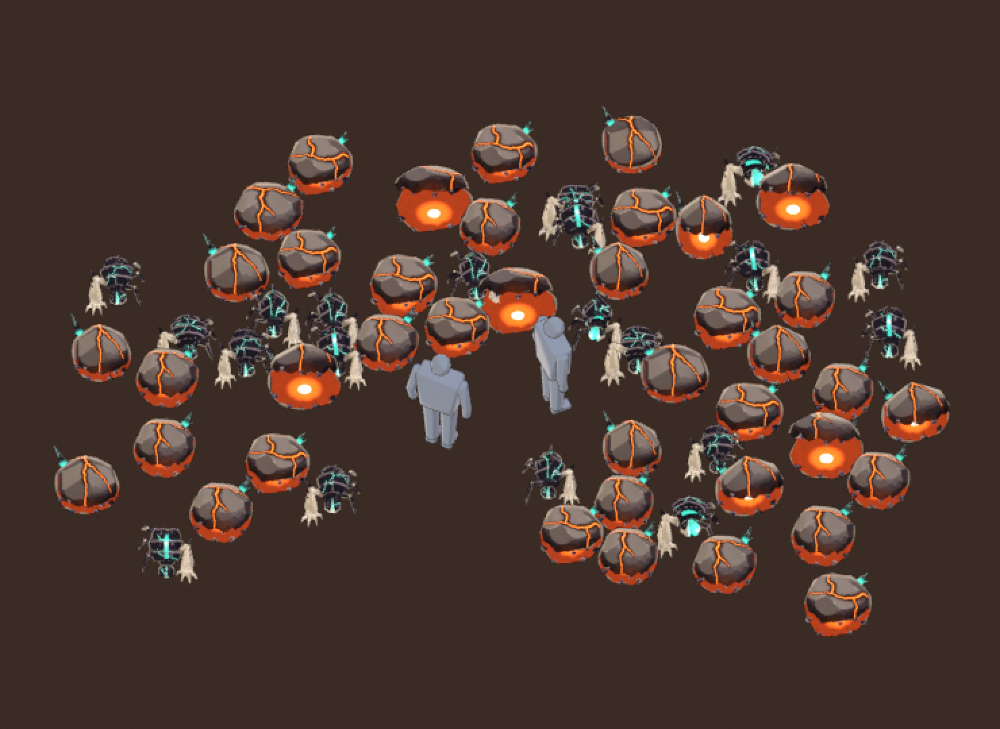

# Cinderling (The Unmade)

"A coal that learned to hate." The most common Cinder Wastes fodder: a lumpy, knapped coal that hops
at you and splits open along a jagged molten grin. There is one base look and two variant looks, and
each is a separate GLB. All three are built, painted, rigged on GF_Swarm_v1, animated, exported and
reviewed from code. **Status: `ai_final_pending_user_approval`.** The user gives the final visual approval.

| | |
|---|---|
| Content row | `cinderling` in `content/sheets/enemies.csv`: Swarm, P0, hp 30, speed 3.2, radius 0.42 × scale 1.0, contact damage 8, mass 1.0, `Chaser`, packs of 3-6, colour `#E0662B`, greybox shape Blob |
| Lore links | The Slag King summons it (`assets/content/bosses.ron`: `Summon(enemy: "cinderling", count: 6 / 8)`, "the furnace spits cinderlings"). The Bellows mini-boss "breathes fire and cinderlings" |
| Verb | **HOP**: one round lump that squashes, springs and chomps. It reads in under a second at about 45 px |
| Build | `tools/blender/gf_assets/enemies/cinderling.py -- --variant base\|v1\|v2`, then `enemies/cinderling_crowd.py` |



## The three looks (one file each)

| File | Look | What changes |
|---|---|---|
| `assets/models/enemies/cinderling.glb` | **Grinning coal** (base) | a round lump with a swollen brow on its right, a Y of seams from the crest, and three obsidian shards on the back-left haunch |
| `assets/models/enemies/cinderling_v1.glb` | **Split-crown** | taller, with a keel along the crown, one long seam split front to back and a diagonal branch, two long shards, **mirrored**, and a lighter, higher hop |
| `assets/models/enemies/cinderling_v2.glb` | **Heavy-brow** | squat and wide, with a massive brow cracked right across, a bigger underbite with tusks, four small shards, and a low, heavy hop |

The rule is the clinker's (art/enemies/clinker/README.md). `cinderling.glb` alone is complete. Every file
has the identical `GF_Swarm_v1` skeleton, the same socket names and the same clip suffixes. Clips are
named `{file_stem}_{clip}` (`cinderling_move@loop`, `cinderling_v1_move@loop`, ...). To add roster width,
the client picks one stem per spawn from meta.json `variant_set` and looks clips up with
`format!("{stem}_{clip}")`. In the 40-copy horde a single look reads as cloned: every copy faces the
heroes, so the same crack pattern repeats 40 times.

## Design decisions

* **Silhouette and verb.** It is a round lump 0.94-1.0 m across and 0.64-0.74 m tall (0.29-0.34 × the
  2.2 m hero, below the waist). Its footprint is 2.2-2.4 × the 0.42 m collider radius. The ONE verb is the hop. The rest of the outline is a single
  small obsidian spike on one back corner, so the game-size silhouette stays a blob. That keeps it apart
  from the clinker at a glance: a round lump against a long, legged crawler (see the crowd sheet, where
  the two mix).
* **The maw is the character.** The coal is split across the front by a jagged crack. The lower half is
  an underbite jaw that juts forward, with dark obsidian fangs. The upper half is a lid, hinged at the
  back on the `head` bone. The split follows a designed sawtooth: teeth about 0.2 m apart and 0.1 m from
  peak to trough. The boundary vertices are snapped onto that surface, so the teeth are big and clean,
  not a zigzag of every small triangle. At rest the lid sits 5.5° open, so a deep red, jagged grin
  smoulders under the crown. The mouth has no eyes and no face (the Unmade are eyeless). The grin and the
  hop carry the hate.
* **The wind-up is the telegraph.** In `windup` the coal squashes low, rears back and the lid opens 46°
  over a white-hot throat. That throat is the one big bright shape a cinderling ever shows. Its
  white-hot core sits deep in the throat, under the lid, so it never shows at rest. Glow at game size
  goes from 13-18 % of the creature's pixels at rest to 51-54 % when loaded. In a horde, "which one
  is about to bite" reads before the engine's red-white decal.
* **Value plan (figure/ground).** The Cinder floor (`#3A2C24`) is dark and warm. The crown is **ash**,
  the burnt-out skin of a coal, painted on every up-facing facet by facet orientation (warm light grey
  `#7B7068`, with `#B0A396` brush strokes on the knapped ridges). The flanks and jaw are coal black with
  anthracite glints (`#6F6878`), and the ink closes the outline. In the 1x in-game render 82-88 %
  of the non-glow body pixels are brighter than the floor (the approved clinker: 66 %). The dark jaw and
  the ink frame the lump.
* **Glow budget.** It is the most common fodder, and the player's Flame element is orange (`#FF7A1A`).
  So the rest glow is kept low: three or four tapered molten seams across the ash (a hot orange core
  `#FF8A3A`, a burnt lip, and a dim ember spill), plus the deep ember-red throat ring `#6A1E06` behind the
  teeth. The only white-hot shape is the throat revealed by the wind-up, the attack and the hit: a pool
  of pale peach (`#FFF3D6` at the centre, `#FFD9B0` at its rim) on the throat floor that steps straight to
  the hot orange `#FF6B1A`, never through the player gold `#FFC940` (see "Review fix" below). The first
  pass carried about 20 % glow at rest, and a white-hot patch showed in every rest gap. At horde density
  that was a sea of fire, and it stole the wind-up's contrast.
* **Seams, not a web.** Random-walk cracks read as letters on a 45 px dome ("Jf", "rK"), and a
  four-way split reads as a cross. The seams are drawn by hand per look (a Y, a keel split with a
  diagonal branch, a cracked brow arc). They are wobbled like a brush line and taper from about 40 mm
  at the crest to about 18 mm at the ends.
* **Faction: The Unmade, the Slag King's brood.** The materials come from `gfa_spec.FACTIONS["unmade"]`:
  slag for the coal (its light plane pushed pale into ash), obsidian for the fangs, molten for the glow
  (the Slag King's ramp; the hot tone sits beside the row colour `#E0662B`), and obsidian and obsidian_wet
  for the growth. The anti-life that woke the coal shows as **one** fused cluster of black obsidian
  crystals on one back corner, glowing dim teal (`#1F8F7E` → `#2FBFA8`, with no mint-white core) where
  it bursts out of the coal, with one bold teal seam. That is about 1 % of the pixels. It is the faction
  mark and the asymmetry marker: the wrong geometry is the swollen brow on one side, the growth on the
  other, and a mouth that sags to one side. There are no player colours, no `#7CFF6B`, and no red-white.
* **Paint.** This is the gf_assets NPR painter (`gfa_paint`). Facet value planes are picked by facet
  orientation: coal below, ash on top, with soft brushy borders. It adds a few knapped facets (planar
  chisel cuts shared by both halves), brushy ridge strokes only on edges sharper than 40° (the first pass
  painted a triangle web of edge lines), cavity darks and AO shadow shapes, and a warm bounce of the maw
  painted on the lips. The textures are 512 px base colour + 512 px emissive, with the throat, fangs and
  growth given less of the atlas (`uv_zone_scale`).

## Rig and clips (GF_Swarm_v1, rigid skin)

| Bone | Drives |
|---|---|
| `root` | the hop height and the pounce (in place overall) |
| `body` | the jaw half, the throat bowl and the jaw fangs: squash and stretch by bone scale, with the base kept on the ground (scale about the pivot, then a matching drop) |
| `head` | the lid (the crown, its fangs and its throat vault), hinged at the back: rotate -X to open the maw |
| `tail` | the obsidian growth, which lags on every hop |
| `legs_a`, `legs_b` | unweighted: a blob has no legs (ENEMIES.md section 5) |

| Clip | Length | Notes |
|---|---|---|
| `idle@loop` | 1.5-1.7 s | smouldering breath (a slow squash), the lid breathing open over the ember, one gnash |
| `move@loop` | 0.37-0.43 s | **one hop**: a deep landing squash, a stretch at push-off, the apex (0.13-0.20 m), a stretch while falling, and the impact. The lid gnashes open on the rise and snaps shut on landing, and the growth lags. Play it at speed ÷ `move_cycle_m` (0.85-0.95 m per hop), about 3.5 hops/s at 3.2 m/s |
| `windup` | 0.5 s | dip, then squash low, rear back and open the lid 46° over the white-hot throat. It ends on the loaded pose, so the client can time-stretch it |
| `attack` | 0.5 s | a pounce-chomp: it springs about 0.4 m forward, the lid snaps shut at frame 5 (the contact hit), and it lands, gnashes and returns to rest |
| `hit` | 0.3 s | a squashed flinch back and to the side, the lid popping open, then it settles |
| `death` | 0.9 s | it swells, the lid bursts off and falls behind it upside down (its glowing vault up), the growth breaks away, and the coal slumps and crumbles to 2 % (a held final pose). Ember and ash VFX at `fx_core` belong to the engine |
| `spawn` | 0.5 s | extra, for `Summon`: it pops from a curled ember to full size and thuds down |

* **Sockets** (all on `body`): `hit_center`, `fx_core` (deep in the throat; the glow and the death
  burst), `fx_mouth` (the front of the grin) and `head_top` (status icons).
* **Facing.** The creature faces glTF +Z and stands on y = 0, so the engine turns it with
  `yaw(angle) * rot_y(PI)` (ENEMIES.md section 2).

## Metrics

| File | Look | Mirrored | Tris | Height (× hero) | Footprint (× collider r 0.42) | Textures | Texel density (median) | Glow at rest / loaded (1x pixels) | Body brighter than the floor (1x) | move_cycle_m | GLB |
|---|---|---|---|---|---|---|---|---|---|---|---|
| cinderling | Grinning coal | no | 1186 | 0.70 m (0.32 x) | 0.96 x 0.97 m (2.3 x r) | 512 + 512 | 223 px/m | 14 % / 51 % | 88 % | 0.90 m | 0.41 MB |
| cinderling_v1 | Split-crown | yes | 1192 | 0.74 m (0.34 x) | 0.94 x 0.94 m (2.2 x r) | 512 + 512 | 219 px/m | 13 % / 51 % | 82 % | 0.95 m | 0.39 MB |
| cinderling_v2 | Heavy-brow | no | 1278 | 0.64 m (0.29 x) | 1.00 x 1.01 m (2.4 x r) | 512 + 512 | 211 px/m | 18 % / 54 % | 85 % | 0.85 m | 0.46 MB |

The budget is 600-1,500 tris for a swarm (the clinker looks are 1,004-1,080). Glow and figure/ground are measured on the
72 px true-size key-pose crops through the game camera (`work/<key>/<key>_pose_*_ingame_22.png`): glow = bright orange
pixels, body = the non-glow creature pixels. The approved clinker scores 66 % on the same body measure.

There is one material (base colour + emissive), no Draco or meshopt, and every file passes
`gfa_validate.py`. The game camera shows about 49 px/m, so the 512 px textures (211-223 px/m median
texel density) are oversampled roughly 4×.

## Review fix: no gold ring in the throat

The art review scored the cinderling 7.5/10 with one must-fix: in the wind-up, 7 % of the pixels sat within
dE 20 of the player gold `#FFC940`, because the throat dwelt in the `#FFC24B` band as a gold ring round the
white-hot core. There were two causes:

* The old ramp blended core → hot in sRGB over half the 0.28 m radius, and the throat floor never reached the
  peach core (the texture max was `#FFA364`). Under the ×1.6 emission gain, red clips first, so that light
  orange showed as gold, then as pale yellow.
* The painted base under the glow was the glow colour itself. The throat bowl faces the toon key light when
  the lid opens, so the lit full-value orange base plus the emission washed the orange itself toward gold
  (`#FFB83B`).

The fix is in `cinderling.py` (`Build.maw_stops`), using the new additive `stops` option of the `gfa_paint`
emit ramp. A pool of pale peach (`#FFF3D6` → `#FFD9B0`) is laid out from each look's throat floor (its
distance to `fx_core`). It steps straight to the hot orange `#FF6B1A` in about 1.5 cm, blended in linear
light. The base under the orange bowl is half value, and it returns to the glow colour by the ember-red
ring that the rest pose shows.

| Look | Gold pixels, wind-up loaded | Gold pixels, hit |
|---|---|---|
| Grinning coal | 6.8 % → 0.0 % | 3.2 % → 0.2 % |
| Split-crown | 7.2 % → 0.0 % | 2.0 % → 0.1 % |
| Heavy-brow | 6.5 % → 0.0 % | 4.5 % → 0.2 % |

At rest, the 1x game-camera crops differ by only a handful of pixels. In close-ups, the rest gap shows the
deep core as white instead of yellow. The glow and figure/ground shares are unchanged to within 0.3 points. In the 40-copy horde, the gold share drops from 1.4 % to 0.2 %; what remains is single 1 px
pixels on the lit seam cores. See `reports/cinderling_review_fix.png`, which shows each look before
(0b0e701) and after, with a gold-band mask, the hit poses, the rendered colour run from orange to the core,
and the painted textures. It is regenerated with
`python tools/blender/gf_assets/enemies/cinderling_fix_sheet.py <pre-fix work dir>`.

## Files

```text
art/enemies/cinderling/
  README.md, status.json, .gitignore (work/, *.blend1)
  source/<key>.blend            model + rig + clips + final material (Git LFS)
  textures/<key>_basecolor.png, <key>_emissive.png   (Git LFS)
  reports/<key>_review.png      per look: turnaround, size vs the hero, in-game 1x/3x (facing / away),
                                silhouette, key poses at game size, clip key frames, textures, palette
  reports/<key>_build_report.json
  reports/cinderling_crowd_review.png   the three looks beside the clinker and the hero, the lineup at game
                                size, the 40-cinderling horde mixed with 20 clinkers at true 1080p size (+
                                silhouette, value-only, the 4-player 28 m view, 2x), the hop cycle per look
  reports/cinderling_crowd.png  the horde, 2x nearest
  reports/cinderling_review_fix.png   the art-review fix, before / after (the throat's gold ring)
  work/                         local renders (git-ignored)
assets/models/enemies/<key>.glb + <key>.meta.json
tools/blender/gf_assets/enemies/cinderling.py, cinderling_crowd.py, cinderling_fix_sheet.py
```

## Rebuild

```text
set BL="C:\Program Files\Blender Foundation\Blender 5.2\blender.exe"
for %v in (base v1 v2) do %BL% -b --factory-startup --python-exit-code 1 -P tools/blender/gf_assets/enemies/cinderling.py -- --variant %v
%BL% -b --factory-startup --python-exit-code 1 -P tools/blender/gf_assets/enemies/cinderling_crowd.py
python tools/blender/gf_assets/gfa_validate.py assets/models/enemies/cinderling.glb
```

One look builds in about 50-90 s on the CPU. `--preview` renders flat zone-colour views of the mesh in
about 10 s, for shape iterations. The crowd script imports the shipped GLBs, so it also checks that they
load, skin and animate in a glTF importer. It also needs the clinker GLBs for the mixed horde.

## Open items

* The user's visual approval of all three looks.
* Engine work (in `crates/`, not done here): load the GLB per key, pick a look per spawn from
  `variant_set`, and map sim state to clips: `move@loop` at speed / `move_cycle_m`; `windup` time-stretched
  to the telegraph (the `Chaser` behaviour has no wind-up state yet, so `windup` / `attack` are ready for a
  contact pounce); `spawn` when the Slag King or the Bellows summons; `death` plus ember VFX at `fx_core`.
* docs/art/ENEMIES.md does not list the cinderling yet. A short entry could point here.
