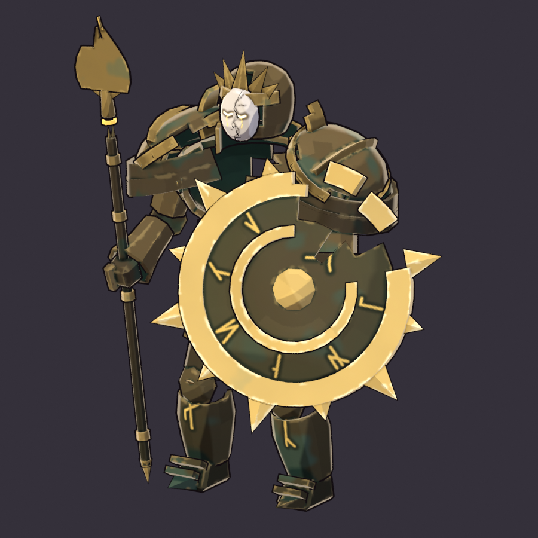

# Forge Warden (`forge_warden`)

**Status: AI build done, user approval pending.** meta.json says
`ai_final_pending_user_approval`, and `status.json` has stage `2_user_approval` set to `pending_human`.

This is the E2 "Warden Husk" from the user's enemy pack, mapped onto the content key `forge_warden`.
It is built end to end from code, with no concept art and no hand edits: model, hand-painted NPR
textures, a dedicated rig, eight clips, the GLB, validation and the review sheets.

```text
"C:\Program Files\Blender Foundation\Blender 5.2\blender.exe" -b --factory-startup --python-exit-code 1 ^
    -P tools/blender/gf_assets/enemies/forge_warden.py
python tools/blender/gf_assets/gfa_validate.py assets/models/enemies/forge_warden.glb
```

One run takes about 30-50 s on the CPU. `--preview` renders the geometry in flat zone colours in about
2 s. `--look` paints the textures into `work/look/` (about 20 s, no rig and no export) and renders three
checks: the 3/4 view, a close view down the 55° camera, and the game camera at true pixel size. Use it
for the value hierarchy. `--poses [--pick] [--game]` adds the rig and clips (no paint, no export).



| Sheet | What it shows |
|---|---|
| [reports/forge_warden_review.png](reports/forge_warden_review.png) | the standard toolkit review: rest-pose turnaround, 4 frames of every clip, in-game camera 1x / 3x / silhouette, textures, palette |
| [reports/forge_warden_scale.png](reports/forge_warden_scale.png) | front lineup with the 2.2 m hero mannequin and height bars, then six key poses through the game camera at true 1080p pixel size (1x) and 3x, plus the game-size silhouette |
| [reports/forge_warden_clips.png](reports/forge_warden_clips.png) | the key poses of all eight clips (the contact sheet of key frames per clip) |
| [reports/forge_warden_review_fix.png](reports/forge_warden_review_fix.png) | before and after the art review fixes, compared through the game camera (6x and 3x crops at 1x) and in the 3/4 view |

## Art review fixes (2026-09-25, score 7/10)

| Must-fix | Fix |
|---|---|
| The body and the halo shield were the same bright gold, so from the 55° camera the shield merged with the torso. | The body plates are repainted dark bronze `#5E5034` with verdigris shadows `#1B3029` and patina patches `#3D5E50`. The darker plates are `#3E3627`. All body gold (collar, diadem, crown, pauldron rims and ridges, flanges, buckle, spikes, the whole spear) moves to a new `trim` zone, a dull old gold `#86703F`. The new `gold` zone is only the halo ring, its rays and shards, the inner halo and the boss, at a slightly brighter `#D2B468`. Only the halo, the porcelain mask and the heart are bright now. |
| The broken runes on the shield ring and the pauldrons broke into white speckle at game size. | The 12 runes on the ring and the pauldron runes and cracks are gone. The shield face carries six big two-stroke runes (0.12 m, lines 0.026 m). The bite, the back, the chest and the greaves keep a few bold cracks or single big runes. Every rune and crack is a cold-gold line `#C9AA56` with a dim emission (core `#6E5626`), never near-white. Only the mask's eyes keep the hot white-gold glow. |
| The hollow-armour read was invisible at game size: it read as a solid golden paladin. | The husk is split open down the sternum: a jagged V from the collar to the belly lames, a little toward the warden's right (screen left, clear of the shield). The collar is open ±58° at the front, and the breastplate splits into two pectorals with ripped inner edges. The heart is bigger (radius 0.095 m, it was 0.075 m) and sits lower and further forward, at (-0.06, -0.02, 1.62). The 55° camera now looks down into a verdigris-black void, 15-20 px across at 1x, with the heart glowing in it. The void's emission is tightened to the skins right around the heart. |

The rig, the clips, the sockets and the silhouette are unchanged, except that the `core` bone and the
`fx_core` socket moved with the heart.

## Brief and content row

`content/sheets/enemies.csv` has Elite, Cinder Wastes, P0, hp 380, speed 2.2, radius 0.75, shield 80,
`Support(range: 6.0, shield: 60.0, interval: 4.0, keep_distance: 6.0)`, colour `#D9B45A`, greybox
Spire and scale 1.2. Its line is "Wraps nearby Unmade in forge-shields. Kill it first." The pack
brief (docs/art/ENEMIES.md section 7) is a corrupted war-construct of the dead pantheon: faded
god-bronze plates over an **empty** interior, a cracked porcelain god-mask with cold gold leaking from
the eye slits, a huge broken-halo shield and a shattered spear. Its verb is **THE WALL**.

## Design decisions

* **The silhouette is the shield.** It is a fragment of a god's ring, 1.33 m across at the ring and 1.7 m with its rays:
  - a thick gold halo ring with twelve chunky rays, alternating long and short;
  - a dark verdigris bronze dome inside the ring, with a raised inner halo and a boss;
  - a jagged bite torn out of the upper outer edge, with two ring shards floating in the gap.

  It is carried on the left arm, forward and out, 24° toward the left and leaning back 17°. From
  the 55° camera it therefore sticks out of the body's outline as a round, serrated disc: see the
  game-size silhouette in the scale sheet. The halo ring is the **only** bright metal on the model,
  and the body behind it is dark bronze. The dome is darker too, so the ring reads as a halo even at
  1x and never merges with the torso.
* **Hollow armour, visibly.** Every plate is a real thick shell (`gfa_shell.thick_patch`) whose inner
  skin is painted as a verdigris-black void lit from within by a cold-gold heart that floats in the
  chest. The plates also leave gaps:
  - the husk is **split open down the sternum**, a jagged V from the wide-open collar down into the
    belly lames. This is the gap the game camera sees: it looks down into the void, where the heart
    floats under the mask;
  - the belly lames are split at the front;
  - the waist is a gap;
  - the arm segments float apart;
  - the greaves and cuisses are open at the back;
  - the cuirass has a torn hole in the back, and the heart shows through it.

  The helm's face opening is wider than the mask, so the darkness shows around it: there is no face
  behind.
* **The head** is small and sunk between the pauldrons. It has a bronze dome, an old-gold diadem and a
  five-ray crown (a dead sun god). The porcelain mask is split into two halves along a jagged crack,
  on the bones `mask_L` and `mask_R`, so the death clip can break it apart last. Its closed eyes
  glow cold gold, with tears of light below them.
* **The spear** is shattered: the shaft snaps under the head, and the head floats above the splinters
  on a glowing band. Its blade is snapped too. It stays upright in the right fist, as a counter-line
  to the disc.
* **Palette** (Fallen Godworks, `gfa_spec.FACTIONS`):

  | Part | Colour |
  |---|---|
  | armour (dark god-bronze) | `#5E5034`, verdigris shadows `#1B3029`, patina `#3D5E50`, light plane `#8E7B4E` |
  | darker secondary plates | `#3E3627` |
  | body trim (old gold) | `#86703F` → `#B49A5A` |
  | shield face | `#524A33` |
  | halo gold (the only bright metal) | `#D2B468` → `#F6E9B8` |
  | porcelain | `#DCD6C9` |
  | void | verdigris-black `#0C1814`, dim cold gold `#6A5220` only right around the heart |
  | heart | `#E0C470`, glowing `#B8963E` → `#E0C470` → `#FFF4D0` |
  | runes and cracks | cold gold `#C9AA56`, dim emission `#3A2C10` → `#6E5626` |
  | eyes (the one hot decal) | `#8A6A28` → `#D4B45A` → `#FFF4D0` |

  There are no player colours and no red-white. The gold stays below the saturation of the player
  gold `#FFC940`.
* **Paint** follows the toolkit's NPR rules:
  - flat value planes and per-plate values;
  - verdigris patina patches and painted contact shadows in the verdigris hue;
  - brushy edge highlights and cavity darks;
  - the plates darken toward the feet.

  The runes are few and big, at cold-gold value:
  - six two-stroke glyphs on the dark shield face, and none on the bright halo ring;
  - three on the back;
  - one on each greave.

  The pauldron tops, which face the camera, carry none. Single bold cracks leak dim light from the
  shield's bite, the back hole and the torn sternum. The porcelain has a hairline crack and no
  emission except the eyes.

## Size and footprint

| | |
|---|---|
| Height | 2.79 m to the crown's tallest ray (1.27 × the 2.2 m hero; the tier allows 1.1-1.35 ×). The helm top is about 2.54 m. |
| Footprint | the collider is radius 0.75 × scale 1.2 = 0.9 m; the body plus shield span 2.27 × 1.32 m (2.5 × the collider radius) |
| Origin | on the ground under the pelvis; faces Blender -Y = glTF +Z (the engine uses `yaw(angle) * rot_y(PI)`) |

## Rig: `GF_ForgeWarden_v1` (30 bones)

* **Core:** the 23 GF_Hero_v1 core bones, with the same names and parents (`root`, `pelvis`,
  `spine_01..03`, `neck`, `head`, `clavicle/upperarm/lowerarm/hand_L/R`, `thigh/shin/foot/toe_L/R`),
  so hero clips can be retargeted later.
* **Extras:**
  - `pauldron_L/R` (the floating shoulder plates);
  - `core` (the heart);
  - `mask_L/R` (the two halves of the mask);
  - `shield` (a child of `lowerarm_L`, pivot at the handle);
  - `spear` (a child of `hand_R`, pivot at the fist).
* **Roll convention** (Ashen Covenant): local +Y runs along the bone and +Z toward the front. Every
  bone has `use_deform`, and none are connected, so floating plates can translate.
* **Skinning:** rigid. Every plate sits on one bone at weight 1.0, because the armour is hollow and
  nothing deforms.
* **Rest pose:** the guard stance, with the shield up in front and the spear upright.
* **How the clips are solved** (`gfa_rig_dedicated`), on every frame:
  - FK for the spine, head and floating plates;
  - two-bone IK that plants the sabatons;
  - the props drive the arms: the shield is placed relative to the chest (or blended to the ground in
    the death), the forearm and fist follow it rigidly, and the upper arm aims at the elbow.

  Then every frame is keyed. Loops are periodic functions, so they close with no hitch.

## Clips (30 fps; client names `forge_warden_<clip>`)

| Clip | Length | What | Brief name |
|---|---|---|---|
| `idle@loop` | 2.0 s | shield-up guard: breathing, hovering pauldrons, the heart spins and pulses | idle |
| `move@loop` | 0.8 s | heavy walk with planted steps and the shield held forward; `move_cycle_m` 1.571 m (natural speed 1.96 m/s against the row's 2.2) | walk@loop |
| `windup` | 0.6 s | the halo shield rises up and back while the body coils and crouches (it ends on the loaded pose) | windup |
| `attack` | 0.7 s | shield bash: the body lunges 0.3 m, the rim drives forward and down, a hold, then back to the guard | shield_bash |
| `hit` | 0.33 s | a flinch back; the mask rattles | hit |
| `death` | 2.2 s | the binding fails: the plates drop inward into a heap, the shield topples flat, the spear clatters down, the heart goes out, and last the mask cracks into its two halves (held) | death |
| `cast` | 1.2 s | support pulse: gather, then the spear slams down and the halo is raised overhead, face up (the belly opens to show the heart) | cast_shield |
| `shield_up` | 0.4 s | brace: the shield comes up to the eyes, crouched behind it (hold the last frame) | shield_up (guard) |

The first six names are the contract's required set, `cast` is the elite's Support clip, and
`shield_up` is an extra. meta.json has `clip_aliases` (`walk@loop`, `shield_bash`, `cast_shield` →
the shipped names), `clip_roles` and `clip_seconds`.

**Sockets** (empties on bones, exported as joint children):

| Socket | Where |
|---|---|
| `hit_center` | the chest (spine_03) |
| `fx_core` | the heart: the glow, and the death sparks / burst |
| `head_top` | above the crown (status icons) |
| `shield` | the shield face centre: the forge-shield pulse VFX of the Support behaviour |
| `attack_origin` | the front of the rim: the bash impact |

## Metrics (last build)

| | |
|---|---|
| Triangles | 7,526 (elite budget 4,000-8,000) |
| Textures | base colour 1024² and emissive 1024² (PNG, embedded); one material `M_forge_warden` |
| UVs | 36 % coverage, texel density about 149 px/m. The hidden void skins and thin rims are packed small, through the optional `uv_zone_scale` / `uv_small_islands` in `gfa_paint`. |
| GLB | about 1.9 MB, uncompressed (bevy_gltf 0.20 safe); `gfa_validate` OK with no warnings |
| Parts | 126 shell and detail parts in 8 paint zones: bronze, bronze_dark, gold (the halo only), trim, porcelain, void, glow, shield |

## Files

| Path | In git |
|---|---|
| `assets/models/enemies/forge_warden.glb` + `.meta.json` | yes (GLB through LFS) |
| `source/forge_warden.blend` | yes (LFS); textures referenced relatively |
| `textures/forge_warden_basecolor.png`, `_emissive.png` | yes (LFS) |
| `reports/*.png`, `reports/build_report.json`, `status.json` | yes |
| `work/` | no (local previews and review frames) |
| `tools/blender/gf_assets/enemies/forge_warden.py` | the build script |
| `tools/blender/gf_assets/gfa_shell.py`, `gfa_rig_dedicated.py` | new shared helpers this build added (thick shell patches; dedicated rigs with IK / prop-driven arms / per-frame clip baking) |

## Open points for the user and the engine

* This build needs the user's final visual approval.
* The client should play `move@loop` at `speed / move_cycle_m` cycles per second, and time-stretch
  `windup` to the sim's windup.
* Hold the last frame of `shield_up` and `death`.
* The shield's pulse VFX belongs at the `shield` socket, and the death sparks at `fx_core`. The
  emissive is authored at strength 1.0, and the engine scales glow brightness itself.
