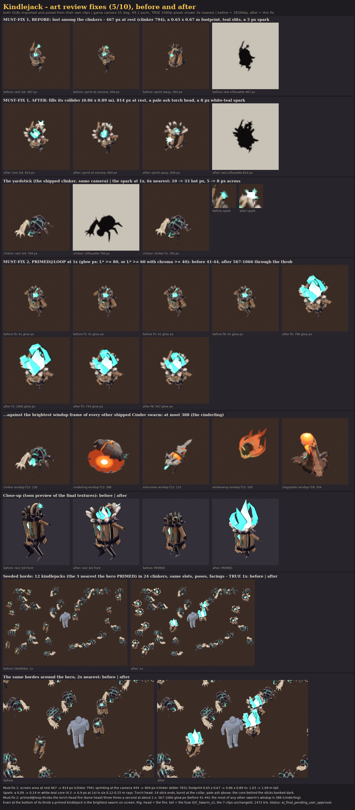

# Kindlejack: the Cinder Wastes bomber (The Unmade)

*"Runs at you. Then it is you who runs."* A bundle of kindling stuffed with Unmade fire, with a torch for a head. It
sprints at you on two obsidian stilts with its lit fuse streaming behind, then plants, and the fire in its torch head
blazes up and throbs until it bursts. It is built, painted, rigged on GF_Swarm_v1, animated, exported and reviewed
from code. **Status: `ai_final_pending_user_approval`.** The user gives the final visual approval.

| | |
|---|---|
| Content row | `kindlejack` in `content/sheets/enemies.csv`: Swarm, P0, hp 26, speed 4.6, radius 0.4 × scale 1.0, contact damage 0, `Bomber(trigger_range: 1.6, fuse: 0.9, radius: 2.2, damage: 32.0)`, packs of 1-2, colour `#FF7A1A`, greybox shape Blob |
| Faction | The Unmade (docs/art/ENEMIES.md section 4): obsidian, slag char, ichor teal |
| Verb | **RUSH**: a forward-leaning, lit torch-bomb that reads as "a running, lit bomb" in under a second at game size |
| Build | `tools/blender/gf_assets/enemies/kindlejack.py` (one script: model, paint, rig, clips, export, review, horde review) |
| Review fix | `tools/blender/gf_assets/enemies/kindlejack_fix_sheet.py` → `reports/kindlejack_review_fix.png` (before / after) |


## What the sim asks of the model

The sim's Bomber (`crates/gf_sim/src/enemies.rs`) runs at 1.1 × its speed toward the target. Inside
`trigger_range` it stops and is **PRIMED** for `fuse × telegraph_time`. It then despawns, and the engine's red-white
circle telegraph deals the radius-2.2 blast. So the model needs a sprint (`move@loop`), a primed read (`windup`, then
`primed@loop` for the rest of the fuse), the detonation (`attack`) and a separate death for a kindlejack shot down
before it blows. The `death_burst` column is empty, so that death is a smaller, sputtering burst rather than a
detonation.

## Art review fix (5/10)



The Cinder art review scored the first build 5/10 with two must-fix items. Both GLBs are compared in
`reports/kindlejack_review_fix.png`: imported, posed from their own clips and rendered through the game camera at TRUE
1080p pixels, with the shipped clinker and the other shipped Cinder swarms as yardsticks, and the same seeded horde
rendered with the old and the new kindlejack.

| Must-fix | Before (3836fda) | After |
|---|---|---|
| Lost among the clinkers: fill the 0.40 m collider (footprint 0.85-0.9 m) | 0.65 × 0.67 m footprint; 467 px at rest at 1x (clinker 794), 444 px sprinting at the camera | 0.86 × 0.89 m footprint; 814 px at rest, 804 px sprinting (clinker 794 / 783) |
| A unique signal: a 2-3 × spark (6-8 px) with a white-teal core | a 0.088 m spark (4.3 px), 10 hot pixels, 5 px across | a 0.14 m white-teal core (6.9 px) in six 0.12-0.15 m rays: 33 hot pixels, 8 px across |
| Crown sticks flared out like a torch head, lighter ash-bleached stick tops | a crown of short charred ends inside the outline | 14 stick ends flared about 35° off the axis into a ring about 0.65 m across, burnt black at the collar and bleached to pale ash `#CBC2B5` above: the one light top plane in the Cinder horde |
| Not "another dark teal-slit body" | teal slits between the sticks all round | thicker sticks; the core behind them is banked to a dark ember teal, so only the chest opening and the torch-head fire glow |
| The primed state must scream at 1x: a pulsing crown glow in `primed@loop` | a trembling swell: 41-44 glow px through the loop | the torch-head fire blazes to about 2 × and throbs three times a second: 567-1066 glow px through the loop. The brightest windup of any other shipped swarm is 388 (the cinderling), so even at the bottom of its throb a primed kindlejack is the brightest swarm on screen |

Glow px = pixels on the creature with L\* ≥ 80, or a saturated glow (L\* ≥ 60 and chroma ≥ 40), so an orange throat
counts as well as a teal one. The review measured "about 540 px, a clinker about 960" with its own crop. The sheet's
numbers are the 1x silhouette pixels of the rest pose at yaw -35°, and the ratio to the clinker goes from 0.59 to 1.03.

A first pass at the fire (round, pointed prisms painted white along the axis) read as a teal ice-crystal bouquet in
the lineup. The fire is now a teardrop heart that sways and hooks over, painted as the white-teal hot core, and four
flattened tongues that bulge out of the bowl and curl back in with a flick, painted saturated faction teal and deeper
at every tip. The primed fire rises above the swarm waist line (about 1.6 m at the throb's peak). That is deliberate:
it lasts only for the 0.9 s fuse, and the body itself stays at 1.09 m.

## Design decisions

* **Silhouette: a walking bundle of dynamite with a torch for a head.** Ten split sticks are tied at the waist and
  the neck by two jagged obsidian collars, the Unmade crust growing over the wood. Their bottom ends are cut at
  angles and flare below the waist. Their tops run on through the neck collar and flare out into a **torch head** of
  14 stick ends (four extra splints are pushed in through the collar). Some ends are splintered to a point, most are
  snapped off blunt, and two are burnt off short. A teal Unmade fire burns in the torch head. A lit fuse rises out of
  the fire and arcs back over the shoulders to a big white-teal spark. Two long obsidian stilt legs (digitigrade, with
  knee and heel spurs) carry it.
* **The Unmade's wrong asymmetry.** One long stick arm trails straight back with three charred twig fingers. The
  other arm is a snapped stump under a pair of obsidian shoulder shards. The front stick is snapped too, and the
  teal core bursts out of the torn chest opening.
* **Apart from the clinker and the cinderling.** It is 1.09 m tall (0.50 × the hero, at the waist line) with a
  0.86 × 0.89 m footprint, so it fills its collider and covers as much screen as a clinker. It is upright where the
  clinker is low and wide, and warm and pale-topped where the clinker is a violet-black shell with teal cracks. In the
  horde it reads as a ring of pale ash sticks around a teal fire with a white spark behind. The lineup and the
  40-copy horde in `reports/kindlejack_horde_review.png` show this.
* **Value plan at game size.** The wood is weathered and warm: faction bone warmed toward the row colour, a
  different value per stick, two sticks burnt black, scorched toward the neck. Around it are two dark obsidian bands
  and dark legs. On top, the pale ash ring of the torch head separates the kindlejack from the `#3A2C24` floor and
  from the dark clinkers. The teal accents are the chest opening, the torch-head fire and the spark.
* **The fuse is the RUSH read from above.** A runner coming at the 55° camera is foreshortened to its top. The fuse
  arcs back past the torch head's rim, so the spark hangs behind and above the fire as a second, separate light. In
  the sprint the fuse streams back and whips like a comet's tail, and the fire streams back in the bowl.
* **The primed read is the fire.** At rest and in the sprint the fire only fills the torch head's bowl. In `windup`
  it catches and flares twice while the bundle swells and the fuse burns down. In `primed@loop` it blazes to about
  2 × (on top of the 1.32 × swell) and throbs three times a second. The swell alone read only at detonation.
* **Palette (The Unmade only).** Obsidian `#1A1720` with an edge light of `#7D7078`. Slag char `#231A17` with
  ash-grey edges `#6E625A`. Wood `#94745A` / light `#D4B690` / shadow `#3E2822`, with a scorch of `#75482B`. The torch
  head is crown char `#33261F` bleached to ash `#CBC2B5` on its flared ends. The fuse cord is `#A8916E`. Ichor rim
  `#1F8F7E`, hot `#2FBFA8`, chest core `#8FF2D8`. The fire's heart runs `#E4FFF6` → `#B8FFE8` → `#8FF2D8` → `#2FBFA8`,
  its tongues `#B8FFE8` → `#2FBFA8` → `#1F8F7E`, and the spark core is `#E4FFF6`. The row colour `#FF7A1A` (which is
  also the Flame element colour) appears only as a painted, non-glowing tint in the wood and the scorch. The only glow
  is faction teal. There are no player colours, no `#7CFF6B` and no red-white.
* **Paint.** This is the gf_assets NPR painter: flat value planes per facet and per stick, a faint grain along the
  sticks, cavity darks, and broken brushy edge strokes. A plane gradient up the bundle axis scorches the wood toward
  the neck. A cylindrical gradient out from the bundle axis bleaches the torch head's sticks to ash beyond 0.2-0.27 m:
  broad value planes, one per stick, not speckle. The core's glow is an explicit ramp (gfa_paint `stops`) from the
  chest opening to a dark ember teal at the back. The fuse cord carries painted bands, and only its last 12 cm glow,
  fading into the spark. A burnt rim and a narrow teal spill frame the chest opening. UV islands are
  importance-weighted (wood 1.15 ×, torch head 1.1 ×, core, fire and spark small), 512 px, with a median of 140 px/m.

## Iterations (what the reviews at game size changed)

| Pass | Problem at game size | Change |
|---|---|---|
| 1 | Wide gaps between 8 sticks: a teal-striped barrel ("a teal thing") | Sticks nearly closed, a smaller core, one narrow chest opening |
| 2 | Wide flat planks between hoops read as a barrel with staves | Round, bent sticks with angle-cut ends that run through the collars and flare at both ends |
| 3 | 20 small dark crown splinters turned to speckle | Each stick's own charred end, 10 big ones, ash-pale at the tip, plus 4 inner splinters |
| 4 | A slim first pass looked *smaller* than a clinker in the horde, although its collider is twice as big | Girth G = 1.45 on every radial size (heights unchanged) |
| 5 | Spark and crown glow merged into one blob from above | The fuse arcs back, so the spark is a second light behind the crown |
| 6 | The sprint was invisible running toward the camera (the fore-aft leg swing is foreshortened) | A bigger bounce, side-to-side roll and twist, the fuse whipping, the arms flapping, the lifted leg kicking out |
| 7 | The chest core clipped to white | Chest core `#8FF2D8`; near-white only in the spark |
| 8 | Art review: still about half a clinker's screen area, the same dark body and teal slits | G 1.9, sticks 1.14 × thicker, the core held back and banked dark behind them, a wider stance, a longer trailing arm |
| 9 | Art review: no signal of its own | The crown flared into a pale ash torch head; a 0.14 m white-teal spark in longer rays |
| 10 | Art review: the primed state read only at detonation | A teal fire in the torch head (bone `head`) that blazes and throbs through `windup` and `primed@loop` |
| 11 | The first fire read as a white ice-crystal bouquet | A swaying teardrop heart as the white-teal core, four flattened curling tongues in saturated teal |

## Rig and clips (GF_Swarm_v1, rigid skin)

| Bone | Drives |
|---|---|
| `root` | bounce, knock-back, the death sink |
| `body` | the sheaf (sticks, torch head, collars, core, shoulder shards) and both arms. Its scale is **the swell** |
| `head` | the torch-head fire. The pivot is the neck collar's centre, so scaling it makes the fire **blaze and throb** |
| `legs_a` / `legs_b` | the left / right stilt leg (pivot on the hip line) |
| `tail` | the fuse and its spark. The pivot is the fuse's root, so scaling it **burns the fuse down** toward the fire |

The first build had the fuse on `head` and the arms on `tail`. The review fix needed a bone for the fire, so the arms
now ride rigidly on `body` and the fuse trails on `tail` (ENEMIES.md: `tail` is the trailing mass). The six bone names
and the seven clip names are unchanged.

The legs are posed in world space (`Poser.legs` in the script). They ride on the hip point the body carries but never
inherit its lean, twist or swell, so the feet stay on the ground while the bundle inflates to 1.32× (and 1.85× at the
blast).

| Clip | Length | Notes |
|---|---|---|
| `idle@loop` | 1.4 s | bouncing on its toes, the bundle breathing (a 3 % swell), the fuse swaying, the fire flickering in the bowl, one twitch |
| `move@loop` | 0.4 s | the sprint, two strides per cycle. The body leans in and rolls, the fuse streams back and whips, the fire streams back, the lifted leg kicks out. `move_cycle_m` 0.9: at the Bomber's 1.1 × 4.6 m/s that is about 5.6 cycles (11 strides) a second |
| `windup` | 0.5 s | PRIMED begins: a skid (lean back, legs braced), the fire catches and flares twice while the bundle swells (1.14×, 1.22×, 1.29×) and the fuse burns down to a stub. It ends on `primed@loop`'s first frame, so the loop follows with no hitch |
| `primed@loop` (extra) | 0.33 s | PRIMED: loop it after `windup` for the rest of the fuse. The fire blazes at about 2 × and throbs (± 17-22 %) three times a second, the swell pulses 1.28-1.36× |
| `attack` | 0.37 s | the detonation from the loaded pose: the fire flashes up, peak swell 1.55×, blast 1.85×, then the pieces fly and shrink to 1 %. The blast itself is the engine's VFX at `fx_core` |
| `hit` | 0.3 s | a flinch back with a squash; the fuse and the fire whip forward and gutter |
| `death` | 0.9 s | shot down: a stagger, a sputtering swell (the fire flares), a hitch, a second swell and a smaller pop. The pieces scatter and shrink to 2 %; the held pose is gone |

**Sockets:** `hit_center` (body, mid-bundle), `fx_core` (body, the chest core: the burst origin), `head_top` (body,
1.3 m) and the extra `fx_fuse` (tail: the spark, which moves down as the fuse burns). **Facing:** the creature
faces glTF +Z and stands on y = 0, so the engine turns it with `yaw(angle) * rot_y(PI)` (ENEMIES.md section 2).
meta.json `clip_map` says which sim state plays which clip.

## Metrics

| Tris | Height | Footprint at rest (w × l) | Textures | Texel density (median) | Emissive texels | GLB |
|---|---|---|---|---|---|---|
| 1,472 (budget 600-1,500) | 1.09 m (0.50 × hero) | 0.86 × 0.89 m (with the arm and the fuse) | 512 + 512 | 140 px/m | 20.8 k (8 % of the atlas) | 0.61 MB |

There is one material (base colour and emissive), no Draco or meshopt, and `gfa_validate.py` prints OK. The
footprint is within ENEMIES.md's 2.2-3 × radius guideline (0.88 m).

## Files

```text
art/enemies/kindlejack/
  README.md, status.json, .gitignore (work/, *.blend1)
  source/kindlejack.blend                 model + rig + 7 clips + final material (Git LFS)
  textures/kindlejack_basecolor.png, kindlejack_emissive.png   (Git LFS)
  reports/kindlejack_review.png           turnaround, size vs the hero (side, waist line), in-game camera at true
                                          size (1x / 3x, sprinting at the camera and away), game-size silhouette,
                                          key poses at true size (incl. the primed throb's peak and low), clip key
                                          frames, textures, palette
  reports/kindlejack_horde_review.png     lineup (hero, clinker, cinderling greybox, kindlejack sprint + primed),
                                          40 kindlejacks mixed with 24 clinkers at true 1080p size (+ silhouette,
                                          + the 28 m four-player view), 3 kindlejacks hidden in a 40-clinker horde,
                                          the sprint across and toward the camera, windup, primed@loop and attack
  reports/kindlejack_crowd.png            the 64-creature horde, 2x nearest
  reports/kindlejack_review_fix.png       the art review fix, before (3836fda) and after, measured at 1x
  reports/kindlejack_build_report.json
  work/                                   local renders (git-ignored)
assets/models/enemies/kindlejack.glb + kindlejack.meta.json
tools/blender/gf_assets/enemies/kindlejack.py, kindlejack_fix_sheet.py
```

## Rebuild

```text
set BL="C:\Program Files\Blender Foundation\Blender 5.2\blender.exe"
%BL% -b --factory-startup --python-exit-code 1 -P tools/blender/gf_assets/enemies/kindlejack.py
python tools/blender/gf_assets/gfa_validate.py assets/models/enemies/kindlejack.glb
```

`--preview` renders flat zone colours from four views and the game camera in about 5 s, for silhouette work.
`--crowd-only` re-renders the horde review from the shipped GLBs. The horde review imports `kindlejack.glb` and the
four clinker GLBs, so it also checks that they load, skin and animate in a glTF importer. It needs the clinker's
GLBs and `enemies/clinker.py` / `clinker_crowd.py`. A full build takes about 30 s on the CPU.

The before / after sheet needs the pre-fix GLB:

```text
git show 3836fda:assets/models/enemies/kindlejack.glb | git lfs smudge > BEFORE\kindlejack.glb
%BL% -b --factory-startup --python-exit-code 1 -P tools/blender/gf_assets/enemies/kindlejack_fix_sheet.py -- --before BEFORE
```

Put the pre-fix `work/kindlejack/` renders in `BEFORE\work\kindlejack\` to include the toon close-ups.

## Open items

* The user's visual approval.
* Engine work (in `crates/`, not done here): load the GLB, map the Bomber states to clips (Approach →
  `move@loop` at speed / `move_cycle_m`; PRIMED → `windup`, then `primed@loop` looped for the rest of the fuse; the
  despawn at the fuse's end → `attack` plus the blast VFX at `fx_core`; killed → `death`). Optionally attach a spark
  particle to `fx_fuse`.
* The cinderling's shipped GLB now exists. The lineup still shows the cinderling's in-game greybox, the shape the
  kindlejack's Blob greybox row shares.
