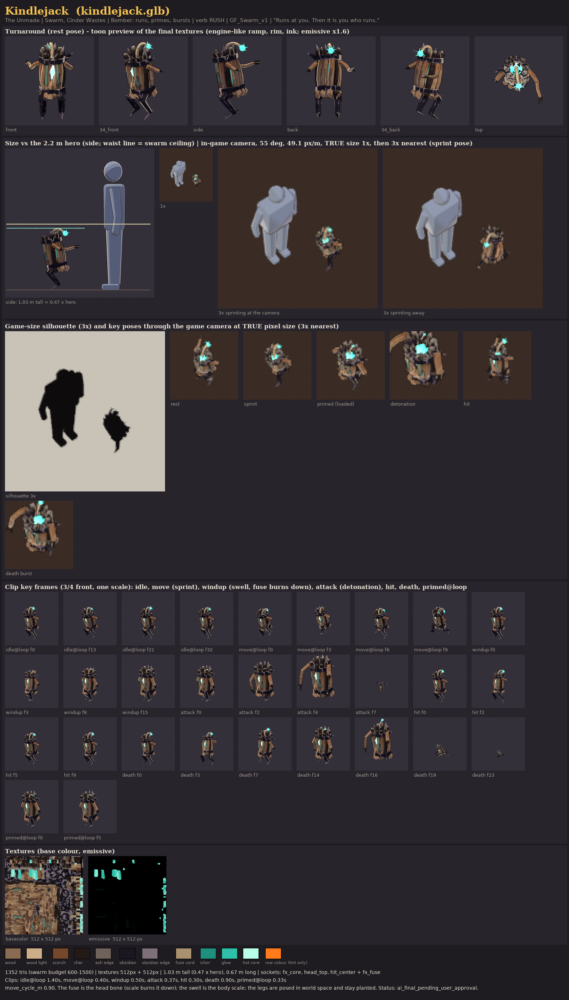

# Kindlejack: the Cinder Wastes bomber (The Unmade)

*"Runs at you. Then it is you who runs."* A tall bundle of kindling stuffed with Unmade fire. It sprints at you
on two obsidian stilts with its lit fuse streaming behind, then plants, swells and bursts. It is built, painted,
rigged on GF_Swarm_v1, animated, exported and reviewed from code. **Status: `ai_final_pending_user_approval`.**
The user gives the final visual approval.

| | |
|---|---|
| Content row | `kindlejack` in `content/sheets/enemies.csv`: Swarm, P0, hp 26, speed 4.6, radius 0.4 × scale 1.0, contact damage 0, `Bomber(trigger_range: 1.6, fuse: 0.9, radius: 2.2, damage: 32.0)`, packs of 1-2, colour `#FF7A1A`, greybox shape Blob |
| Faction | The Unmade (docs/art/ENEMIES.md section 4): obsidian, slag char, ichor teal |
| Verb | **RUSH**: a tall, forward-leaning figure that reads as "a running, lit bomb" in under a second at game size |
| Build | `tools/blender/gf_assets/enemies/kindlejack.py` (one script: model, paint, rig, clips, export, review, horde review) |



## What the sim asks of the model

The sim's Bomber (`crates/gf_sim/src/enemies.rs`) runs at 1.1 × its speed toward the target. Inside
`trigger_range` it stops and is **PRIMED** for `fuse × telegraph_time`. It then despawns, and the engine's red-white
circle telegraph deals the radius-2.2 blast. So the model needs a sprint (`move@loop`), a primed read (`windup`: plant,
swell, the fuse burning down), the detonation (`attack`) and a separate death for a kindlejack shot down before it
blows. The `death_burst` column is empty, so that death is a smaller, sputtering burst rather than a detonation.

## Design decisions

* **Silhouette: a walking bundle of dynamite.** Ten split sticks are tied at the waist and the neck by two jagged
  obsidian collars, the Unmade crust growing over the wood. Their bottom ends are cut at angles and flare below the
  waist. Their tops run on through the neck collar into a crown of charred stick ends: some splintered, some snapped
  off blunt, all pale with ash at the tip. A lit fuse rises out of the crown and arcs back over the shoulders to a
  teal-white spark. Two long obsidian stilt legs (digitigrade, with knee and heel spurs) carry it.
* **The Unmade's wrong asymmetry.** One long stick arm trails straight back with three charred twig fingers. The
  other arm is a snapped stump under a pair of obsidian shoulder shards. The front stick is snapped too, and the
  teal core bursts out of the torn chest opening.
* **Apart from the clinker and the cinderling.** It is 1.03 m tall (0.47 × the hero, under the waist line) and about
  0.4 m wide at the belly: taller and thinner than the cinderling's 0.84 × 0.67 m Blob greybox, and upright where
  the clinker is low and wide. In the horde it is a warm, upright bundle with a spark. The clinkers are violet-black
  shells with cream bone clubs. The lineup and the 40-copy horde in `reports/kindlejack_horde_review.png` show this.
* **Value plan at game size.** The wood is weathered and warm: faction bone warmed toward the row colour, a
  different value per stick, two sticks burnt black, scorched toward the neck. Around it are two dark obsidian bands,
  a charred crown whose ash tips separate the top from the `#3A2C24` floor, and dark legs. There are three teal
  accents: the chest opening, the glow inside the crown, and the spark. The spark is the brightest pixel, the
  "lit fuse" read.
* **The fuse is the RUSH read from above.** A runner coming at the 55° camera is foreshortened to its top. The fuse
  arcs back, so the spark hangs behind the crown's glow as a second, separate light. In the sprint the fuse streams
  back and whips like a comet's tail.
* **Palette (The Unmade only).** Obsidian `#1A1720` with an edge light of `#7D7078`. Slag char `#231A17` with
  ash-grey edges `#6E625A` and ash tips `#A39A90`. Wood `#8A6C52` / light `#CDAE88` / shadow `#3E2822`, with a
  scorch of `#75482B`. The fuse cord is `#A8916E`. Ichor rim `#1F8F7E`, hot `#2FBFA8`, chest core `#8FF2D8`, and
  `#B8FFE8` only in the spark. The row colour `#FF7A1A` (which is also the Flame element colour) appears only as a
  painted, non-glowing tint in the wood and the scorch. The only glow is faction teal. There are no player colours,
  no `#7CFF6B` and no red-white.
* **Paint.** This is the gf_assets NPR painter: flat value planes per facet and per stick, a faint grain along the
  sticks, cavity darks, and broken brushy edge strokes. A plane gradient up the bundle axis scorches the wood toward
  the neck, and another turns the charred ends to ash at their tips. The fuse cord carries painted bands. Only its
  last 5 cm glow, fading into the spark. A burnt rim and a narrow teal spill frame the chest opening. UV islands
  are importance-weighted (wood 1.2×, core and spark small), 512 px, with a median of 162 px/m.

## Iterations (what the reviews at game size changed)

| Pass | Problem at game size | Change |
|---|---|---|
| 1 | Wide gaps between 8 sticks: a teal-striped barrel ("a teal thing") | Sticks nearly closed, a smaller core, one narrow chest opening |
| 2 | Wide flat planks between hoops read as a barrel with staves | Round, bent sticks with angle-cut ends that run through the collars and flare at both ends |
| 3 | 20 small dark crown splinters turned to speckle | Each stick's own charred end, 10 big ones, ash-pale at the tip, plus 4 inner splinters |
| 4 | A slim first pass looked *smaller* than a clinker in the horde, although its collider is twice as big | Girth G = 1.45 on every radial size (heights unchanged) |
| 5 | Spark and crown glow merged into one blob from above | The fuse arcs back, so the spark is a second light behind the crown |
| 6 | The sprint was invisible running toward the camera (the fore-aft leg swing is foreshortened) | A bigger bounce, side-to-side roll and twist, the fuse whipping, the arms flapping, the lifted leg kicking out |
| 7 | The chest core clipped to white | Chest core `#8FF2D8`; near-white only in the spark |

## Rig and clips (GF_Swarm_v1, rigid skin)

| Bone | Drives |
|---|---|
| `root` | bounce, knock-back, the death sink |
| `body` | the sheaf: sticks, crown, collars, core, shoulder shards. Its scale is **the swell** |
| `head` | the fuse and its spark. The pivot is the fuse's root, so scaling it **burns the fuse down** toward the crown |
| `legs_a` / `legs_b` | the left / right stilt leg (pivot on the hip line) |
| `tail` | both arms (pivot at the shoulders): they flap in the sprint and fling up in the swell |

The legs are posed in world space (`Poser.legs` in the script). They ride on the hip point the body carries but never
inherit its lean, twist or swell, so the feet stay on the ground while the bundle inflates to 1.32× (and 1.85× at the
blast).

| Clip | Length | Notes |
|---|---|---|
| `idle@loop` | 1.4 s | bouncing on its toes, the bundle breathing (a 3 % swell), the fuse swaying, one twitch |
| `move@loop` | 0.4 s | the sprint, two strides per cycle. The body leans in and rolls, the fuse streams back and whips, the arms flap, the lifted leg kicks out. `move_cycle_m` 0.9: at the Bomber's 1.1 × 4.6 m/s that is about 5.6 cycles (11 strides) a second |
| `windup` | 0.5 s | PRIMED: a skid (lean back, legs braced), then the swell (1.2×, then 1.32×) while the fuse burns down to a stub and the arms fling up, with a tremble. It ends on the loaded pose. Time-stretch it to `fuse × telegraph_time` |
| `attack` | 0.37 s | the detonation from the loaded pose: peak swell 1.55×, blast 1.85×, then the pieces fly and shrink to 1 %. The blast itself is the engine's VFX at `fx_core` |
| `hit` | 0.3 s | a flinch back with a squash; the fuse whips forward |
| `death` | 0.9 s | shot down: a stagger, a sputtering swell, a hitch, a second swell and a smaller pop. The pieces scatter and shrink to 2 %; the held pose is gone |
| `primed@loop` (extra) | 0.33 s | optional: the loaded, trembling, pulsing swell, if PRIMED outlasts the windup |

**Sockets:** `hit_center` (body, mid-bundle), `fx_core` (body, the chest core: the burst origin), `head_top` (body,
1.24 m) and the extra `fx_fuse` (head: the spark, which moves down as the fuse burns). **Facing:** the creature
faces glTF +Z and stands on y = 0, so the engine turns it with `yaw(angle) * rot_y(PI)` (ENEMIES.md section 2).
meta.json `clip_map` says which sim state plays which clip.

## Metrics

| Tris | Height | Footprint at rest (w × l) | Textures | Texel density (median) | Emissive texels | GLB |
|---|---|---|---|---|---|---|
| 1,352 (budget 600-1,500) | 1.03 m (0.47 × hero) | 0.65 × 0.67 m (with the arms and fuse) | 512 + 512 | 162 px/m | 16.3 k (6 % of the atlas) | 0.57 MB |

There is one material (base colour and emissive), no Draco or meshopt, and `gfa_validate.py` prints OK. The
footprint is under ENEMIES.md's 2.2-3 × radius guideline (0.88 m) by design: the brief asks for taller and thinner
than the cinderling. The sprint stride and the primed swell reach about 0.85 m.

## Files

```text
art/enemies/kindlejack/
  README.md, status.json, .gitignore (work/, *.blend1)
  source/kindlejack.blend                 model + rig + 7 clips + final material (Git LFS)
  textures/kindlejack_basecolor.png, kindlejack_emissive.png   (Git LFS)
  reports/kindlejack_review.png           turnaround, size vs the hero (side, waist line), in-game camera at true
                                          size (1x / 3x, sprinting at the camera and away), game-size silhouette,
                                          key poses at true size, clip key frames, textures, palette
  reports/kindlejack_horde_review.png     lineup (hero, clinker, cinderling greybox, kindlejack sprint + primed),
                                          40 kindlejacks mixed with 24 clinkers at true 1080p size (+ silhouette,
                                          + the 28 m four-player view), 3 kindlejacks hidden in a 40-clinker horde,
                                          the sprint across and toward the camera, windup and attack at game size
  reports/kindlejack_crowd.png            the 64-creature horde, 2x nearest
  reports/kindlejack_build_report.json
  work/                                   local renders (git-ignored)
assets/models/enemies/kindlejack.glb + kindlejack.meta.json
tools/blender/gf_assets/enemies/kindlejack.py
```

## Rebuild

```text
set BL="C:\Program Files\Blender Foundation\Blender 5.2\blender.exe"
%BL% -b --factory-startup --python-exit-code 1 -P tools/blender/gf_assets/enemies/kindlejack.py
python tools/blender/gf_assets/gfa_validate.py assets/models/enemies/kindlejack.glb
```

`--preview` renders flat zone colours from four views and the game camera in about 5 s, for silhouette work.
`--crowd-only` re-renders the horde review from the shipped GLBs. The horde review imports `kindlejack.glb` and the
four clinker GLBs, so it also checks that they load, skin and animate in a glTF importer. It needs the clinker's
GLBs and `enemies/clinker.py` / `clinker_crowd.py`. A full build takes about 50-80 s on the CPU.

## Open items

* The user's visual approval.
* Engine work (in `crates/`, not done here): load the GLB, map the Bomber states to clips (Approach →
  `move@loop` at speed / `move_cycle_m`; PRIMED → `windup` stretched to the fuse, then `primed@loop`; the despawn at
  the fuse's end → `attack` plus the blast VFX at `fx_core`; killed → `death`). Optionally attach a spark particle to
  `fx_fuse`.
* The cinderling is not built yet. The comparison uses its current in-game greybox.
