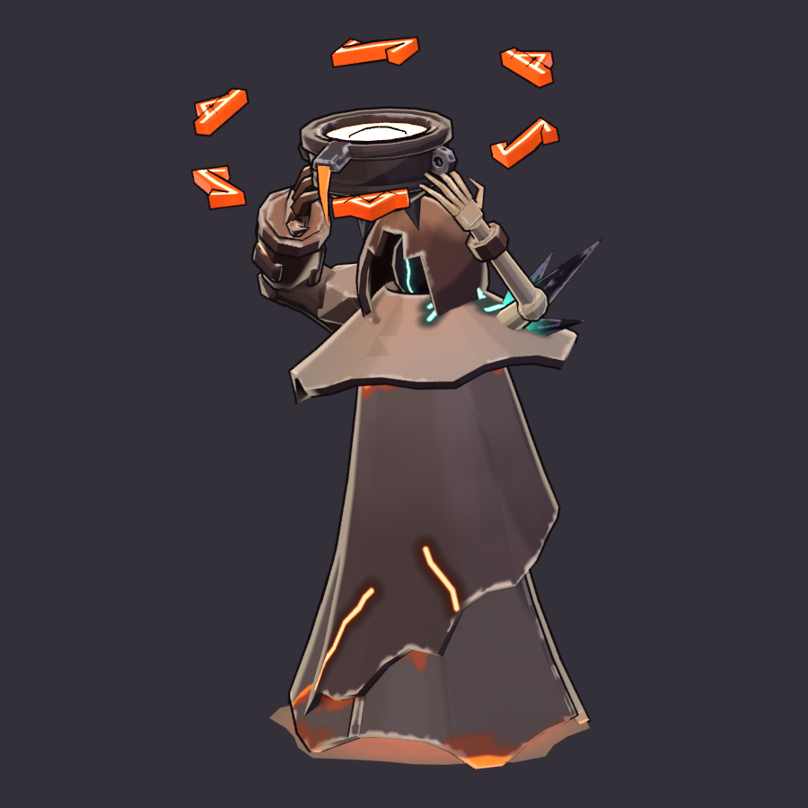

# Molten Hexer (`molten_hexer`)

**Status: AI build done, user approval pending.** meta.json says
`ai_final_pending_user_approval`, and `status.json` has stage `2_user_approval` set to `pending_human`.

There is no concept art for this enemy. It is designed from its content row and built end to end
from code, with no hand edits: model, hand-painted NPR textures, a dedicated rig, eight clips (plus
three aliases), the GLB, validation and the review sheets.

```text
"C:\Program Files\Blender Foundation\Blender 5.2\blender.exe" -b --factory-startup --python-exit-code 1 ^
    -P tools/blender/gf_assets/enemies/molten_hexer.py
python tools/blender/gf_assets/gfa_validate.py assets/models/enemies/molten_hexer.glb
```

A full run takes about 1.5-2 minutes on the CPU (the UV unwrap is most of it). Other modes:
- `--preview` renders the geometry in flat zone colours in about 5 s.
- `--look` paints into `work/look/` and renders the 3/4 view, a close 55° view and the game camera at
  true pixel size, with no rig and no export.
- `--poses [--game] [--clip <name>]` adds the rig and the clips, rendered in flat colours.



| Sheet | What it shows |
|---|---|
| [reports/molten_hexer_review.png](reports/molten_hexer_review.png) | the standard toolkit review: rest-pose turnaround, 4 frames of every clip, the in-game camera at 1x / 3x with the silhouette, the textures and the palette |
| [reports/molten_hexer_scale.png](reports/molten_hexer_scale.png) | the front lineup with the 2.2 m hero mannequin and height bars, 3/4 views of the idle and the beam firing, six key poses through the game camera at true 1080p pixel size (1x and 3x), the game-size silhouette, and the hexer among its biome-mates (forge_warden, six clinkers, two heroes) at 1x and 2x |
| [reports/molten_hexer_clips.png](reports/molten_hexer_clips.png) | the key poses of all eight clips |
| [reports/molten_hexer_review_fix.png](reports/molten_hexer_review_fix.png) | the art-review fixes, before and after: the turnaround, the Cinder flagstones at true pixel size with the floor-value mask, and the melt ramp with the gold-band check |

## Brief and content row

`content/sheets/enemies.csv` has these values:

| Field | Value |
|---|---|
| Class | Elite |
| Biome | Cinder Wastes |
| Phase | P0 |
| hp / speed | 300 / 2.4 |
| Collider | radius 0.62 × scale 1.1 |
| Resist | Flame 0.4 |
| Behaviour | `Caster(range: 13.0, windup: 1.2, width: 1.2, length: 14.0, damage: 36.0, cooldown: 3.8, keep_distance: 9.0)` |
| Colour | `#FF4D6D` |
| Greybox | Spire |

Its line is "Channels molten beams across the arena." In the sim (`gf_sim` enemies.rs, `Caster`),
the hexer keeps 9 m away. In range it stops, faces the target and holds still for the windup while the
engine draws a 14 × 1.2 m line telegraph from its feet. The beam lands when the windup ends.

The task brief asks for these things:
- a robed, tower-like caster of slag and molten god-metal;
- a beam focus (a floating crucible or a crown of molten runes) that reads in the outline;
- a long channel pose and a beam-sweep loop.

## Design decisions

* **Faction: The Unmade.** "Slag and molten god-metal" is the Slag King's material, and it is his
  biome. The hexer is a priest of his court: slag, molten, obsidian and pale bone, with a few teal
  Unmade cracks. It never uses the player colours or red-white. The row colour `#FF4D6D` only
  darkens the slag shadows toward a rose (`#120C0E`); the engine draws the telegraph.
* **The glow ramp skips forge gold.** Every glow runs white-hot `#FFF3D6` → peach `#FFC4A0` →
  molten orange `#FF6B1A` → rim `#C8400C`. The Slag King's forge gold `#FFC24B` is never used, because it
  sits dE 5 from the player gold `#FFC940`. The pour drip glows orange over a half-value base (gfa_paint
  emit `stops`). With the glow colour as its base, the toon key light plus the ×1.6 emission washed it to
  gold.
* **Verb: THE BEAM. The gimmick is the beam focus.** A floating iron crucible full of white-hot
  melt is held over the cowl. It is ringed by a **crown of molten runes**: six glyphs, 0.3 m each,
  lying flat in a ring 1.44 m across and tilted 12° toward the camera.
  - From the 55° game camera, the top of the silhouette is a white-hot disc inside a ring of orange
    glyphs, above a dark tower.
  - The ring is wider than the hem, so it clears the body outline on both sides.
  - The glyphs are written along the ring like an inscription:
    - A = eihwaz, a stem hooked opposite ways at both ends;
    - B = thurisaz, a stem with a hooked barb.

    They are bold molten strokes with a peach-white core line. Earlier drafts used an arrow and a fork
    (they read as a UI radial menu), a zigzag (it read as a Storm bolt) and a crossed stem (it read
    as an X).
  - The glyphs repeat every two runes, so any 120° turn of the ring is seamless.
* **The body is a spire of cooling slag**, a hooded tower 2.75 m tall, in **three uneven tiers**.
  Everything slumps toward the heavy slag arm, like a candle melting off true, so the hems run as
  diagonals, not parallel rings.
  - The cape is short and broad. It hangs longer under the slag arm and is hitched over the shard
    shoulder. Its wide sloped top faces the 55° camera.
  - The overrobe is ONE long crust tier (two of the old skirts merged). It sags to the right-front,
    where one torn tongue nearly reaches the pool, and it is hitched short over the left-back. Its hem
    is sheared toward the slag arm. Two bold molten fissures rise from the torn hem, so the long tier
    reads as cooling slag, not cloth.
  - The underskirt leans the other way. It shows as a wedge under the hitched-up side and puddles
    onto a dim molten pool. Its front is split into two panels on the hidden legs, so the robe steps
    when it glides.
  - Each tier leaks an orange seam of molten right under the lip of the tier above.
  - The cowl is tall and pointed, with an arched opening and an obsidian face split by one thin teal
    slit.
* **Unmade asymmetry that survives game size.**
  - The right arm is a massive slag arm with crust plates and bold molten cracks, and it cups the
    crucible.
  - The left arm is a thin, wasted pale-bone arm with long splayed fingers.
  - A spray of obsidian shards breaks out of the left shoulder, with teal leaking from its base and
    two bold teal cracks.
* **The value hierarchy.**
  1. the white-hot melt;
  2. the rune crown;
  3. the thin seams and the ground line;
  4. the teal accents.

  The body values are set against the real Cinder floor: mauve-brown flagstones at L\* 17-39 with
  oxblood gaps at L\* 6.
  - The slag body is a cool coal (`#3E3234`), a hue off the warm floor. It lightens up the overrobe
    (`#504446`) under the cape, and the underskirt is a lighter cooled crust (`#564B4B`), so the
    diagonal hem reads as a value step.
  - The up-facing crust is lifted to ash (`#6E625C`). The cape and the shoulder boulder are the
    planes the 55° camera sees first, so they get the palest ash (`#877A72`), above every floor stone.
  - The lift band sits between the robe bodies (their normals face up only 10-25°) and the lips, with
    little noise, so it never breaks a body into camouflage patches.
  - The first build darkened the slag to near-black `#1F1714` to keep it off the flat floor tone.
    On the flagstones that sank it into the gaps and dark stones (the art review below).
* **Paint.** The toolkit painter (`gfa_paint`) runs once. This build wraps it for that one call with
  its own passes, adapted from `enemies/slag_king.py`: per-part body values, a top-plane lift (with
  wider, paler bands on the cape and the shoulder boulder), edge strokes from each part's own creases
  only, a seam glow under every hem (driven by the real hem height of the tier above) and a ground
  underglow. `gfa_paint` itself is unchanged. The glyphs' hot core lines and the overrobe's two
  fissures are decals.

## Size and footprint

| | |
|---|---|
| Height | 2.75 m to the top of the rune crown (1.25 × the 2.2 m hero; the elite tier allows 1.1-1.35 ×). The cowl peak is at about 2.3 m. |
| Footprint | the collider is radius 0.62 × scale 1.1 = 0.68 m; the model spans 1.65 × 1.78 m (the crown and the hem), which is 2.4-2.6 × the collider radius |
| Origin | on the ground under the body; faces Blender -Y = glTF +Z (the engine uses `yaw(angle) * rot_y(PI)`) |

## Rig: `GF_MoltenHexer_v1` (34 bones)

* **Core:** the 23 GF_Hero_v1 core bones, with the same names and parents, so hero clips can be
  retargeted later. The legs are hidden under the robe. `thigh_L` / `thigh_R` carry the two front
  panels of the lowest skirt, and the other leg bones are unweighted.
* **Extras:**
  - `crucible` (a child of `root`) floats in chest space and blends to the ground when it falls;
  - `molten`, the melt surface, swells, surges and drains;
  - `crown` (tilt and lift along the ring axis) → `crown_spin` (the turn about its local +Y) →
    `rune_0..5` (radial offsets, a three-crest bob, the fall to the ground);
  - `pool`, the molten pool under the hem, spreads when the hexer dies.
* **Roll convention** (Ashen Covenant, via `gfa_rig_dedicated`): local +Y runs along the bone and +Z
  toward the front. Every bone has `use_deform`, and none are connected.
* **Skinning:** rigid. Every part sits on one bone at weight 1.0.
* **Rest pose:** the idle stance, with the crucible held over the cowl.
* **How the clips are solved:** a per-frame solver sets the spine, legs and ring by FK and places the
  crucible in chest space. The wrists then reach for the crucible by two-bone IK, and the hands follow
  its frame. Every frame is keyed, and loops are periodic functions.

## Clips (30 fps; client names `molten_hexer_<clip>`)

| Clip | Length | What |
|---|---|---|
| `idle@loop` | 2.4 s | hovering stance: the crucible bobs over the cowl, the ring turns 120° a loop, the melt breathes |
| `move@loop` | 0.8 s | glide: leaning in, the front robe panels step, the crucible trails, the ring tilts back. `move_cycle_m` 1.92 (the row's 2.4 m/s at natural playback) |
| `windup` | 0.6 s | the channel begins: it rears back and hoists the crucible, and the ring pulls in tight and whirls. It ends on the loaded pose |
| `attack` | 0.83 s | the beam: the crucible is thrust forward and tipped so its lip faces the target, and the ring swings upright in front of the lip. The fire key is at 0.23 s, the hold ends at 0.5 s, then it returns to the stance |
| `hit` | 0.33 s | a flinch: the crucible jolts and the runes are flung outward |
| `death` | 1.87 s | the tower sags and sinks into itself, the crucible slips and spills on its side, the runes drop into the spreading pool (held) |
| `channel@loop` | 1.0 s | **the long channel pose**: loaded and trembling, the ring whirling 240° a loop, the melt surging |
| `beam_sweep@loop` | 2.0 s | **the beam-sweep loop**: the fire pose held while the torso and the focus yaw ±28°, the ring spinning fast |

The first six are the contract's required set. Three aliases are exported as second tracks of the
same actions: `channel` = `channel@loop`, `beam` = `attack`, `sweep@loop` = `beam_sweep@loop`.
meta.json has `clip_aliases`, `clip_roles`, `clip_seconds`, `clip_events_s` and `caster_mapping`.

**Caster mapping for the client:**
1. When the sim enters its windup, play `windup`, then `channel@loop` until the beam lands.
2. When the beam lands, play `attack`.
3. For a held or sweeping beam, loop `beam_sweep@loop`.

Every clip starts and ends with the ring turned by a multiple of 120°, so the ring pose matches at
every clip boundary. The client may add spin to `crown_spin` on top.

**Sockets** (empties on bones, exported as joint children):

| Socket | Where |
|---|---|
| `hit_center` | the chest (`spine_03`) |
| `attack_origin` | the centre of the rune ring (`crown_spin`): the beam VFX leaves through the focus ring |
| `fx_core` | the white-hot melt (`molten`): the glow and the death burst |
| `fx_mouth` | the pour lip (`crucible`): the spill and drip VFX |
| `head_top` | above the crown (status icons) |

## Metrics (last build)

| | |
|---|---|
| Triangles | 4,800 (elite budget 4,000-8,000) |
| Textures | base colour 1024² and emissive 1024² (PNG, embedded); one material `M_molten_hexer` |
| UVs | 48 % coverage, texel density about 187 px/m median. The hidden inner skins and the pool are packed small (`uv_zone_scale`). |
| GLB | about 1.7 MB, uncompressed (bevy_gltf 0.20 safe); `gfa_validate` OK with no warnings |
| Parts | 61 parts in 10 paint zones: slag, arm, obsidian, bone, iron, molten, core, rune, void, pool |
| Game read (1x, five poses) | 5-11 % of the hexer's pixels within ±7 L\* of the Cinder flagstone gaps or dark stones (median L\* 36-42) |
| Gold check | 0 % of the emissive texels within dE 20 of the player gold `#FFC940` (the closest is dE 36); no rendered pixel in that band in any review frame |

## Art review fix (6.5/10)

The art review had two must-fix items. [reports/molten_hexer_review_fix.png](reports/molten_hexer_review_fix.png)
shows both, before (commit `4a12556`) and after, with the same cameras and poses. It is made by
`tools/blender/gf_assets/enemies/molten_hexer_fix_sheet.py -- --before <dir with the pre-fix GLB and emissive map>`.

1. **The robe read as a tiered cake and was lost in the dark floor.** It was three stacked,
   near-symmetric skirts under a cape, with parallel hems. 30-35 % of its pixels sat within ±7 L\* of
   the flagstone gaps and the dark stones.
   - Two skirts are merged into one long overrobe. The tiers now slump and lean with uneven,
     diagonal, torn hems (see "The body" above).
   - The slag is a cool coal instead of near-black, and the cape and shoulder tops are the palest ash.
   - Near the gaps: 26-35 % → 0.4-1.0 % of the pixels. Near the dark stones: 33-39 % → 5-10 %.
     Median L\*: 25-30 → 36-42.
2. **The crucible's melt ramp passed through forge gold.** 5.4 % of the emissive texels were within
   dE 20 of `#FFC940`, and the closest was dE 4.9.
   - The ramp is now white-hot → peach → orange, and the rune core lines are peach-white.
   - The pour drip glows over a half-value base.
   - Gold texels: 5.4 % → 0 % (the closest is now dE 35.6). Rendered gold pixels: 0.17 % → 0 % in the
     five game poses, and 616 → 0 in the 3/4 view.

The skeleton, clips, sockets, the crucible and the rune crown are unchanged. The tris went from 4,520
to 4,800.

## Files

| Path | In git |
|---|---|
| `assets/models/enemies/molten_hexer.glb` + `.meta.json` | yes (GLB through LFS) |
| `source/molten_hexer.blend` | yes (LFS); textures referenced relatively |
| `textures/molten_hexer_basecolor.png`, `_emissive.png` | yes (LFS) |
| `reports/*.png`, `reports/build_report.json`, `status.json` | yes |
| `work/` | no (local previews and review frames) |
| `tools/blender/gf_assets/enemies/molten_hexer.py` | the build script (no shared toolkit module was changed) |

## Open points for the user and the engine

* This build needs the user's final visual approval.
* The beam itself is engine VFX. It should leave from `attack_origin`, which sits in front of the
  crucible's lip during `attack` and `beam_sweep@loop`.
* Play `move@loop` at `speed / move_cycle_m` cycles per second.
* Hold the last frame of `windup` and `death`.
* The emissive is authored at strength 1.0, and the engine scales glow brightness itself.
