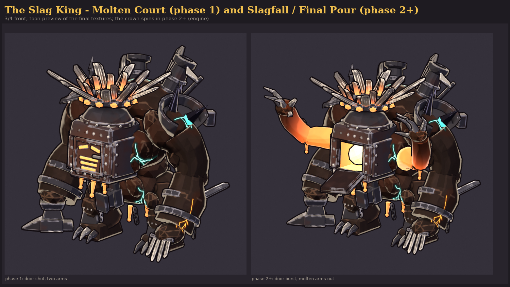

# The Slag King (`slag_king`)

**Status: AI build done, user approval pending.** meta.json says `ai_final_pending_user_approval`,
and `status.json` has stage `2_user_approval` set to `pending_human`.

The Cinder Wastes boss, built end to end from code with no concept art and no hand edits:

```text
"C:\Program Files\Blender Foundation\Blender 5.2\blender.exe" -b --factory-startup --python-exit-code 1 ^
    -P tools/blender/gf_assets/enemies/slag_king.py -- [--preview] [--no-review] [--quick] [--size 2048]
python tools/blender/gf_assets/gfa_validate.py assets/models/enemies/slag_king.glb
```

One run takes about 2-4 minutes on the CPU: model, paint, rig, 25 clips, export, validation and the four
review sheets. `--preview` builds only the mesh and renders flat zone-colour views in about 10 s.



| Sheet | What |
|---|---|
| [reports/slag_king_review.png](reports/slag_king_review.png) | phase-1 turnaround, phase-2 views, size comparison against the 2.2 m hero and a 13 m pole, textures, palette |
| [reports/slag_king_ingame.png](reports/slag_king_ingame.png) | the game camera (orthographic, 55°, yaw 0) at true 1080p pixel size with four hero mannequins: phase 1 and phase 2 at view height 22 m, phase 1 at 28 m, game-size silhouettes |
| [reports/slag_king_clips.png](reports/slag_king_clips.png) | key frames of all 25 clips (loops: 4 evenly spaced frames; one-shots: start, loaded, event, follow-through, end) |
| [reports/slag_king_34.png](reports/slag_king_34.png) | 3/4 front of both phases (the first look) |

## Brief

The row in `content/sheets/enemies.csv`: Boss, Cinder Wastes, hp 28,000, speed 1.6, radius 2.2, scale
2.4 (sim collider radius 5.28 m), mass 30, resist Flame 0.5, `Boss(script: "slag_king")`, colour
`#6B2A14`, greybox Colossus. Its line is "A living foundry colossus crowned in cooling slag." The
user's pack (E3) and docs/art/ENEMIES.md section 7 give the rest.

* **Verb: THE FURNACE THAT WALKS.** A hunched slag titan, **12.8 m tall** (5.8 × the hero) with a
  **15.0 × 11.4 m** footprint, about 2.2 × the 5.28 m collider. It has knuckle-heavy gorilla
  proportions: short column legs, a huge shoulder hump, and forearms bigger than the upper arms.
* **The head is a cast-iron furnace** slung low in front of the hump. Its face is a bottom-hinged
  furnace door with glowing slits: two slanted eye slits over a three-bar grille mouth. The door
  covers a pocket holding a **white-hot core**. A glowing flue on the furnace dome gives the crown a
  hot centre from the 55° camera.
* **The crown** is a floating halo of 11 broken sword blades and 11 snapped stubs, fused into a molten
  ring. The steel is tempered bronze toward the ring and glows where the blades are welded in. It
  rides its own joint (`crown_spin`), so the engine can spin it. From the game camera it is the first
  thing you see: a sunburst with a hot eye over the furnace face.
* **A thousand failed weapons:** the right fist is a whole broken **anvil** (face down, horn out and
  forward: the ground-pound head). The left fist is a claw of four fused blades. A greatsword, a war
  axe, a war hammer and broken swords jut from the hump, and a spear runs through the right shoulder.
  Each forearm carries a blade. A broken anvil (its horn snapped off) is fused into the belly, and
  shackle chains hang from the belly and the wrists. Two **chimney stacks** on the hump glow at the
  mouth (the foundry read; `chimney_L/R` sockets for smoke).
* **The Unmade:** obsidian shards with teal ichor roots grow from the left shoulder and the back. Teal
  Unmade cracks (`#2FBFA8`) and molten cracks (`#FF6B1A`) are painted through the slag as decals.
* **Palette:** slag `#0C0908` / `#2B201B` / `#5E4434` with the row colour `#6B2A14` as a heat tint
  around the furnace. Iron is a neutral dark grey `#363337`, steel a warm grey `#77716C`, and molten
  runs `#C8400C` → `#FF6B1A` → `#FFC24B`. The core is `#FFF3D6` and the Unmade glow is teal `#2FBFA8`.
  There are no player accent colours and no red-white: the engine draws the telegraphs.

## Phases and how the engine switches them

The phase state is carried by the clips. **Every clip keys every joint**, so a clip always says which
body it shows. Nothing depends on joints that a clip leaves alone.

| Phase (`bosses.ron`) | Body | Loops | Enter with |
|---|---|---|---|
| Molten Court (100 %) | door shut, two arms; `arm2_upper_L/R` held at **scale 0.001**, folded inside the chest | `idle@loop`, `move@loop` | - |
| Slagfall (60 %) | door **burst** (hangs open, twisted), the white-hot core exposed, **two molten arms** out (scale 1) | `idle_p2@loop`, `move_p2@loop` | `phase2` (3.0 s: hunch and shudder, burst at 1.47 s, arms grow 0.001 → 1.18 → 1) |
| Final Pour (25 %) | same body as Slagfall | the `_p2` loops | `phase3` (2.4 s roar) |

Client rules (also in meta.json `phase_switch`):

1. In phase ≥ 2, play `<clip>_p2` when it exists, else `<clip>`. `windup`, `attack`, `hit`,
   `slam_trail` and `radial` have `_p2` twins. `strike_cone`, `strike_line`, `pools`, `summon` and
   `death` only happen in phase 2+, so they are authored with the phase-2 body. `strike_circle`,
   `door_open`, `door_close` and `roar` are phase-1 only.
2. **Crown spin is procedural.** All clips hold `crown_spin` at identity. After animation runs, rotate
   the `crown_spin` joint about its local +Y (the crown axis): 75°/s in Slagfall, 150°/s in Final Pour,
   ×2 during `radial`. The `crown` joint above it carries the authored bob, lift and fall. Keyed spin
   would whip backwards in every cross-fade, so the spin is left to the engine.
3. **Final Pour's "crown glows white"** is an emissive boost on the one material (multiply the emissive
   by about 1.6 and lerp it toward `#FFF3D6`). The textures are not swapped.

## Clips (30 fps, all in place)

| Clip | s | Events (s) | Notes |
|---|---|---|---|
| `idle@loop` | 3.2 | | heavy breathing, door chatters, crown bobs |
| `move@loop` | 2.4 | | one stride (L + R steps), root drops on each stomp; `move_cycle_m` 4.45 |
| `idle_p2@loop` | 4.8 | | four arms swaying, door swinging on its broken hinge |
| `move_p2@loop` | 4.8 | | two strides; `move_cycle_m` 9.4 |
| `windup` / `windup_p2` | 1.0 | loaded 1.0 | dip, then both fists overhead (ends loaded; time-stretch to the sim windup) |
| `attack` / `attack_p2` | 0.87 | impact 0.17 | the two-fisted slam from the loaded pose |
| `hit` / `hit_p2` | 0.5 | | flinch; the door jolts |
| `strike_circle` | 2.2 | impact 1.2 | the big ground pound; the impact sits on the 1.2 s windup |
| `slam_trail` / `_p2` | 2.03 / 2.0 | impact 0.9 / 0.87, 2nd 1.1 / 1.07 | the anvil slams on the windup, the claw follows on the trail's second beat |
| `radial` / `_p2` | 1.6 | release 0.5 | gather under the crown, then fling everything wide (the crown sprays slag) |
| `door_open` / `door_close` | 0.8 | open 0.57 / shut 0.47 | the furnace face drops like a jaw, then slams shut |
| `roar` | 2.4 | peak 0.8 | intro / taunt; jaw open, arms spread, tremble |
| `phase2` | 3.0 | burst 1.47 | Molten Court → Slagfall |
| `phase3` | 2.4 | peak 0.73 | Slagfall → Final Pour |
| `strike_cone` | 2.0 | impact 1.0 | the anvil sweeps across the front (70° cone) |
| `strike_line` | 2.8 | impact 1.0, pour end 2.0 | rears back, then leans over and pours from the open furnace |
| `pools` | 1.8 | release 1.0 | all four arms high, then whip molten drops wide |
| `summon` | 2.0 | spawn 0.63, 1.0, 1.37 | the furnace belches cinderlings three times |
| `death` | 3.5 | collapse 1.8 | stagger, knees buckle, falls onto its fists; the crown slides off onto the ground in front; ends held |

The windups end on held loaded poses so the engine's red-white decals have a readable anticipation.
The impact frames sit on the `bosses.ron` windups (1.2, 0.9, 0.85, 1.0, 1.0 s).

**Brief-name aliases.** These are exported as second animations of the same action, so both naming
schemes resolve (listed in meta.json `clip_aliases`): `walk@loop` = `move@loop`, `ground_pound` =
`strike_circle`, `sweep` = `strike_cone`, `furnace_open` = `door_open`, `phase2_idle@loop` =
`idle_p2@loop`, `phase_transition` = `phase2`.

## Rig `GF_SlagKing_v1`

There are 26 deform joints, with rigid skinning (each part rides one joint):
`root`, `pelvis`, `spine_01`, `spine_02`, `head`, `door` (bottom hinge), `crown`, `crown_spin`,
`upperarm/lowerarm/hand_L/R`, `thigh/shin/foot_L/R`, and `arm2_upper/lower/hand_L/R` (the phase-2
arms). Every joint points up with roll 0, so the rest rotations are identity and the local frame is
the creature frame (X left, Y up, Z forward). The exceptions are `crown` and `crown_spin`, which point
along the crown axis (tilted 7° back), so local +Y is the spin axis. The core names follow GF_Hero_v1
(`pelvis`, `spine_0x`, `upperarm`, `lowerarm`, `thigh`, `shin`, `foot`).

**Sockets** (empties under the joints; glTF positions in meta.json `boss_sockets`):

| Socket | Joint | Use |
|---|---|---|
| `hit_center` | spine_02 | hit VFX and damage numbers |
| `fx_core` | head | the white-hot core (burst and death VFX) |
| `fx_mouth`, `attack_origin` | head | the furnace mouth: summon spit, the pour |
| `head_top` | crown | status icons above the crown |
| `crown_center` | crown | the radial spray origin |
| `impact_R`, `impact_L` | hand_R (anvil face), hand_L (claw) | slam dust and cracks |
| `foot_L_fx`, `foot_R_fx` | feet | footstep dust |
| `arm2_tip_L/R` | arm2_hand | pools drops |
| `chimney_L/R` | spine_02 | chimney smoke |

## Metrics (last build)

| | |
|---|---|
| Triangles | 21,543 (boss budget 20,000-40,000). 263 parts; 2,670 buried faces were culled inside the parts they sit in |
| Textures | base colour 2048², emissive 2048² (PNG, embedded); 10 paint zones; UV coverage about 46-48 % (the packer varies slightly per run); texel density median 36 px/m, p90 41 (the game camera shows 39-49 px/m) |
| Material | one, `M_slag_king`: base colour + emissive, roughness 0.85, metallic 0, single-sided |
| Size | 12.8 m tall, footprint 15.0 × 11.4 m (glTF bounds in meta.json) |
| GLB | about 7.6 MB (3.7 MB is the base-colour PNG); no compression extensions (bevy_gltf 0.20 safe) |
| Animations | 31 (25 clips + 6 aliases), 78 channels each (every joint keyed) |

## How it is painted

`gfa_boss.paint_scaled` runs the shared painter on the mesh at **1/8 scale**. The painter's fixed brush
features (stroke wobble, dab break-up, emission noise) are tuned for 0.1-1 m weapons; at 1/8 scale
they become boss-sized brush strokes. Recipes and decals are written in real metres and converted.
The zones:

* slag: faceted value planes, broken warm edge strokes, cavity darks, and a row-colour heat tint
  around the furnace;
* iron and steel;
* blade: tempered toward the ring and glowing at the welds;
* lava: the phase-2 arms, white-hot where they leave the body and cooling to dark crust at the claws;
* molten, core, obsidian, ichor;
* 13 crack decals, teal and molten.

Small UV islands (rivets, chain links, beads) are packed at 55 % when the installed `gfa_paint`
supports `uv_small_islands`.

## Files

| Path | In git |
|---|---|
| `assets/models/enemies/slag_king.glb` + `.meta.json` | yes (GLB through LFS) |
| `art/enemies/slag_king/source/slag_king.blend` | yes (LFS); textures referenced relatively; the NLA tracks are the clips |
| `art/enemies/slag_king/textures/*.png` | yes (LFS) |
| `art/enemies/slag_king/reports/*` | yes (each PNG < 2 MB) |
| `art/enemies/slag_king/work/` | no (previews, per-view renders, sheet layouts) |
| `tools/blender/gf_assets/enemies/slag_king.py` | the build script |
| `tools/blender/gf_assets/gfa_boss.py` | new shared helpers for elites and bosses: dedicated rigs, rigid skin on any bone set, buried-face culling, painting at a paint scale, clip aliases, true-pixel in-game frames, size comparison, key-pose clip strips |

## Open points

* The user's visual approval.
* Engine work (not done here, `crates/` is off limits): load the GLB for `slag_king` and apply the
  phase rules above. That covers the `_p2` clip choice, the procedural `crown_spin` rotation and the
  Final Pour emissive boost. The creature faces glTF +Z, so the engine turns it with
  `yaw(angle) * rot_y(PI)`.
* The model is wider than the 5.28 m collider in its arms (± 7.5 m). That is intended: the fists
  overlap the ground around it, where the slam telegraphs land.
