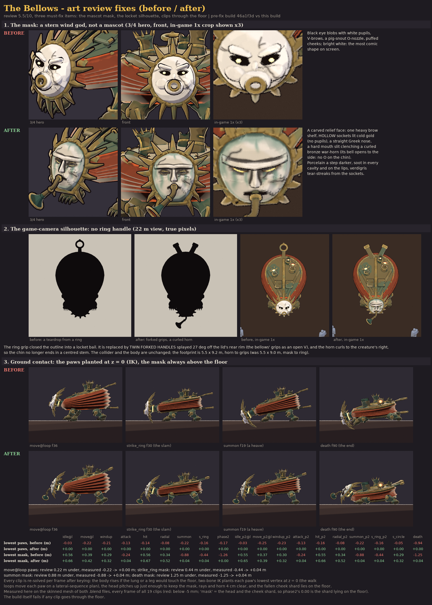

# The Bellows (`the_bellows`)

**Status: AI build done, user approval pending.** meta.json says `ai_final_pending_user_approval`,
and `status.json` has stage `2_user_approval` set to `pending_human`.

This is the Cinder Wastes mini-boss, which is also the biome's **Warlord** POI in the open world
(docs/OPEN_WORLD.md: mandatory, worth 2 Seals, on the route to the gate). It was built end to end from
code, with no concept art and no hand edits:

```text
"C:\Program Files\Blender Foundation\Blender 5.2\blender.exe" -b --factory-startup --python-exit-code 1 ^
    -P tools/blender/gf_assets/enemies/the_bellows.py -- [--preview] [--no-review] [--lite] [--size 2048]
python tools/blender/gf_assets/gfa_validate.py assets/models/enemies/the_bellows.glb
```

A run takes 1-4 minutes on the CPU, depending on load. It covers the model, the paint, the rig, 19
clips, the floor solve, the export, validation and five review sheets. The flags:

* `--preview` builds only the mesh and renders flat zone colours (plus two face close-ups) in about 30 s.
* `--lite` renders only the 3/4 hero shots and the game-camera frames, into `work/review/`.
* `--clips-only` builds the rig and the clips and runs the floor solve and its check only (about 10 s).


| Sheet | What |
|---|---|
| [reports/the_bellows_34.png](reports/the_bellows_34.png) | the first look: Stoke (phase 1) and Blaze (phase 2), 3/4 front |
| [reports/the_bellows_ingame.png](reports/the_bellows_ingame.png) | the game camera (orthographic, 55°, yaw 0) at true 1080p pixels with four 2.2 m heroes at the fight distance: Stoke at 22 m, Blaze turned 35° at 22 m, Stoke at 28 m, and the game-size silhouettes |
| [reports/the_bellows_verb.png](reports/the_bellows_verb.png) | the verb BREATHE at true pixels: rest, inhale, breathe and the summon bow, facing the camera and side-on |
| [reports/the_bellows_review.png](reports/the_bellows_review.png) | the Stoke turnaround, the Blaze views, size against the 2.2 m hero and a 6 m pole, the textures and the palette |
| [reports/the_bellows_clips.png](reports/the_bellows_clips.png) | key frames of all 19 clips |
| [reports/the_bellows_review_fix.png](reports/the_bellows_review_fix.png) | the art review fix, before / after (see below); the numbers are in `the_bellows_review_fix.json` |

## Art review fix (review score 5.5/10)



The review had three must-fix items. The before column is the first build (commit 46a1f3d), rendered and
measured with the same code as the after column.

1. **The mask read as a cartoon mascot.** It had black eye blobs with white pupils, V-brows, a pig-snout
   O-nozzle and puffed cheeks, and it was the brightest, most comic shape on screen. It is remade as a stern
   mythic wind god (`build_face()`):
   - a carved relief face, not a dome;
   - one heavy brow shelf with a furrow;
   - hollow almond sockets lit cold gold from the furnace inside, with no pupils;
   - a straight Greek nose, and a hard mouth slit clenching a curled bronze war-horn. The horn's bell
     opens to the side, so there is no O on the chin from any view.

   The porcelain is a step darker (`#C7BFAE`, grey-green shadows). Soot sits in every cavity and on the
   lips, verdigris weeps at the edge, and a few broad verdigris tear-streaks run down from the sockets and
   the brow.
2. **The game-camera silhouette was a teardrop hanging from a ring, like a locket.** Both ring-grip handles
   are gone. The lid now carries **twin forked handles**, two broad bronze paddles splayed 27° off the rear
   rim with old-gold grip blocks, so the rear of the outline is an open V. The horn curls to the creature's
   right, so the chin no longer ends in a centred stem. The body and the collider are unchanged.
3. **Clips went through the floor.** The paws sank 0.22 m in `move@loop` and the mask went 0.44 m
   (`strike_ring`), 0.88 m (`summon`) and 1.25 m (`death`) under the ground. Every clip is now re-solved
   and re-baked on every frame by `plant_clips()`:
   - the body rises if the lung, a vent or a leg would come within 5 cm (1 cm for the legs) of the floor;
   - analytic two-bone IK plants each paw with its lowest vertex exactly at z = 0. The walk loops move each
     paw on a lateral-sequence plan: stance slide, then a lifted swing;
   - the head pitches up just enough to keep the mask, the rays and the horn 4 cm clear. In `summon` and
     `death` the face bows until the horn is at the ground;
   - the fallen cheek shard lies on the floor in `phase2`.

   The build fails if any planted paw leaves the floor or anything goes below it. All 19 clips pass (see
   `ground` in `reports/build_report.json`). `tools/blender/gf_assets/enemies/the_bellows_fix_views.py`
   measures any build's `.blend` on the skinned mesh. On the pre-fix file every one of the 19 clips goes
   under the floor; on this build none does.

## Brief

The row in `content/sheets/enemies.csv` is:

| Field | Value |
|---|---|
| Class, biome, phase | MiniBoss, Cinder Wastes, P1 |
| hp, speed | 7,000, 1.8 |
| radius, scale | 1.6, 1.6 (sim collider radius 2.56 m) |
| mass | 12 |
| behaviour | `Boss(script: "the_bellows")` |
| colour, greybox | `#B5532A`, Colossus |

Its line is "A furnace-lung the size of a house. It breathes fire and cinderlings." The mini-boss tier
asks for 2 × the hero's height, a unique verb, 10-20k tris, up to 2048 px and a dedicated rig.

## Design decisions

* **Faction: Fallen Godworks.** A bellows is forge equipment, so this is the great bellows of the gods'
  forge, walked off its hearth when the pantheon fell: a corrupted divine machine. The Cinder Wastes now
  has Unmade swarms (clinker) and an Unmade boss (slag_king), plus a Godworks elite (forge_warden) and this
  Godworks mini-boss.
* **Verb: BREATHE.** The body is a real bellows, with the lid hinged at the front:
  - Five pleated hide folds (open V strips with a sharp ridge) sit between a god-bronze lid and a bottom
    board. Each fold rides its own bone at its share of the lid's opening.
  - On the inhale the lid heaves up, the folds fan apart and swell (the middle ones most), and the lung
    balloons.
  - On the breath the lid slams, the folds crush flat and the mask thrusts forward.
  - The deep valley of every fold is painted with a dim dead-ember glow. It is hidden while the lung is
    crushed and bared when it swells, so the furnace inside shows on every inhale.
  - The idle loop breathes too (the lid rises 6.5°), so the verb reads even at rest.
* **Game-camera read.** The first build read as a tortoise from the 55° camera: splayed legs, a domed
  shell and a round face. The redesign keeps only bellows cues in the outline:
  - a teardrop board;
  - a narrow bronze nozzle bell out of the hinge;
  - the mask at the tip, its war-horn curling out to one side;
  - twin forked handles splayed off the lid's rear rim (an open V; the first build's ring grip read as a
    locket);
  - the fold ruff all round;
  - cabriole lion legs tucked under the body, so only the paws peek out.
* **The mask** is a cracked porcelain wind god, stern and mythic (remade after the art review, see above):
  - a carved relief face with one heavy brow shelf, hollow almond sockets lit cold gold from the furnace
    inside (no pupils) and a straight Greek nose;
  - a hard mouth slit clenching a curled bronze war-horn. The breath, the fire and the summoned coals come
    out of its bell, which opens sideways and down to the creature's right;
  - grimed porcelain: soot in the cavities and on the lips, verdigris at the edge and in tear-streaks;
  - a full sun of swept bronze rays (mane and beard) framing it.

  The face is tilted up 18° so the 55° camera sees it, and it is 1.9 m wide, about the hero's height. It
  is the lightest value on the model, toned down so it is not a white blob.
* **Lid and vents.**
  - The lid is one dark god-bronze plane with verdigris patina, an old-gold rim with rivets, a slim
    old-gold spine and two raised bronze fan straps.
  - Three vents: a tall and a short chimney with crowns of spikes, and a snapped stub. They are
    asymmetric, and their mouths glow hot cold-gold at the centre, fading to dead ember.
  - Two fire hatches sit over glowing grates.
  - Earlier glowing cracks on the lid read as glyphs at 1x and were removed.
* **Broken runes.** Each whole chimney carries one big two-stroke glyph in cold gold (`#C9AA56`, a dim glow),
  on the side the camera sees. None sit on the lid (it faces the camera) or on the hide: runes across the
  folds broke into speckle.
* **Phases (Stoke → Blaze).** In `phase2` the lung heaves and the left cheek of the mask cracks off and
  falls (bone `mask_shard`), showing the white-gold furnace behind it. At the same time the two fire hatches
  blow open (bones `hatch_L/R`) over their glowing grates. Blaze clips hold that body.
* **Palette** (Fallen Godworks, `gfa_spec.FACTIONS`):

  | Part | Colour |
  |---|---|
  | god-bronze | `#5E5034`, verdigris shadows `#1B3029`, patina `#3D5E50`, light plane `#8E7B4E` |
  | bottom board, hips, claws, grate bars | `#3E3627` |
  | old-gold trim (rim, spine, rays, bands, grip blocks, horn rim) | `#86703F` → `#B49A5A` |
  | hide | `#542D20`, light plane `#A84E2A` (the row colour's hue, toned down), fold shadows `#1A0C0A` |
  | porcelain | `#C7BFAE`, shadows `#646B64`, soot `#2A2521`, verdigris streaks `#44705E`, dark hairline cracks `#2E2824` |
  | glows | cold gold `#D4B45A` → core `#FFF4D0`, dead ember `#8A3A1E` at the rims, fold valleys `#4A1A0C` → `#A8481E` |

  A texture scan finds no player colours and no telegraph red in the base colour. In the emissive, the
  furnace core's hot tone was cooled to `#E2CA7C` to stay clear of the player gold `#FFC940`. The engine
  draws the fire, the embers and the red-white telegraphs.

## Size and footprint

| | |
|---|---|
| Height | 5.23 m to the tallest chimney crown (2.38 × the hero; the tier allows 1.7-2.4 ×). The lid's rear is at about 4.1 m, and the mask's centre at 2.6 m. |
| Footprint | 5.46 m wide × 9.2 m long, from the horn's bell to the grip blocks. The collider radius is 2.56 m, and the body without the mask and the grips is about 5.5 × 6.3 m, which is 2.2-2.5 × the radius. |
| Triangles | 17,676 (mini-boss budget 10,000-20,000) |
| Textures | base colour and emissive, 2048² each, embedded PNG. Painted at 1/4 scale; texel density median 47 px/m (the game camera shows 39-49 px/m); UV coverage 43 %. |
| Material | one, `M_the_bellows`: base colour + emissive, roughness 0.85, single-sided |
| GLB | 5.1 MB, uncompressed (bevy_gltf 0.20 safe) |

## Rig `GF_Bellows_v1`

There are 27 deform joints with rigid skinning (each part rides one joint):

| Joints | What they carry |
|---|---|
| `root`, `pelvis` | the chassis and the bottom board |
| `lid` | the top board, hinged at the front |
| `pleat_1..5` | the folds, all pivoting on the lid hinge |
| `head` | the nozzle bell, the mask and its war-horn |
| `mask_shard` | the left cheek, which breaks off in Blaze |
| `hatch_L/R` | the fire hatches |
| `chimney_1..3` | the vents |
| `front_thigh/shin/paw_L/R`, `hind_thigh/shin/paw_L/R` | the four legs |

Every joint points up with roll 0, so the rest rotations are identity and the local frame is the
creature frame: X left, Y up, Z forward. The exception is `hatch_L/R`, which point along the lid normal, so
that their local Z is the hatch hinge line.

Sockets (empties under the joints; glTF positions are in meta.json `boss_sockets`):

| Socket | Joint | Use |
|---|---|---|
| `hit_center` | pelvis | hit VFX and damage numbers |
| `fx_core` | head | the furnace behind the mask (phase-2 burst, death) |
| `fx_mouth`, `attack_origin` | head | just outside the war-horn's bell: the fire breath, the lobbed gout, spawned cinderlings and emberwisps |
| `head_top` | lid | status icons |
| `vent_1`, `vent_2`, `vent_3` | chimney_1..3 | radial ember spray and smoke |
| `hatch_vent_L`, `hatch_vent_R` | lid | the Blaze fire hatches |
| `paw_fx_front_L/R`, `paw_fx_hind_L/R` | the paws | footfall dust and slam cracks |

## Clips (30 fps, all in place)

Every clip keys every joint, so each clip carries its phase:

* Stoke clips hold the hatches shut and the shard at scale 1.
* Blaze clips hold the hatches open and `mask_shard` at scale 0.001.
* In Blaze the client plays `<clip>_p2` when it exists, else `<clip>`.

| Clip | s | Events (s) | Notes |
|---|---|---|---|
| `idle@loop` / `idle_p2@loop` | 3.2 | | one breath a loop in Stoke, two deeper ones in Blaze; the open hatches flutter |
| `move@loop` / `move_p2@loop` | 1.6 / 1.33 | | lateral-sequence walk (LH, LF, RH, RF). Each planted paw slides under the body on the floor (IK), and each swinging paw lifts 0.3 m and comes forward. `move_cycle_m` 1.69 / 1.94 |
| `windup` / `_p2` | 1.0 | loaded 1.0 | **the inhale**: brace, the lid heaves open, the folds swell, the face lifts. Ends loaded; time-stretch it to the sim windup |
| `attack` / `_p2` | 1.13 | release 0.13, breath_end 0.67 | **the breath**: the lid slams and the folds crush; the mask thrusts and pours fire (VFX at `fx_mouth`) |
| `hit` / `_p2` | 0.5 | | a flinch; the lid jolts open |
| `radial` / `_p2` | 1.6 | release 0.5, second 0.77 | squat and suck, then two hard pumps; every vent barks embers |
| `summon` / `_p2` | 2.07 | spawn 0.63, 1.0, 1.37 | the face bows until the horn's bell is at the ground and the lung heaves three times; a coal is born out of the horn on each heave (cinderlings in Stoke, emberwisps in Blaze) |
| `strike_ring` / `_p2` | 2.07 / 1.97 | impact 1.0 / 0.9 | rears on the hind legs with a full breath, slams the front paws down; the lid slams and the bag blasts a ring round the body |
| `strike_circle` | 1.8 | release 0.73, impact 0.9 | Blaze only: inhale, aim, lob a gout of fire that lands on the target |
| `phase2` | 2.6 | crack 1.2, burst 1.33 | Stoke → Blaze: heaving, a breath too big, the cheek cracks off and falls, the hatches blow open |
| `death` | 3.0 | collapse 1.93 | always in Blaze: a last gasp, the legs buckle front first, the lung sags and the lid slams, the tall chimney topples, the body sinks onto its belly with the paws splayed and the face bowed to the floor. Ends held |

The clips are keyed pose to pose, then `plant_clips()` re-solves every frame on the floor and bakes it
linearly (see the art review fix above). The impact frames match the `bosses.ron` windups: Ring 1.0 s (Stoke), 0.9 s (Blaze), Circle 0.9 s. The
brief's names are exported as aliases of the same actions, listed in meta.json `clip_aliases`:

| Alias | Clip |
|---|---|
| `inhale` | `windup` |
| `breathe` | `attack` |
| `inhale_p2`, `breathe_p2` | the `_p2` twins |
| `walk@loop` | `move@loop` |
| `blaze_idle@loop` | `idle_p2@loop` |
| `phase_transition` | `phase2` |

The attack-to-clip map per phase is in meta.json `phases`.

## How it is painted

`paint_bellows()` in the build script composes the shared toolkit and changes nothing in it:

1. `gfa_paint`'s unwrap, Cycles bakes and zone painter run at **1/4 scale**, so the brush features become
   0.1-0.4 m strokes.
2. `gfa_brush`'s broad value planes and tapered edge strokes repaint the two bronze zones. Their lathes and
   tubes would streak under per-facet values.
3. This build's own passes follow:
   - up-facing planes lifted, and the hide's down-facing fold faces darkened, which gives the stripes;
   - verdigris patina in the bronze contact shadows;
   - a per-part radial glow for every vent and grate (hot centre, dead-ember rim);
   - the hollow sockets (cold gold deep inside, darkening to a black rim) and the horn's throat (dark at the
     bell's rim, dead ember, cold gold deep inside);
   - the porcelain grime: soot in the cavities and on the lips, verdigris at the edge and in tear-streaks;
   - the fold-valley ember.
4. The decals go on last.

Buried faces are culled: 340 faces inside closed parts, plus the lid's underside and the board's top,
which lie inside the bag. The folds are open strips, so hidden faces take no texels.

## Files

| Path | In git |
|---|---|
| `assets/models/enemies/the_bellows.glb` + `.meta.json` | yes (GLB through LFS) |
| `art/enemies/the_bellows/source/the_bellows.blend` | yes (LFS); textures are referenced relatively, and the NLA tracks are the clips |
| `art/enemies/the_bellows/textures/*.png` | yes (LFS) |
| `art/enemies/the_bellows/reports/*` | yes (each PNG < 2 MB) |
| `art/enemies/the_bellows/work/` | no (previews, per-view renders, sheet layouts) |
| `tools/blender/gf_assets/enemies/the_bellows.py` | the build script (no shared toolkit module was changed) |
| `tools/blender/gf_assets/enemies/the_bellows_fix_views.py`, `the_bellows_fix_sheet.py` | the review-fix evidence: ground contact, side views and the silhouette of any build's `.blend` (Blender), and the before / after sheet (PIL) |

## Open points

* The user's visual approval.
* Engine work (not done here; `crates/` is off limits):
  - load the GLB for `the_bellows`, turned with `yaw(angle) * rot_y(PI)`;
  - pick the `_p2` clips in Blaze;
  - spawn the fire, ember and summon VFX at the sockets on the clip events;
  - optionally push the emissive a little in Blaze.
* docs/art/ENEMIES.md has no section for this mini-boss yet. That file is outside this build's working
  area, so a docs pass should add one, pointing here.
* The model is longer than the collider (9.2 m with the horn and the grips). That is intended: the
  fire breath and the ring slam are telegraphed around it.
* The breath comes out of a bell that opens sideways (to the creature's right). The engine aims the fire
  VFX from `fx_mouth` at the target, so the cone may start slightly off the face's centre line.
