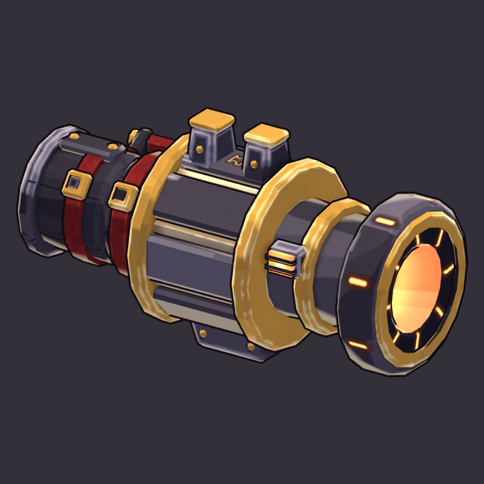
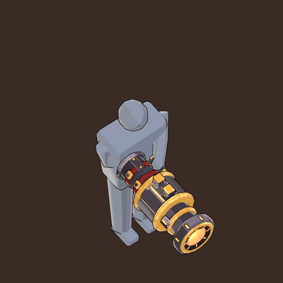
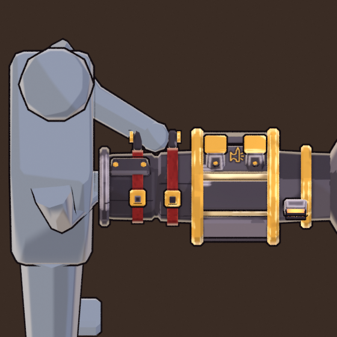

# Colossus Cannon (`colossus_cannon`)

**Status: AI build done, waiting for user approval.** meta.json says
`ai_final_pending_user_approval`, and `status.json` has stage `2_user_approval` set to `pending_human`.

This is Valdris's signature siege cannon. It is built end to end from code with `tools/blender/gf_assets`:
there is no hand-edited mesh and no concept image made for it. One run takes about 45 s on the CPU and
rebuilds everything below:

```text
"C:\Program Files\Blender Foundation\Blender 5.2\blender.exe" -b --factory-startup --python-exit-code 1 ^
    -P art/weapons/colossus_cannon/source/colossus_cannon_build.py -- [--size 1024] [--no-review]
python tools/blender/gf_assets/gfa_validate.py assets/models/weapons/colossus_cannon.glb
```

`tools/blender/gf_assets/weapons/colossus_cannon.py` is an alias that runs the same build script.







The full review sheet is [reports/colossus_cannon_review.png](reports/colossus_cannon_review.png). It has a
turnaround, close-ups, the hold seen through the game camera, the in-game camera at 1x and 3x, the silhouettes
and the textures. The 3/4 back view is [reports/colossus_cannon_34_back.png](reports/colossus_cannon_34_back.png),
and the paint up close (drum staves and sleeve) is [reports/colossus_cannon_detail.png](reports/colossus_cannon_detail.png).

## Revision 2 (art review, 7/10)

The art review had two must-fix items. Both are fixed, and `meta.json` records them under `revisions` and
`grip_L_reach`.

* **`grip_L` was out of reach.** The off-hand handle sat on the drum's left flank, about 0.95 m from the
  left shoulder. A 2.2 m hero reaches about 0.76 m (GF_Hero_v1 on Brax: upper arm 0.33 m, forearm
  0.325 m, wrist to palm 0.09 m, scaled). The drum handle is gone. `grip_L` is now a **brace handle on
  the sleeve's upper-left**, slung between two lugs that ride on the two straps: an iron bar with gold
  end caps and a war-red wrap. It moved from Blender grip space (-0.312, 0.23, 0) to (-0.186, -0.115, 0.108),
  which is glTF (-0.312, 0, -0.23) to (-0.186, 0.108, 0.115). That is 0.13 m in toward the barrel axis and
  0.35 m back toward the body. The review hold changed with it: the right elbow is tucked in front of
  the right chest, 0.18 m right of the centre line, 0.18 m forward and 1.47 m up, instead of hanging
  0.43 m out to the side. The cannon therefore rides close to the body's centre line, and the handle
  sits on it, 0.45 m in front of the shoulders. Left shoulder to `grip_L` is now **0.58 m** for the review
  mannequin and 0.60 m for a GF_Hero_v1 shoulder, so the elbow stays comfortably bent. The left hand
  steadies the cannon arm, the classic arm-cannon brace.
* **The gunmetal streaked like procedural brushed metal.** `gfa_paint` gave every facet its own value
  and broke every sharp-edge highlight into fbm dabs. On the lathes and on the long, parallel stave
  bevels, those terms added up to thin, regular, light horizontal lines. The dark-iron drum core's octagon
  edges, which show between the staves, added more. Both zones are now painted by the new
  `tools/blender/gf_assets/gfa_brush.py`:
  - **a few broad value planes per part**: normals snap to the part's own principal axes, so a stave
    face is one value, a chamfer merges into a neighbour, and a lathe splits into four broad planes with
    brushy borders;
  - **tapered brush strokes** on about 40 % of each part's own edge length, 0.2 m apart on average,
    with a lighter glint core. They are independent per part, so the staves on either side of a gap never
    line up into pinstripes.

  Brush noise and soot spots are gone from the gunmetal. The gold, leather, shells and glows are painted
  exactly as before.

## Brief

The row in `content/sheets/chassis.csv`: Auto fire, damage 26, 2.6 shots/s, range 13, knockback 3.0,
splash radius 1.6, Kinetic, style `Shell`, tags `heavy; splash; valdris`. Its line is "Siege artillery
for one. Shells burst on impact, knocking the horde back."

The references were both Valdris concepts (`docs/media/playable_characters/VALDRIS.jpg`,
`VALDRIS THE ANVIL-BORN.jpg`), `art/characters/valdris/brief.md` sections 2 and 4, and the TRELLIS
blockout close-ups in `art/characters/valdris/reports/blockout/`.

* **Arm-mounted.** A plated sleeve straps over the right forearm with two war-red straps and gold
  buckles. The right fist closes on an inner handle bar inside the sleeve; that bar is `grip_R`, the
  origin. WEAPONS.md's first brief said "shoulder-slung". This build follows the concept and the task
  brief instead, and the WEAPONS.md row now says so.
* **Family HEAVY / SPLASH, verb THE LUMP.** Along the aim the silhouette is a dumbbell of three masses:
  - a slim sleeve;
  - a fat **breech drum**, the widest mass and about 1/3 of the length, with the concept's two **top
    clamps** (gold caps) and an **under-bracket**;
  - a short barrel with the third gold band;
  - a wide, stepped **muzzle collar**. It is a siege-gun swell, deliberately not the Sunspike's bell,
    with a gold ring and a 0.24 m glowing **ember bore**.
* **Loaded drum.** The drum is an octagon of eight bevelled gunmetal staves. The cream Kinetic shells sit
  recessed in the gaps, so at game size the drum shows cream and dark stripes.
* **Shell-burst ring.** Eight glowing radial slots sit on the muzzle face, and eight glowing blast ports
  go around the collar, so the burst reads from the front, the side and the top. Both are painted
  decals and cost no triangles.
* **Details:**
  - the off-hand **brace handle** on the sleeve's upper-left, between the two straps (`grip_L`; revision 2);
  - a steam vent with a glowing grille on the barrel's right side (`eject`);
  - a raised spine plate on the sleeve top;
  - Valdris's **anvil sigil** in forge gold on the top stave between the clamps, facing the game camera.
* **Value rhythm toward the muzzle.** The sleeve darkens toward the elbow, then come the gold drum
  hoops and cream shells, then the dark barrel and gold band, the gold muzzle ring, and finally the
  ember bore, the brightest value on the weapon.
* **Palette.** It comes from Valdris's colour script, with the Kinetic element hue for the shells and
  the glow cores:

  | Material | Colours |
  |---|---|
  | gunmetal | `#48424C`, from the declared `#2A242E` and the measured cannon steel `#47403A`, kept cool |
  | dark iron | `#2A2530` |
  | Forge Gold | `#D29C40` (declared `#FFC24B`) |
  | Deep War Red straps | `#7A1F1F` |
  | Kinetic shells | `#E6D2A6` (element `#F4E3C1`) |
  | glow | rim `#E2561A` (Ember Amber) → hot `#FF9A3C` → core `#FFF4D6` |

## Decisions

* **The glow hue.** WEAPONS.md says glows use the element hue, and Kinetic `#F4E3C1` is a pale cream.
  The concept's muzzle is ember amber, and it is his "hottest point and aim read" (brief section 4).
  So the ember amber is the rim and hot tone, and the Kinetic cream is the white-hot core and the
  shells. The telegraph red-white does not appear.
* **Size.** The concept barrel is about 0.31 m across. This build is larger on purpose: the drum is
  0.46 m across (0.51 m over the gold hoops), 0.64 m tall over the clamps and the bracket, and 1.16 m
  from the elbow cuff to the muzzle face. The front mass (drum, barrel and collar) is 0.76 m, and the
  sleeve over the forearm is 0.35 m. At 49 px/m the cannon is about 57 px long next to a 108 px hero.
  To scale it, change the `R_*` and `*_Y` constants at the top of the script.
* **Budget choices.** The sleeve and the barrel are single lathes. The plate seams are painted, the
  bands are open hoops without inner walls, and the drum staves are flat bevelled boxes. The first
  version, with curved bevelled plate rings, had 6,352 triangles.
* **Single-sided safety.** Every open surface (the lathes and hoops) is oriented explicitly, because
  `recalc_face_normals` only guesses on open meshes. I checked with Workbench and backface culling on
  from six views: there are no holes.

## Metrics (last build)

| | |
|---|---|
| Triangles | 3,414 (two-handed / heavy budget 2,000-4,000); 55 parts in 7 paint zones |
| Textures | base colour 1024², emissive 1024² (PNG, embedded); texel density about 282 px/m (median), atlas coverage 37 %; gunmetal and iron painted with `gfa_brush` |
| Material | one material, `M_colossus_cannon`: roughness 0.85, metallic 0, single-sided; emissive strength 1.0 (the engine scales it) |
| Size | 1.16 m long, 0.51 m wide (over the drum hoops), 0.64 m tall |
| GLB | 0.94 MB, no compression extensions (safe for bevy_gltf 0.20) |
| Sockets (glTF) | `grip_R` (0, 0, 0) · `grip_L` (-0.186, 0.108, 0.115), the sleeve's brace handle (0.58 m from the left shoulder in the review hold) · `muzzle` (0, 0, -0.80), the bore face · `glow_core` (0, 0, -0.23), the breech chamber · `eject` (0.212, 0.07, -0.49), the right vent, its +Y (glTF -Z) pointing out right, up and back |

**Grip frame.** The origin is the right palm centre on the inner handle. Blender +Y is the barrel
(glTF -Z) and +Z is up. The sleeve and barrel axis runs through the palm. The forearm lies along -Y inside
the sleeve (inner radius 0.10 m), and the elbow is about 0.38 m behind the palm, at the cuff.

## Files

| Path | In git |
|---|---|
| `assets/models/weapons/colossus_cannon.glb` + `.meta.json` | yes (GLB through LFS) |
| `source/colossus_cannon_build.py` | yes: the build script (regenerates everything) |
| `source/colossus_cannon.blend` | yes (LFS); textures referenced relatively |
| `textures/colossus_cannon_basecolor.png`, `_emissive.png` | yes (LFS) |
| `reports/colossus_cannon_review.png`, `_34.png`, `_34_back.png`, `_detail.png`, `_held.png`, `_held_close.png`, `build_report.json` | yes |
| `work/` (every review render, the sheet layout) | no (`.gitignore`) |

## Open points for the user's review

* **The hold pose is an arm-cannon pose.** The weapon only sits right when the right forearm points
  along the aim inside the sleeve. That belongs to the GF_Hero_v1 aim animation and to the
  `weapon_socket_R` orientation (WEAPONS.md section 7). A rifle-style hold would push the forearm
  through the drum. The review renders use a custom hold (revision 2): the right elbow is tucked in front
  of the right chest, the forearm is level along the aim, the elbow sits at the cuff, and the left hand
  holds the brace handle. The aim animation should match it.
* **`grip_L` reach (fixed in revision 2).** The brace handle is 0.58 m from the left shoulder in that
  hold. If you prefer the concept's free left fist, the handle can simply be ignored by the IK; the
  socket stays because the two-handed tier requires it.
* **Size against other heroes.** It is tuned to read as siege artillery on Valdris, a 2.3 m
  juggernaut. On a slimmer hero it may look oversized. See "Size" above for the constants that scale it.
* **Ember versus enemy molten.** The ember rim `#E2561A` is close to the Unmade "molten" orange
  `#FF6B1A`. It is limited to the bore, the burst slots, the ports and the vent, so it stays a small,
  hot accent.
