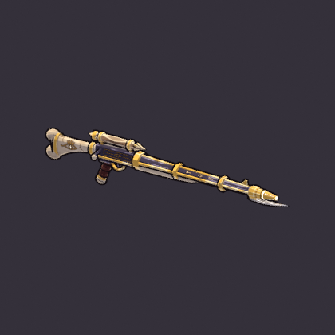

# Godsbane Rifle (`godsbane_rifle`)

**Status: AI build done, user approval pending.** meta.json says
`ai_final_pending_user_approval`, and `status.json` has stage `2_user_approval` set to `pending_human`.

It is built end to end from code with `tools/blender/gf_assets`, with no concept art and no hand edits:

```text
"C:\Program Files\Blender Foundation\Blender 5.2\blender.exe" -b --factory-startup --python-exit-code 1 ^
    -P art/weapons/godsbane_rifle/godsbane_rifle_build.py -- [--size 1024] [--no-review] [--details-only]
```

`godsbane_rifle_build.py` is a launcher for the build script, which lives with the other weapons at
`tools/blender/gf_assets/weapons/godsbane_rifle.py`. One run takes about 25 s on the CPU and rebuilds
everything below. `--details-only` is for paint iteration: it repaints and renders only the close-up sheet
and the 4x in-game hold, and exports nothing.



* [reports/godsbane_rifle_views.png](reports/godsbane_rifle_views.png): large toon-preview renders
  (both sides, 3/4 front, 3/4 from above). The square turnaround tiles are too small for a 1.6 m rifle.
* [reports/godsbane_rifle_details.png](reports/godsbane_rifle_details.png): close-ups of the crystal
  scope (3/4 from above, right side) and of the barrel sigils.
* [reports/godsbane_rifle_review.png](reports/godsbane_rifle_review.png): the standard review sheet
  (turnaround, in-game camera at 1x and 3x, silhouettes, textures).
* [reports/godsbane_rifle_hold_ingame_x4.png](reports/godsbane_rifle_hold_ingame_x4.png): the 2.2 m
  mannequin holding the rifle at its grip frame, seen through the in-game camera (55°, orthographic).
  It has the same framing as the 1x review shot, rendered at 4x resolution.

## Brief

The row in `content/sheets/chassis.csv`: Kinetic, style Slug, fire Auto, damage 22, fire rate 3.2, 1
projectile, 1° spread, speed 34, range 17, pierce 1, crit 10 % ×2.5, tags `precise; pierce`. Its line
is "The rifle that killed a god. It remembers." The art brief asked for a long, elegant rifle with a
god-bone stock, gilded rails and a crystal scope, and the longest silhouette of the set. No hero has
it as a signature chassis (`characters.csv`), so it was designed as a general arsenal weapon.

* **Family: PRECISE / PIERCE → verb THE NEEDLE** (docs/art/WEAPONS.md section 5). It is 1.60 m long
  (about 79 px at 1080p), the top of the rifle band and the longest weapon built so far. Two-thirds of
  that length is barrel, about 0.07 m thick with the rails. It has a crystal scope and a sight blade
  on top, and one sharp point at the front: a bone fang under a tapered gold crown. The only thing
  that leaves the line sideways is a short bolt knob. At 1x in the game camera it reads as one long
  gold line with a cream-tan crystal near the hands and the bright white point at the far end.
* **Value rhythm:** a pale god-bone stock, then a dark leather grip and a dark engraved iron receiver
  under a cut Kinetic-cream crystal scope. Next comes a dark octagonal barrel framed by three gilded
  lines (two side rails and a top rib, which is what the 55° camera sees), then a faceted gold crown
  with glowing channels, a glowing bore "pupil" and a pale fang with a glowing fuller. The brightest
  value of the whole rifle is at the muzzle; the crystal is a mid value.
* **Story ("It remembers"):** the stock is a god's femur. The butt is the bone's double knuckle, with
  the heel condyle rising above the comb line, bound in gold. Both stock sides carry a carved gold
  god-eye with a faintly glowing slit iris, and hairline cracks are painted into the bone. Three large
  engraved Kinetic sigils sit on each upper barrel flat between the gold bands: a forked stave (the god
  that fell), the god-eye lozenge (it remembers) and a fang pointing at the muzzle (the kill).
* **Palette:** the warm metals of the player's arsenal plus the Kinetic element cream `#F4E3C1`
  (`palette.rs`) for every glow. Bone `#D9C6A2` (shadow `#7A5A40`), leather `#4A2622`, iron `#3E3746`,
  gold `#E4B24A`, crystal facets `#E0CA9C` (lit) / `#957250` (flanks) / `#43375A` (violet pavilion)
  with a `#5E4230` core, glow `#D9B77E` → `#F4E3C1` → `#FFFFFF`. There is no telegraph red.

### Decisions

* **The crystal is a cut stone, painted, with almost no glow** (art review fix, 2026-09-25). The first
  build lit the quartz with wide emissive streaks over a near-white base, and the review found that it
  read as a flat white cylinder up close and as a white speck at game size, brighter than the muzzle.
  Now the rings of the crystal turn 30° against each other, so each band between two rings is cut into
  twelve triangular facets (kites and diamonds along the body). A straight six-sided prism read as a
  round rod whatever its paint. Each facet takes one of three Kinetic-cream values from its orientation
  (lit cream table on top, warm tan flanks, violet pavilion underneath). This uses the new `facets` zone
  key in `gfa_paint`. The middle of the stone is a darker amber core that fades to cream toward the
  pointed ends. Its only light is four small painted glints with a dim warm emission, and the
  `glow_core` socket is still there for a VFX glow. At 1x the brightest pixel is now the muzzle, not the
  scope.
* **The barrel runes are three sigils, not a line of text** (art review fix, 2026-09-25). Nine small
  random rune glyphs per flat read as typed text in close-ups. Now there are three hand-drawn, angular
  sigils per flat, 0.028 m long, in 0.0042 m engraved strokes, about 0.074 m apart. They are mirrored
  across the top rib.
* **The muzzle's bright point has to read from the side.** A recessed bore disc faces forward and
  vanishes when the rifle is aimed across the screen. So the bore is a convex glowing pupil just proud
  of the crown, and a slim glowing band and four glowing channels run up the crown's taper.
* **Decal lines are at least about 2.5 texels wide** (0.0028 m or more at about 750 px/m). Thinner
  lines aliased into dashes.
* **In-game review crop: 190 px instead of 150.** A 150 px crop cut the muzzle off. The standard
  sheet's game-size silhouettes are re-flowed at 2x so that they fit one row.

## Metrics (last build)

| | |
|---|---|
| Triangles | 3,160 (two-handed budget 2,000-4,000) |
| Textures | base colour 1024², emissive 1024² (PNG, embedded); 43 parts in 8 paint zones; texel density about 740 px/m (median); UV coverage 38 %; about 7 % of the painted texels carry emission |
| Material | one material, `M_godsbane_rifle`: roughness 0.85, metallic 0, single-sided, emissive strength 1.0 |
| Length | 1.605 m, from the butt knuckle to the fang tip. Barrel line about 0.07 m thick; the scope and grip give 0.30 m of height at the receiver only |
| GLB | 1.18 MB, no compression extensions (bevy_gltf 0.20 safe) |
| Sockets (glTF) | `grip_R` (0, 0, 0); `grip_L` (0, 0.027, -0.40) under the bone forend; `muzzle` (0, 0.085, -1.118) at the bore; `glow_core` (0, 0.159, -0.058), the crystal centre; `eject` (0.03, 0.097, -0.075), right-side port, forward = right and up |

**Grip frame:** the origin is the right palm centre on the pistol grip. Blender +Y is the barrel
(glTF -Z) and +Z is up. The bore axis sits 0.085 m above the palm.

## Files

| Path | In git |
|---|---|
| `assets/models/weapons/godsbane_rifle.glb` + `.meta.json` | yes (GLB through LFS) |
| `tools/blender/gf_assets/weapons/godsbane_rifle.py` (the build) and `godsbane_rifle_build.py` (the launcher) | yes |
| `source/godsbane_rifle.blend` | yes (LFS); textures referenced relatively |
| `textures/godsbane_rifle_basecolor.png`, `_emissive.png` | yes (LFS) |
| `reports/*.png`, `reports/build_report.json` | yes |
| `work/` (every review render, sheet layouts) | no (`.gitignore`) |

## Open points for the user's review

* **Length.** 1.60 m is deliberate: "the longest silhouette of the set". Aimed across the screen it is
  about as long as the hero is tall on screen. If it crowds the co-op view, shorten the barrel first
  (`BARREL`, the crown and fang `y` values and `MUZZLE_Y` in the script) and keep the stock.
* **The hold.** The review mannequin holds weapons at hip height, so the stock disappears into its
  torso. A real shouldered hold comes from GF_Hero_v1's `weapon_socket_R`. The left hand's target
  (`grip_L`) sits 0.40 m in front of the right.
* **Scope glow.** The crystal no longer glows (review fix): its only emission is four small, dim glints.
  If you want a magical scope back in the game, add a small VFX glow at the `glow_core` socket. Keep it
  dimmer than the muzzle, rather than repainting the stone.
