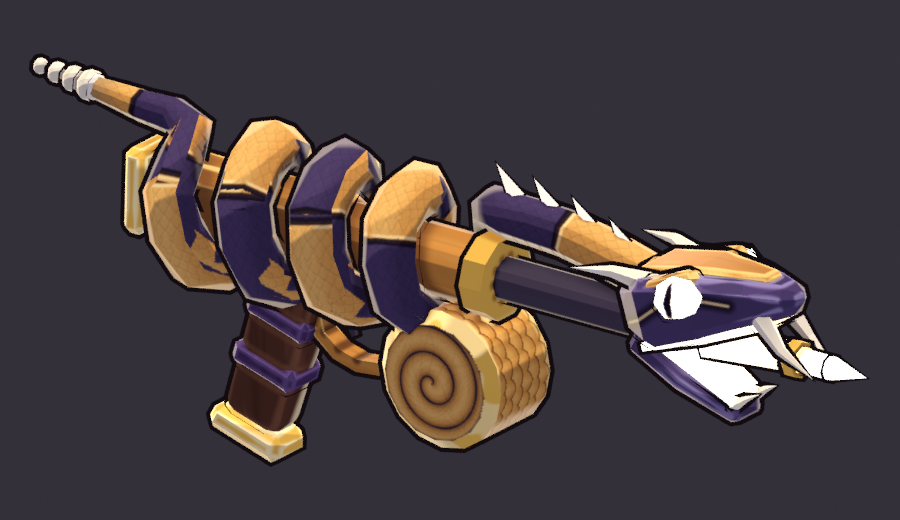

# Serpent SMG (`serpent_smg`)

**Status: the AI build is done and waiting for the user's approval.** meta.json says
`ai_final_pending_user_approval`, and `status.json` has stage `2_user_approval` set to `pending_human`.

This is Kael's signature weapon. It is built end to end from code with `tools/blender/gf_assets`. There
is no concept art and nothing was edited by hand:

```text
"C:\Program Files\Blender Foundation\Blender 5.2\blender.exe" -b --factory-startup --python-exit-code 1 ^
    -P art/weapons/serpent_smg/source/serpent_smg_build.py -- [--size 1024] [--no-review] [--quick]
```

`tools/blender/gf_assets/weapons/serpent_smg.py` runs the same script, following the toolkit's
convention. One run takes about 35 s on the CPU and rebuilds everything listed under Files. `--quick`
builds only the geometry and writes flat-colour Workbench turnarounds and game-size silhouettes to
`work/quick/` in a few seconds. That is the loop for silhouette changes.



Three review images go with it:

* [reports/serpent_smg_review.png](reports/serpent_smg_review.png): the standard sheet (turnaround,
  in-game camera at 1x and 3x, silhouettes, textures).
* [reports/serpent_smg_held.png](reports/serpent_smg_held.png): the gun in the 2.2 m mannequin's
  right hand at its grip frame, through the in-game camera (55° pitch), zoomed and at true size.
* [reports/serpent_smg_before_after.png](reports/serpent_smg_before_after.png): the art review fixes,
  compared with the first build (commit `c39b4b3`) at the same cameras.

## Art review fixes (2026-09-25)

The first build scored 6/10 in the art review. The review had three must-fix items, and all three are
fixed in this build:

1. **"At game size it reads as a dark speckled stick on the mid-dark floor."** The value is lifted. The
   coils carry broad **light-bronze bands** (`#CC9046`, with a painted `#F2C874` ridge). The neck is
   banded too, the head has a broad bronze crown plate, and the drum is bright bronze and gold. On the
   gun pixels in front of the hand at true size (aim 0), the mean value rose from 121 to 138, and the
   share of light pixels (L > 150) rose from 23 % to 42 %. The front end is bigger and brighter. The eyes
   are larger (radius 0.019 m, up from 0.0145). The jaws open wider (17° / 28°, up from 14° / 24°). The
   throat glow is bigger and at full strength. A new **glowing jet** carries the throat light forward
   between the fangs into a thicker needle (radius 0.0095 m, up from 0.0075). The front end's mean
   value at true size rose from 139 to 159.
2. **"The diamond-outline scale pattern turns into speckle at 1x."** It is replaced by **three broad
   alternating dark / bronze bands per coil**. The bands are locked to the helix angle around the bore,
   and one band sits centred on top of each coil, where the game camera looks. Because 3 is odd,
   neighbouring coils swap colour, so the receiver reads as a bold stripe rhythm. The small detail is
   low-contrast, so it averages out at 1x instead of speckling: a thin dark ring and a broken gold line at
   each band edge, and a faint scale lattice.
3. **"The drum is invisible at game size and looks like a cart wheel up close."** The drum is **merged
   into the coil mass**, and it has a **brighter rim** too. It is now a squat canister (0.11 m across,
   0.08 m wide; before it was 0.124 × 0.068) tucked up and back under the front coils, which swallow its
   top. It has a gold chamfer rim and a light bronze band with engraved scales. Its domed faces are
   painted as **one coiled bronze tail** with a soft violet groove. The hub, the recessed face, the thin
   rim ring and the magwell are gone. Alternating bands on the faces were tried first, but they lined up
   into spokes.

## Brief

The row in `content/sheets/chassis.csv` says: Kinetic, style Needle, Auto, 11 shots/s, damage 7, 6°
spread, range 11, tags `rapid; kael`, and the line "A hissing stream of needles. Never stops talking."
It is the `signature_chassis` of **Kael, the Wraithshot** (`characters.csv`: a ghost gunslinger and
agile duelist, colour `#9A7CFF`).

* **Family RAPID, verb THE STREAM** (docs/art/WEAPONS.md section 5). **Tier `one_handed`**: 1,000-2,500
  tris, sockets `grip_R` and `muzzle`, no `grip_L`. The tier is confirmed here.
* **One serpent is the whole gun.**
  * **Tail.** A beaded bone rattle lies on the back of the receiver.
  * **Body.** It winds **four tight coils** around the bronze receiver. They are the rapid family's
    "many small repeated elements": broad dark/bronze bands (three per coil) give a stripe rhythm, and
    the coils give a serrated top and bottom edge in the 1x silhouette.
  * **Neck.** It runs forward, **lean and slightly raised** like a snake about to strike, along a
    thin dark-iron barrel. Four **glowing needle quills** on its spine sweep backward, which gives
    the forward sweep and a row of small lights leading to the muzzle.
  * **Head (the muzzle).** A wedge viper skull with a broad bronze crown plate and backswept bone
    horns. The jaws are wide open, with two long bone fangs and small lower fangs. The big eyes glow and
    have slit pupils. The throat, palate and tongue glow white-hot, and a glowing jet carries the light
    forward into the **needle barrel** the throat spits, the family's small muzzle.
* **Drum magazine.** A squat bronze canister sits Thompson-style in front of the grip, tucked up under
  the front coils, which swallow its top. Its domed faces are painted as the serpent's **coiled tail**
  (one bronze spiral). A gold chamfer rim catches the light, and the band carries **engraved
  overlapping scales**. This covers the "coiled drum" and the "scale-textured drum" in both briefs.
* **Grip.** A raked pistol grip in dark wood with two dark-violet leather wraps, a gold pommel and a
  bronze trigger guard that runs into the drum.

## Paint and value

* **Value rhythm, back to front:** a bone rattle; then the four coils in broad dark violet / light
  bronze bands; a bright bronze and gold drum below them; a banded neck; a bronze-crowned head; then the
  brightest values at the front: bone fangs and horns, the big glowing eyes, and the white-hot mouth,
  jet and needle.
* **Snake skin.** A post-pass on top of `gfa_paint.paint`, in the build script (`skin_postpass`).
  gfa_paint itself is not changed, because the hook is swapped in only for this run. Each texel is
  mapped into body coordinates: arc length along the serpent's centre-line and angle around the tube.
  The bands follow a **band coordinate** (`_band_coord`). In the coils it is the helix angle around the
  bore: three bands per turn, with the edges at 60°, 180° and 300°, so one band sits centred on the top of
  each coil. On the tail and the neck it is the arc length at the same mean band length (0.101 m).
  Inside each band there is a lighter painted ridge along the back of the coil, and the flanks fall
  gently toward the band's shadow hue. The contact shadows (AO) are painted in each band's own shadow
  hue. The small stuff only shows up close: a thin dark ring and a broken gold line at each band edge, a
  faint scale lattice, and bone **belly scutes** on the inner side of the coils.
* **Drum.** The domed faces are one coiled bronze tail: a painted ridge on the crest of the spiral and a
  soft, broken violet groove between the turns. The chamfer is a gold rim with a broken brushy
  highlight, and the band is light bronze with engraved overlapping scales.
* **Everything else** uses the stock gfa_paint zones: flat value planes, cavity darks, broken brushy
  edge highlights, brushed streaks on the bronze, wood grain, and a leather grain on the wrap. The
  viper's **eye stripe** is a painted line decal (bone-gold with a black halo).
* **Glow (emissive texture)** is Kinetic: core `#FFFBF0`, then `#F4E3C1` (`palette.rs`), then warm
  gold `#E6A650` at the edges. It is in the eyes (with a thin dark slit pupil and no emission there),
  the throat, palate, tongue and jet (radial from the throat, 0.11 m, full strength), the four quills
  (at 0.75 strength) and the needle, which is white-hot at the tip. There is no telegraph red.
* **Palette:** dark band `#3A2D4C` (ridge `#5E4C74`), bronze band `#CC9046` (ridge `#F2C874`), band-edge
  gold `#F6D896`, belly `#D8C7A0`, head `#44365A`, bronze `#B87A35`, gold `#E4B24A`, bone `#E8DCC0`, iron
  `#3B3340`, wood `#4E2E22`, wrap `#3E2A4E`. The violet in the dark bands, the head and the wrap is a
  quiet nod to Kael's `#9A7CFF`. It stays out of the glow channel, which belongs to the Kinetic element.

## Metrics (last build)

| | |
|---|---|
| Triangles | 2,330 (one-handed budget 1,000-2,500) |
| Parts / zones | 41 parts in 13 paint zones, one mesh, one material `M_serpent_smg` (roughness 0.85, metallic 0, single-sided) |
| Textures | base colour 1024² and emissive 1024² (PNG, embedded). Texel density is 953 px/m median (858-1008), atlas coverage 42 % |
| Length | 0.77 m from the rattle to the needle tip (the SMG class is 0.6-0.85 m), about 38 px at 1080p. The drum is 0.11 m across and 0.08 m wide |
| GLB | 1.18 MB, no compression extensions (safe for bevy_gltf 0.20); validation OK with no warnings |
| Sockets (glTF) | `grip_R` (0, 0, 0); `muzzle` (0, 0.095, -0.528) at the needle tip; `glow_core` (0, 0.095, -0.378) in the throat |

**Grip frame.** The origin is the right palm centre on the pistol grip. Blender +Y is the barrel
(glTF -Z) and +Z is up. The bore axis sits 0.095 m above the palm. The weapon is an identity child of
the aim pivot or `weapon_socket_R` (docs/art/WEAPONS.md section 7).

## Files

| Path | In git |
|---|---|
| `assets/models/weapons/serpent_smg.glb` + `.meta.json` | yes (the GLB through LFS) |
| `source/serpent_smg_build.py` | yes: the build script |
| `source/serpent_smg.blend` | yes (LFS); it references the textures relatively |
| `textures/serpent_smg_basecolor.png`, `_emissive.png` | yes (LFS) |
| `reports/serpent_smg_review.png`, `_34.png`, `_held.png`, `build_report.json` | yes |
| `reports/serpent_smg_before_after.png` | yes: a one-off comparison with commit `c39b4b3`, made with `gfa_sheet.py` from `work/fix/` |
| `work/` (every review render, the sheet layouts, `quick/`) | no (`.gitignore`) |

## Open points for the user's review

* **The hold.** The review mannequin holds the gun at chest height with the grip frame from
  `gfa_render.weapon_hold_matrix`. The real hold comes from GF_Hero_v1's `weapon_socket_R`.
* **The mouth glow.** The glowing throat, palate, tongue and jet are what make the front end read at
  game size. In the toon preview (emissive x1.6), the open mouth saturates to white. If it looks too
  white in the engine, lower `radius` (0.11) or `strength` (1.0) on the `glow_throat` recipe before
  shrinking the geometry.
* **The band balance.** The coils are about half bronze. For a darker, moodier gun, change `bronze` in
  `SKIN` toward the receiver's `#B87A35`. For even more read, set `bands_per_turn` to 5. Keep it odd, so
  neighbouring coils keep swapping colour.
* **The quills.** They are glowing Kinetic needles, which is a design choice: the needles the serpent
  spits. For a plain look, set the `quill` zone's `emit` to None to turn them into bone spines.
* **The Kael tie-in.** Kael has no model yet. The violet in the scales and the grip wrap is an
  assumption, and it is two hex values in `SKIN` and `RECIPES` if his palette ends up different.
