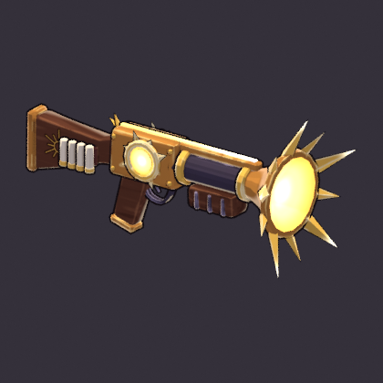

# Sunspike Shotgun (`sunspike_shotgun`)

**Status: AI build done, user approval pending.** meta.json says
`ai_final_pending_user_approval`, and `status.json` has stage `2_user_approval` set to `pending_human`.

This is the proof weapon for `tools/blender/gf_assets`. It is built end to end from code, with no
concept art and no hand edits:

```text
"C:\Program Files\Blender Foundation\Blender 5.2\blender.exe" -b --factory-startup --python-exit-code 1 ^
    -P tools/blender/gf_assets/weapons/sunspike_shotgun.py
```

One run takes about 40 s on the CPU and rebuilds everything below.



The full review sheet (turnaround, in-game camera at 1x and 3x, silhouettes, textures) is
[reports/sunspike_shotgun_review.png](reports/sunspike_shotgun_review.png).

## Brief

The row in `content/sheets/chassis.csv`: Radiant, style Pellet, 7 pellets, 22° spread, range 8, fire
rate 1.6, tags `spread; close`. Its line is "A fistful of sunlight at arm's length."

* **Family: SPREAD → verb FAN-OUT** (docs/art/WEAPONS.md section 5). It is a short, heavy two-handed
  blunderbuss. The bell muzzle flares into a **crown of ten sun-rays**, alternating long and short and
  raked 30° forward, about 0.50 m across. That crown is the shape that has to survive at about 50 px.
  It shows as a sun from the front and as a spiky fan in the in-game silhouette.
* **Value rhythm toward the muzzle:** dark wood stock, bronze receiver, dark iron barrel, then a gold
  crown with white-hot ray tips and a white-gold glowing bore. The brightest value sits where the
  pellets leave.
* **Radiant language:** a sun core in a proud gold ring on both receiver sides (the `glow_core`
  socket), a glowing channel along the top rib (it reads from the 55° camera), a half-sun hammer
  crest, a carved sunburst on the stock (painted decal), and four sun-shells in a leather holder on the
  right side of the stock.
* **Palette:** the warm metals of the player's arsenal plus the Radiant element gold `#FFE27A`
  (`palette.rs`). Wood `#5E3625`, iron `#3B3340`, bronze `#B87A35`, gold `#E4B24A`, shell
  `#E6D8B8`, leather `#4A2622`, glow `#FFB43C` → `#FFE27A` → `#FFFCEE`.

## Metrics (last build)

| | |
|---|---|
| Triangles | 2,948 (two-handed budget 2,000-4,000) |
| Textures | base colour 1024², emissive 1024² (PNG, embedded); 63 parts in 10 paint zones |
| Material | one material, `M_sunspike_shotgun`: roughness 0.85, metallic 0, single-sided |
| Length | 1.045 m, grip to ray tips; crown 0.50 m across |
| GLB | about 1.0 MB, no compression extensions (bevy_gltf 0.20 safe) |
| Sockets (glTF) | `grip_R` (0, 0, 0), `grip_L` (0, 0.012, -0.31) under the pump, `muzzle` (0, 0.14, -0.592), `glow_core` (0, 0.14, -0.06) |

**Grip frame:** the origin is the right palm centre on the pistol grip. Blender +Y is the barrel
(glTF -Z) and +Z is up. The bore axis sits 0.14 m above the palm.

## Files

| Path | In git |
|---|---|
| `assets/models/weapons/sunspike_shotgun.glb` + `.meta.json` | yes (GLB through LFS) |
| `source/sunspike_shotgun.blend` | yes (LFS); textures referenced relatively |
| `textures/sunspike_shotgun_basecolor.png`, `_emissive.png` | yes (LFS) |
| `reports/sunspike_shotgun_review.png`, `reports/sunspike_shotgun_34.png`, `reports/build_report.json` | yes |
| `work/` (every review render, sheet layout) | no (`.gitignore`) |

## Open points for the user's review

* **The hold pose.** In the review, the mannequin holds the gun at hip height. The real hold comes
  from GF_Hero_v1's `weapon_socket_R`.
* **Crown size.** It is deliberately oversized for readability. If it competes with the hero's own
  silhouette, scale the rays down (`RAY_R0` and the ray lengths in the script) before anything else.
