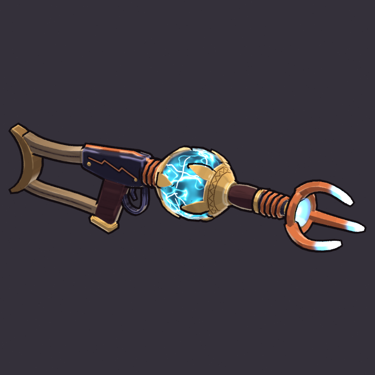

# Thundercoil Launcher (`thundercoil_launcher`)

**Status: AI build done, user approval pending.** meta.json says
`ai_final_pending_user_approval`, and `status.json` has stage `2_user_approval` set to `pending_human`.

This is Selene's signature chassis. It is built end to end from code with `tools/blender/gf_assets`,
with no concept art and no hand edits:

```text
"C:\Program Files\Blender Foundation\Blender 5.2\blender.exe" -b --factory-startup --python-exit-code 1 ^
    -P art/weapons/thundercoil_launcher/source/thundercoil_launcher_build.py -- [--size 1024] [--no-review]
```

`tools/blender/gf_assets/weapons/thundercoil_launcher.py` is a shim that runs the same script, so the
toolkit's `weapons/<key>.py` convention also works. One run takes about 25 s on the CPU and rebuilds
everything below.



The full review sheet (turnaround, in-game camera at 1x and 3x, silhouettes, textures) is
[reports/thundercoil_launcher_review.png](reports/thundercoil_launcher_review.png).
[reports/thundercoil_launcher_ingame_close.png](reports/thundercoil_launcher_ingame_close.png) shows the
weapon in the 2.2 m mannequin's hands at its grip frame, through the 55° game camera zoomed in (5.2 m
view height).

## Brief

The row in `content/sheets/chassis.csv`: Storm, style Orb, auto fire 3.5/s, damage 16, speed 22,
range 14, splash radius 1.0 m at 40 %, tags `storm; splash; selene`. Its line is "Coiled lightning orbs
that crackle on impact." The wielder is Selene, the Stormcaller, a glass cannon ("Lightning in human
shape", colour `#6FE3FF`). The art brief: a slender two-handed launcher with copper coils and a
storm-glass chamber crackling cyan-white. Storm `#3FD8FF` goes in the emissive only, and sparingly.
The weapon should be elegant, not bulky.

## Decisions

* **Family: HEAVY/SPLASH → verb THE LUMP, carried by one mass.** WEAPONS.md asks the splash family for
  a top-heavy lump at about 4:1. The brief asks for slender and elegant. So only the chamber is
  massive: a **storm-glass orb**, 0.20 m across, sits in the breech between the hands. Everything else
  is thin. The ratio is about 5.5:1, and the orb is the single biggest mass and the brightest value.
  At 1x in the game camera, the weapon reads as a mid-value line with a glowing orb and a forked copper
  tip with three white-hot points.
* **The orb** sits in two small brass cups whose rims open into five calyx leaves each, interleaved.
  An engraved lightning frieze runs around each cup. It is painted as a plasma globe: dark slate
  glass, a low storm-blue glow, thin bright plasma wisps and white-cyan crackle veins. The whole ball
  reads as "full of lightning" from every side, with no view-dependent tricks. It stays opaque, with
  normals facing out, because the engine inks by N·V and culls back faces.
* **Coils (the storm accent):** a copper coil pack sits on the neck between the receiver and the orb.
  A tapering copper induction coil wraps the barrel in front of the wooden forestock sleeve. A copper
  conductor rail runs along the receiver top into the neck coil.
* **Wide round muzzle, forked like a conductor:** a brass bell holds a glowing bore. Around it are a
  copper halo ring and three thick, forward-swept conductor prongs. Each ends in a blunt electrode tip,
  and the front half of each prong glows from storm blue to white-hot. From the top it reads as a
  trident; from the side, as a claw. It is 0.23 m across, about three times the barrel.
* **Stock:** a smoked-bone swan-neck skeleton stock with dark scrimshaw lines ends in a **dark bronze
  crescent butt** whose horns point back (Selene is the moon). The first version had a dark wood stock.
  It vanished into the dark arena floor at 1x. The pale bone that replaced it was then the largest light
  shape and pulled the eye to the back. The stock is now a mid value between the two: one step darker
  than the old bone, falling off toward the butt. It still carries the weapon's length on a dark floor,
  and the orb and muzzle lead the read.
* **Value rhythm:** mid smoked-bone stock falling off to a dark bronze butt → dark iron receiver and
  dark wood grip → the glowing orb in bright brass (the lead) → dark sleeve → copper coil → copper
  halo, glowing bore and white-hot prong tips, where the orbs leave.
* **Palette:** the warm metals of the player's arsenal plus storm glass. Smoked bone `#9A7F5C`, dark
  wood `#45282A`, iron `#2D2A38` (with a copper lightning-bolt inlay on both receiver sides), brass
  `#C79E55`, bronze `#8A6638`, copper `#C0673A`, storm glass `#18202E`. Glows run `#0E4E7E` → Storm
  `#3FD8FF` → `#F2FFFF`. The base colour under glows is pale steel-white, never cyan. About 18 % of the
  surface emits: the orb, the bore and the front half of each prong.
* **Painting:** `gfa_paint` does the zones, with flat planes, cavity darks, brushy edge highlights, bone
  grain with a value fall-off toward the butt, and oxidation spots on the brass and bronze. The build
  script runs the painter's steps itself, with one extra pass for the orb's plasma before the decals.
  The shared toolkit was not changed.

## Iterations

1. A glass capsule wound with a copper helix, with a cyan band glowing around its middle. The helix
   read as flat rings, the whole chamber was a solid cyan cylinder (far from "sparingly"), and the
   iron rod poked through the bore, which looked like an eyeball.
2. A near-spherical orb in brass cups with thin claws, and a dark storm-marble glow. The claws were
   half-buried stubs, and the orb was too dark to pop at 1x.
3. Calyx leaves and an engraved frieze replaced the claws, and the glow got brighter. A cloud-gated
   glow made "continents" on the orb, so plasma wisps (ridged noise) replaced it. A bone stock replaced
   the dark wood so the length reads at 1x.
4. **Rev 2, after the art review (7/10).** It had two must-fix items.
   * The pale bone stock was the largest light shape and pulled the eye to the back at 1x. The bone
     is now one value step darker (`#D2C3A5` → `#9A7F5C`, with a less pale edge highlight). A painted
     gradient darkens it further toward the butt, and the crescent is dark bronze instead of bright
     brass. The brass pinstripes became dark scrimshaw lines, because brass vanished on the darker
     bone. The stock is also 4 cm shorter.
   * The three-prong muzzle was 1-2 px at 1x and did not read. The prongs are now longer (tip at
     0.80 m instead of 0.76 m) and about 60 % thicker (base radius 18.5 mm instead of 11.5 mm). They
     splay wider, so the muzzle is 0.23 m across instead of 0.17 m. They end in blunt electrode tips
     instead of needles. The glow covers the front half of each prong instead of the last 2 cm.
     At 1x the fork is a clear claw with three white-hot points. The ring count is unchanged, so the
     triangle count is too.

   A first pass used `#A08A6C` for the bone. At 1x its top strut still showed as a tan line behind
   the orb, so the bone went one notch darker and warmer.

## Metrics (last build)

| | |
|---|---|
| Triangles | 3,856 (two-handed budget 2,000-4,000); 38 parts in 10 paint zones |
| Textures | base colour 1024², emissive 1024² (PNG, embedded); about 730 px/m (median), atlas coverage about 35 % |
| Material | one material, `M_thundercoil_launcher`: roughness 0.85, metallic 0, single-sided |
| Length | 1.150 m, from the crescent horns to the prong tips (launcher class 0.9-1.15 m); orb 0.20 m, muzzle 0.23 m across |
| GLB | about 1.16 MB, no compression extensions (bevy_gltf 0.20 safe) |
| Sockets (glTF) | `grip_R` (0, 0, 0), `grip_L` (0, 0.052, -0.441) under the sleeve, `muzzle` (0, 0.10, -0.634) at the bore, `glow_core` (0, 0.10, -0.27) at the orb's centre |

**Grip frame:** the origin is the right palm centre on the pistol grip. Blender +Y is the barrel
(glTF -Z) and +Z is up. The bore axis sits 0.10 m above the palm.

## Files

| Path | In git |
|---|---|
| `assets/models/weapons/thundercoil_launcher.glb` + `.meta.json` | yes (GLB through LFS) |
| `source/thundercoil_launcher_build.py` | yes: the build script |
| `source/thundercoil_launcher.blend` | yes (LFS); textures referenced relatively |
| `textures/thundercoil_launcher_basecolor.png`, `_emissive.png` | yes (LFS) |
| `reports/thundercoil_launcher_review.png`, `_34.png`, `_side.png`, `_ingame_close.png`, `_ingame_close_side.png`, `_ingame_1x.png`, `_ingame_1x_sil.png`, `build_report.json` | yes |
| `reports/thundercoil_launcher_rev2_before_after.png` (the rev-2 art-review fixes, before vs after) | yes |
| `work/` (every review render, sheet layout) | no (`.gitignore`) |

## Open points for the user's review

* **Stock colour.** Smoked bone (`BONE` in the script) is the middle ground between the old pale bone,
  which pulled the eye to the back, and dark wood, which vanished on dark floors. Moving it one step
  either way only means changing that constant.
* **Orb brightness.** The plasma glow is authored at emissive strength 1.0, and the engine scales it.
  If the orb competes with the projectiles, reduce `I` in `paint_glass` (the 0.34 floor) first.
* **The hold pose.** In the review, the mannequin holds the weapon at hip height. The real hold comes
  from GF_Hero_v1's `weapon_socket_R`; see WEAPONS.md section 7.
