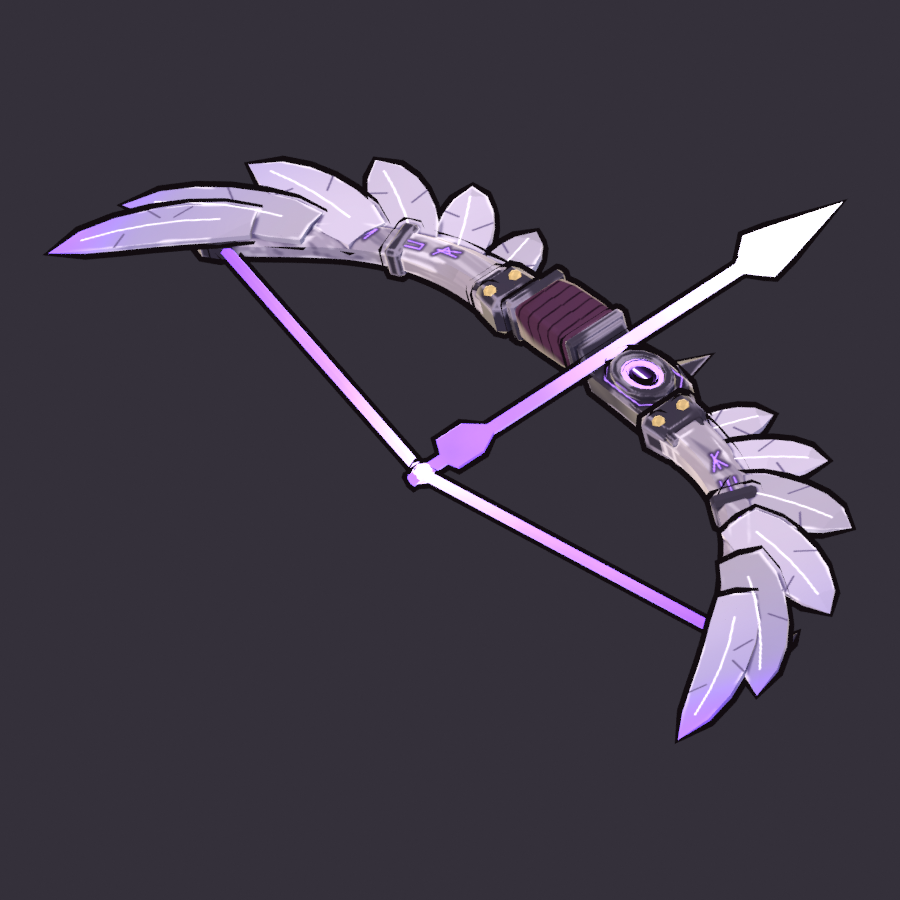

# Wraith Bow (`wraith_bow`)

**Status: AI build done, user approval pending.** meta.json says
`ai_final_pending_user_approval`, and `status.json` has stage `2_user_approval` set to `pending_human`.

Thessaly's signature charge bow. It is built end to end from code with `tools/blender/gf_assets`, with no
concept art and no hand edits:

```text
"C:\Program Files\Blender Foundation\Blender 5.2\blender.exe" -b --factory-startup --python-exit-code 1 ^
    -P art/weapons/wraith_bow/source/wraith_bow_build.py -- [--size 1024] [--no-review]
python tools/blender/gf_assets/gfa_validate.py assets/models/weapons/wraith_bow.glb
```

One run takes about 35-45 s on the CPU and rebuilds everything below.



* [reports/wraith_bow_review.png](reports/wraith_bow_review.png) is the standard sheet: turnaround, the
  in-game camera at 1x and 3x, silhouettes and textures.
* [reports/wraith_bow_hold.png](reports/wraith_bow_hold.png) shows the bow held by the 2.2 m mannequin
  (right palm on the string, left palm on the riser) through the 55° game camera. It has three aim
  directions, zoomed 4.5x, and the same aims at true 1080p size with game-size silhouettes.

## Brief

The row in `content/sheets/chassis.csv`: Void, style Arrow, fire Charge, damage 40, fire rate 2.0,
1 projectile, speed 30, range 18, pierce 2, charge 0.8 s ×2.5, crit 8 % ×2.5. Tags `charge; pierce;
thessaly`. Its line is "Draw to charge; loose hex-bolts that pass through the living."

The brief asked for a recurve of pale wraith-wood and dark iron with a spectral glowing string, limbs
that curl like ghostly wings, and two hands: `grip_L` on the riser, `grip_R` at the string. Thessaly
(`characters.csv`) is the Hexweaver, a witch-engineer. Any hero can wield any chassis, so the glows use
the **Void element hue** (`#A45CFF`, `palette.rs`) and not her player green.

## Design decisions

* **Family: CHARGE → verb THE DRAW** (docs/art/WEAPONS.md section 5). The bow is modelled **at half
  draw**. The spectral string makes a shallow V (0.09 m) back to the right hand, so stored tension
  shows even when the bow is idle. The secondary tags each add one accent. *Pierce*: a spectral
  **hex-bolt** (hexagonal bipyramid head) sits on the string and runs through the riser, so the one sharp
  point is at the front. *Void*: a hollow **void eye** in an iron frame on the riser, with a violet rim
  and a glowing slit pupil.
* **Wing limbs.** Each limb is a pale wood spar that curves back to an iron nock claw. Six carved
  feathers fan from it: pointing forward near the riser, then outward and back at the tip like a spread
  wing's primaries, the last ones curling. The feathers overlap and are stacked 5 mm apart. Their tips
  fade into violet glow (the "ghostly" part). From the game camera the bow reads as a pair of spread
  wings around a glowing bolt.
* **Canted 72° about the aim axis** (top limb toward the weapon's right). The game camera looks down at
  55°, so an upright bow goes edge-on whenever the hero aims up or down the screen. Canted this far, the
  limb plane faces the camera at 0.57-0.97 for every aim, and the wing silhouette survives in every
  review aim (right, down-right toward the camera, up-left away from it). The bow is modelled upright in a "bow frame" and rotated by `CANT` at the end. Every
  socket, paint centre and decal goes through the same `W()` transform. If the user wants an upright or
  flat bow instead, change `CANT_DEG` and rebuild.
* **Value rhythm:** a dark iron riser in the middle (plum leather grip wrap, iron limb pockets with
  bone-brass bolts, iron bands, iron nock claws). Then the pale limbs and feathers. Then the glows: a
  violet string, a violet bolt shaft, and a **white-hot bolt head at the front, the brightest value**.
  The wood and feathers sit one step below white (`#9C91A3` / `#B0A6BC`), so their painted value planes
  survive the lit side of the toon ramp.
* **Painting:** flat value planes per face and per feather, wood grain along the limbs, cavity darks,
  and brushy edge highlights on the iron. Painted line decals add Hexweaver sigils carved into both limbs
  (faintly glowing), a pale rachis and two dark vane splits on every feather (both faces), a hexagon
  engraved round the eye, the eye's slit pupil, and spiral seams on the grip wrap.
* **Glow colours:** the rim `#6E3CE0` → hot `#8A5CF5` → core `#B89CFF` (the string) / `#F2ECFF` (the bolt
  head). This is the Void hue authored a little darker and bluer: saturated `#A45CFF` clips to
  pink-magenta when the engine brightens emissive (blue saturates first). The engine scales the
  strength (emissive authored at 1.0).
* **Tier:** `two_handed` (2,000-4,000 tris, 1024 px), as WEAPONS.md proposes.

## Grip frame and sockets

The origin is **`grip_R` = the right palm centre on the string's nocking point** (the drawing hand).
Blender +Y is the aim (glTF -Z), +Z is up, +X is the weapon's right. The weapon hangs from
`weapon_socket_R` / the greybox aim pivot with an identity transform (WEAPONS.md section 7).

| Socket | glTF (x, y, z) | What |
|---|---|---|
| `grip_R` | (0, 0, 0) | right palm at the nocking point |
| `grip_L` | (-0.086, -0.028, -0.332) | left palm on the riser grip (left-hand IK target) |
| `muzzle` | (0, 0, -0.38) | the arrow rest at the riser front (as WEAPONS.md specifies for this chassis) |
| `glow_core` | (0, 0, -0.63) | the bolt head: charge-fill VFX, point light |

**Deviation from the WEAPONS.md table.** The table said "`grip_R` = the bow grip". The brief for this
build puts `grip_R` at the string and `grip_L` on the riser, and I followed the brief. With the weapon on
the right-hand socket, this is a right-handed archer's hold: the right hand draws, the left arm reaches
to the riser. The WEAPONS.md row now records it.

## Metrics (last build)

| | |
|---|---|
| Triangles | 3,226 (two-handed budget 2,000-4,000) |
| Parts | 40 parts in 9 paint zones (wood, feather, iron, wrap, brass, void, glow_eye, glow_string, glow_bolt) |
| Textures | base colour 1024², emissive 1024² (PNG, embedded); texel density about 604 px/m median; atlas coverage 37 % |
| Material | one material, `M_wraith_bow`: roughness 0.85, metallic 0, single-sided |
| Size | 1.46 m tip to tip (with the feathers), bolt tip 0.75 m ahead of the string; bounds in glTF x -0.73..0.72, y -0.22..0.26, z -0.75..0.10 |
| GLB | about 1.1 MB, no compression extensions (bevy_gltf 0.20 safe); `.blend` 0.16 MB |
| Rig / clips | none (a static weapon, like the rest of the arsenal so far) |

## Files

| Path | In git |
|---|---|
| `assets/models/weapons/wraith_bow.glb` + `.meta.json` | yes (GLB through LFS) |
| `source/wraith_bow_build.py` | yes: the whole build (geometry, paint recipes, decals, export, review) |
| `source/wraith_bow.blend` | yes (LFS); textures referenced relatively |
| `textures/wraith_bow_basecolor.png`, `_emissive.png` | yes (LFS) |
| `reports/wraith_bow_review.png`, `reports/wraith_bow_hold.png`, `reports/wraith_bow_34.png`, `reports/build_report.json` | yes |
| `work/` (every review render, sheet layouts) | no (`.gitignore`) |

## Open points for the user's review

* **The cant.** Is a strongly canted, almost flat bow right for the game? It is a deliberate readability
  choice for the 55° camera. An upright bow looks more classic but goes edge-on in half the aims.
* **The nocked bolt is part of the mesh.** It stays visible after a shot. That reads as "the next bolt
  conjured", but if the client wants to hide it between shots, the bolt has to become its own node
  (a small change in `build_mesh`).
* **Half-draw pose.** There is no rig. A live draw (the string pulled to the full V on charge) needs
  either a two-bone string rig with a `wraith_bow_draw` clip, or client-side VFX at `glow_core`.
* **The hold** in the review uses the toolkit's generic mannequin (the right hand in front of the chest).
  The real pose comes from GF_Hero_v1's `weapon_socket_R` and the left-hand IK to `grip_L`.
