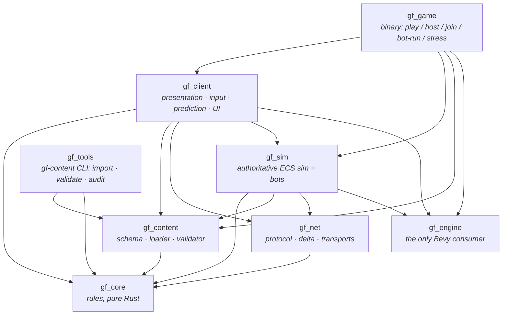

# GODFORGE — Architecture

> Rust 1.96 · Bevy **=0.20.0-rc.1** (pinned) · host-authoritative 4-player co-op · data-driven content.
> This document is the contract every contributor codes against. Section references (§n) point at
> the master creation prompt.

## 1. Principles → mechanisms

| Principle (source) | Mechanism in this codebase |
|---|---|
| Engine isolation; Bevy churn is the #1 schedule risk (§14, §18) | Bevy is named in **one line** of the workspace manifest. Only `gf_engine` uses Bevy APIs directly; the rules, content and netcode crates don't depend on Bevy at all. |
| Co-op from day one; no single-player code paths (§20.3) | The host's own player connects to the sim over a **loopback transport**. Solo, listen server and dedicated bot runs all go through `NetServer` / `NetClient`. |
| Data-driven everything (§20.2, §20.9) | Every number lives in `assets/content/*.ron`, most of it generated from `content/sheets/*.csv`. It is validated at import and on load, and its hash is exchanged in the handshake. |
| One aim abstraction (§20.11) | `gf_core::aim`: target selection → aim solution → fire. AUTO, ASSISTED and MANUAL are three parameter sets (`aim_modes.ron`) over one pipeline. Weapon code never branches on the mode. |
| Readability budget (§5, §20.4) | VFX tiers (`Full → Reduced → Silhouette`) are driven by the live effect count (`game.ron: vfx`). Ally effects render at reduced alpha. Telegraphs are always danger red-white; player-side zones are always gold. |
| Test rigs (§20.7) | Headless bots play real runs through the real netcode (`--bot-run`). A stress scene holds 4 bots against 400 enemies (`--stress`). Both run as CI gates. |
| Roster scalability (§20.10) | A character is rows in `characters.csv` + `character_trees.csv` + a kit in `kits.ron` (ability steps are data). Adding one needs no code changes. |
| Determinism (weekly seeds, §11.5) | Single-threaded fixed-order `SimTick` schedule, `gf_core::rng` (xoshiro256++ seeded through SplitMix64, fully specified in-tree and pinned by golden-value tests), fixed 60 Hz step. Same seed + inputs ⇒ bit-identical run (tested). |

## 2. Crate graph



| Crate | Depends on Bevy? | Responsibility |
|---|---|---|
| `gf_core` | no | Forge (chassis + Core/Mechanism/Relic/Sigil; equip/fuse/reroll/salvage; recipes), modifier vocabulary + rarity scaling, weapon compilation, DPS preview, aim policies, damage/status model, elemental synergies, party scaling + Chaos Tiers, Team Overdrive, Soul-Tether revive, shared movement step, deterministic RNG. 85 unit tests. |
| `gf_content` | no | Typed schema for every table, RON loader, cross-reference validation, phase gating (P0/P1/EA/V1), content hash. |
| `gf_net` | no | Wire protocol, entity-level delta snapshots against acked baselines, quantization, loopback transport with simulated latency/jitter/loss, UDP transport, `CompositeServer` (loopback host player + UDP remotes). |
| `gf_engine` | **yes** | Bevy re-export (`prelude`), the deterministic schedule helper, and (feature `client`) window/camera/UI/screenshot adapters that absorb API churn. |
| `gf_sim` | via `gf_engine` | Headless 60 Hz ECS simulation: players, kits, weapons, projectiles, enemies + bosses, director, anvils, boons, drops, run flow, snapshots. Includes `SimServer` (host loop) and `bot` (bot brains + `run_headless`). |
| `gf_client` | via `gf_engine` | Input devices → intent, prediction + reconciliation, scene proxies, VFX, HUD, forge/boon/door/end panels. It never simulates the game. |
| `gf_game` | via `gf_engine` | The `godforge` executable (CLI modes below). |
| `gf_tools` | no | `gf-content`: CSV → RON import (`--check` for CI), validation report, 100-hour audit. |

Bevy features: the sim needs only `std` + `bevy_log` (plus the ECS/app core). The client adds
`3d`, `ui`, input devices, `default_font` and `png` through `gf_engine/client`. A headless host
therefore links no renderer, windowing or audio.

## 3. Runtime topology

```text
            ┌──────────────────────────── host process ────────────────────────────┐
            │  SimServer thread (60 Hz, fixed)                                      │
            │   NetServer ── CompositeServer ─┬─ loopback  ◄──► local NetClient ────┼─► gf_client (render, input)
            │   SimTick schedule              └─ UdpServer ◄──► remote NetClient ───┼─► remote gf_client
            └──────────────────────────────────────────────────────────────────────┘
```

* **Solo** = `Connect::Local`: the sim thread uses a loopback listener, and the client connects to it.
* **Host** = `Connect::Host`: a `CompositeServer` fans in loopback (even peer ids) and UDP (odd peer ids).
* **Join** = `Connect::Join`: a UDP client to a remote host. If the host can't be reached it falls back to solo.
* **Bots / CI** = `bot::run_headless`: the same `SimServer` plus N `NetClient`s driven by `BotBrain`.
  Over an ideal link it fast-forwards (a 25-minute run takes seconds). With `--rtt` / `--loss` it
  runs in real time over a lossy loopback that counts as *remote*, so it exercises the 20 Hz path.
* **Bot teammates** (`--bots N` in a windowed session) = `bot::spawn_bot_party`: extra loopback clients of
  your own host on a separate thread. They fill a co-op party for play-testing and capture.

Steam Datagram Relay plugs in as a third `ServerTransport` / `ClientTransport` implementation
(steamworks-rs `NetworkingSockets`). Lobbies, invites and rich presence live in the client shell.
Nothing in the protocol or sim changes.

## 4. The tick (host)

`SimServer::step` runs these steps each tick:

1. Poll the transport and apply joins and leaves (join-in-progress is allowed by default).
2. Feed each client's newest commands into `PlayerInput`. Edge inputs are **press counters**,
   so they are never lost or doubled, and actions arrive **reliably** over the unreliable stream.
3. Run `SimTick` in fixed order: `Input → Players → Enemies → Spatial → Weapons → Combat → Damage → World → Cleanup`.
4. Stream snapshots at a **per-client rate**. The host's own loopback player gets 60 Hz
   (`snapshot_every: 1`) and remote peers get 20 Hz (`remote_snapshot_every: 3`, §14). Cosmetic events
   are buffered per client until its next snapshot, so the slower stream never drops one. A due
   client gets a `WorldSnapshot`.
   Each client gets public state plus its private view (bag, wallet, boon offers: personal loot streams).
   The world is encoded as an entity-level delta against that client's last acked baseline.
   Projectiles carry a **motion descriptor** (`pos₀, vel, t₀`), so after their first appearance they cost 0 bytes.

Measured on this container (`--stress 400 --bots 4`, dev profile): **0.61 ms mean / 0.97 ms p99** host
tick against a 16.67 ms budget. That is roughly 17× headroom for the PC-min target and the mobile tiers.

## 5. The client frame

| Set | Systems |
|---|---|
| `Net` | `poll_link` (snapshots, roster, events; reconcile prediction) · forge toggle · UI hover capture |
| `Input` | keyboard/mouse, gamepad, touch (floating twin-stick + ≥44 px buttons) and autopilot. All of them fill one `InputState`. |
| `FixedUpdate` (60 Hz) | `send_command`: queue actions, send the command, predict the local mover with **the same `gf_core::movement::step_mover` the host runs**, and keep unacked inputs for replay. |
| `Scene` | rebuild room on `room_serial` · match `NetId → proxy` (spawn/update/despawn) · extrapolate motion-descriptor entities at the fractional render tick · ease others · telegraph fill · hit flash / status tint · player rigs at the predicted position |
| `Presentation` | camera (co-op centroid framing, room clamp, trauma² shake) · VFX (tiered particle budget) · HUD · panels · scripted screenshots |

Reconciliation replays the unacked inputs from the authoritative mover state. The correction is
kept as a decaying visual offset, so the player never sees a snap. `Link::render_tick` gives the
fractional server tick used for extrapolation.

## 6. Signature systems

### The Forge (§6)
* `WeaponBuild = chassis + [Core, Mechanism, Relic, Sigil]`. The Sigil is locked for the run (`forge.locked_slots`).
* Anvil event: an anvil room (or anvil door) spawns a **Dormant** anvil. Interacting starts **Kindling**,
  a hold-the-ring wave where progress pauses while the ring is empty. Then comes **Hot**, a forge window
  with charges; forge-focus time scale applies when every player has the panel open. Finally the anvil goes **Spent**.
* Actions: equip (free), fuse (charge; two parts → higher rarity, and a weaker donor is refused),
  reroll (charge + shards), salvage (shards). They are pure functions in `gf_core::forge::apply_action`,
  shared by the host, the bots and the **UI preview** (the panel runs the real function on a copy and shows the DPS delta).
* Named combos (`recipes.csv`) are detected from the build + element and feed the codex (72 authored).

### Boons (§7)
There are 8 gods. The Standard/Legendary/Duo/Team kinds with requirement gating are data, and
offers roll per player. Picking a boon or rerolling is a reliable `PlayerAction`.

### Aim (§5, §20.11)
One pipeline, three parameter sets. AUTO pays a damage tax (`damage_mult 0.9`) for perfect uptime.
ASSISTED adds magnetism cones and soft-lock. MANUAL enables precision hits and **Deadeye** (+2%/hit, up to +20%).
The mode can be switched live, and the HUD shows the tax or the current Deadeye bonus.
Per-weapon quirks (beam sweep, charge-to-lock) are fields in the weapon profile.

### Co-op (§10)
* Elemental synergies fire when two elements from **different sources** meet on one target within
  2.5 s (12 rules, 1.5 s per-target cooldown). Solo, your own two elements can combo at half power,
  so the system is learnable before co-op.
* Team Overdrive uses one shared meter, and any player can trigger it.
* Soul-Tether revive: a downed player drifts as a wraith for up to 20 s while any ally within 3.5 u
  channels a 3 s revive. Otherwise the Forge reforges them 10 s later, so **no one is out for more than
  30 s**. Solo runs get one Rekindle.
* Party scaling (HP, count, elites) and Chaos Tiers 1–20 are content tables.

## 7. Presentation language (§12)

The greybox primitives are placeholders. Swapping in glTF scenes touches only
`gf_client::palette` (the mesh/material cache) and the per-kind spawners in `scene.rs`. The
colour and readability rules are final:

* Element hues: Kinetic bone-brass, Flame orange, Storm cyan, Void violet, Plague green, Radiant gold.
* Rarity: Common parchment → Rare blue → Epic violet → **Godforged gold**. Rare+ loot gets a light beam.
* Players: P1 gold, P2 cyan, P3 violet, P4 green ground rings (`game.ron: player_colors`).
* Enemy danger: telegraphs fill red-white from the centre until they resolve, and winding-up enemies blink red.
  Enemy shots are magenta-cored so they never read as player projectiles.
* Look: a warm shadow-casting key light against cool fill, HDR + bloom (TonyMcMapface), a painted-flagstone
  ground tinted per biome, inverted-hull ink outlines on characters and enemies, and a UI vignette.
* Type: DejaVu Serif Bold for headings and DejaVu Sans for body (bundled, redistributable; `assets/fonts`).
  The body face replaces Bevy's ASCII-only default font, so every glyph the UI uses renders.

## 8. Performance and LOD budgets

| Budget | Where | Default |
|---|---|---|
| Host tick | `--stress` CI gate | p99 < 16.67 ms (measured 0.97 ms @ 400 enemies) |
| Snapshot size | `RunReport.max_snapshot_bytes` | delta + motion descriptors; printed per run |
| VFX tier thresholds | `game.ron: vfx.reduced_at / silhouette_at` | 450 / 900 live effects |
| Particles per tier | `vfx.particles` | 1600 / 700 / 200 |
| Damage numbers | `vfx.rs` | own damage only, aggregated per target, ≤ 40 alive |
| Ally effect alpha | `vfx.ally_effect_alpha` | 0.55 |

Mobile tiers reuse the same knobs with different values: a separate tuning pass, same content pipeline (§14).

## 9. Art pipeline hook (Blender 5.x → glTF)

Asset keys already exist in content: `EnemyDef.shape`, `CharacterDef.skins`, `ChassisDef.key`.
The production path is:

1. `blender -b -P tools/blender/export.py` (CI) exports `assets/models/{kind}/{key}.glb` (meshopt), with
   animations named `{char}_{clip}@loop` on the master skeleton.
2. `gf_client::palette` gains a `Handle<Scene>` lookup by key. When the file is missing it falls back to the
   current greybox primitive, so content can land before art does.
3. Weapon fire, recoil, aim offsets and hit flinches stay procedural in `scene.rs`, so they don't multiply authored clips.

## 10. Testing

| Rig | Command | Gate |
|---|---|---|
| Unit tests | `cargo test --workspace` | rules, content, netcode, sim determinism |
| Content | `cargo run -p gf_tools -- import --check` | sheets ↔ generated RON in sync, 0 errors |
| Nightly bot run | `godforge --bot-run --bots 4 --phase ea` | no crash, no stall (must end in victory/defeat), p99 tick in budget |
| WAN soak | `godforge --bot-run --bots 4 --phase ea --rtt 100 --loss 0.02 --minutes 5` | real time, 20 Hz snapshots: clears rooms without a wipe |
| Chaos stress | `godforge --stress 400 --bots 4` | p99 tick < 16.67 ms |
| Attack-mode parity | `godforge --bot-run --aim auto --seed 7` vs `--aim manual --seed 7` | both complete (acceptance #8) |
| Client smoke | `godforge --autoplay --screenshot shot.png --shots 4` | renders under Xvfb/lavapipe |

## 11. Known gaps (tracked for P2)

* Steamworks glue (SDR transport, lobbies, achievements, cloud saves): the transport traits and the
  achievement table are ready, but the SDK integration isn't written yet.
* Lag compensation for hitscan and beams. Projectile hits already resolve on the host.
* Meta hub (Altar of Ember, character trees), Echo drones and barks: fully authored and validated
  as data, but not yet wired into systems. Their P2 hooks are `gf_content::{AltarNode, TreeNode, EchoTuning, BarkDef}`.
* Audio.
* Authored glTF art (see §9).
